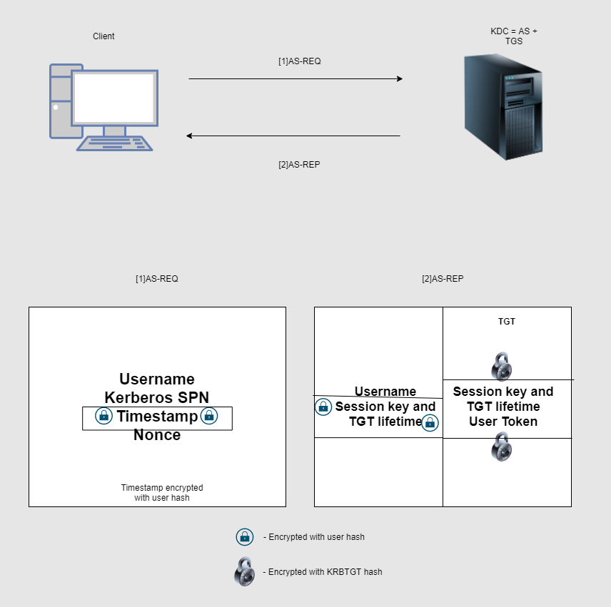
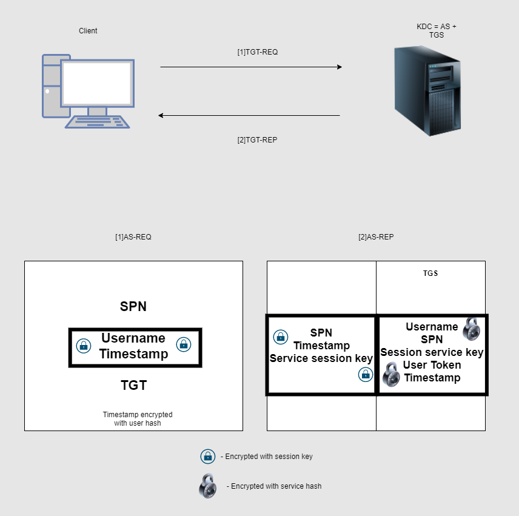

---

layout: post
title: Playing With Windows Security - Part 2
lang: en
lang-ref: playing-windows-sec-2
categories: [Windows security]
tags: [windows, cybersecurity, kerberos, red team, pentesting]

---

# Kerberos Authentication Protocol

After the first part at which we talked about authentication in Windows and explained how attacks like Pass-The-Hash works. At this part we are going to analyse Kerberos, a centralized authentication protocol designed by MIT around 1980s. Also they develop [`krb`](https://web.mit.edu/kerberos/){:target="\_blank"}, the Kerberos Linux (`kfw` for Windows), implementation. It is not common but you might come with a Linux environment using Kerberos(especially with RedHat). You will see Kerberos almost always in Windows domain environs. Understanding Kerberos will help us to learn how the whole family of Kerberos attacks work and why some of them are so powerful, for example Golden Ticket, that cannot be mitigated at all but detected and stopped.

Kerberos is the hound of Hades -God of the underworld and brother of Zeus- in Greek mythology. Kerberos uses a KDC, or Key Distribution Center, which has the job of authenticating users and granting services tickets, or TGS. We will see Kerberos on a theoretical point of view, in part 3 we will pwn an Active Directory test lab using [WSLab](https://github.com/microsoft/WSLab){:target="\_blank"} and we will put in practise all the things learned.

## Key Concepts

- Kerberos Realm
- KDC (Key Distribution Center)
- Tickets

## Attacks
- Overpass-The-Hash
- Pass-The-Ticket
- Golden Ticket
- Silver Ticket
- Kerberoasting
- ASReproasting

# Kerberos Realm

The Kerberos Realm is simply over which domain the authorithation server can authenticate users or takes part. Say we have a host `service1` within the domain `corp.local`. We would like to to access a service at `service1.corp.local` and to do that we authenticate using Kerberos and obtain a TGT using `kinit`. Now, `kinit` needs to authenticate versus the KDC, but, which KDC? In order to know which configuration of Kerberos is needed we identify it with the `Realm`. It is a form of identification, simply.

In Windows sytems it is the same as the domain name. As you know Windows AD is an integrated system of DNS, Kerberos, LDAP... Internally names are converted to Kerberos principals, it is then when we will have the `Realm`. For example, say we have and AD domain `corp.local` and Kerberos authentication working, that KDC on the Domain Controller can authenticate users belonging to `corp.local`. On Linux systems, you do not have the KDC linked or attached to one domain it is possible to define wich Realm to use for each domain. so you can define multiple realms in `/etc/krb5.conf` and when some authentication flow is going on the realm will be used to differentiate between domains to apply some config or another.

Take a look at this `krb5.conf` config file example:

```conf
[libdefaults]
	default_realm = ATHENA.MIT.EDU

[realms]
# use "kdc = ..." if realm admins haven't put SRV records into DNS
	ATHENA.MIT.EDU = {
		admin_server = kerberos.mit.edu
	}
	ANDREW.CMU.EDU = {
		admin_server = kdc-01.andrew.cmu.edu
	}

[domain_realm]
	mit.edu = ATHENA.MIT.EDU
	csail.mit.edu = CSAIL.MIT.EDU
	.ucsc.edu = CATS.UCSC.EDU

[logging]
#	kdc = CONSOLE
```

Inside square brackets we have just section names. We should focus at lines 6-11 and lines 14-16. At lines 6 to 11 we have the definition of the `realms` section, at which the configuration of the Realms `ATHENA.MIT.EDU` and `ANDREW.CMU.EDU` takes part (specifically we define the location of the KDCs). And as of lines 14 to 16 we are defining 3 domains mapped to some realm: `mit.edu` and all hosts inside it are mapped to `ATHENA.MIT.EDU` (except csail.mit.edut), `csail.mit.edut` mapped to `CSAIL.MIT.EDU` and all hosts under `ucsc.edu` and itself mapped to `CATS.UCSC.EDU`.

`Note: The realm is uppercase by definition and normally the same as the domain name although actually it can be whatever string`.

# KDC (Key Distribution Center)

The Key Distribution Center is the key part on Kerberos, it is the server that manages authorization itself and generetes the corresponding tickets, Ticket Granting Ticket, or TGT, and Ticket Granting Service, or TGS. Actually we can define de KDC as AS + TGS, i.e, on the one hand it acts as a Authorization Server(AS) checking users present correct credentials and on the other hand it acts as a Ticket Granting Server, creating and sending tickets.
Imagine you want to access an SMB resource, so Kerberos authentication flow will communicate with de KDC asking for authentication to that service (that is uniquely identified using the Service Principal Name, [SPN](https://docs.microsoft.com/en-us/windows/win32/ad/service-principal-names)). The flow is as follows:
- The KDC checks credentials, they are OK so the KDC respond back sending the TGT and you are authenticated.
- Now you need a TGS to present it to the SMB service, you ask the KDC that you want to access that SMB service presening the TGT and because the TGT is correct you are given with a TGS that can be used to authenticate to that service.
- You then go to the SMB service, present the TGS, the SMB service asks Kerberos and Kerberos says that the TGS is correct so you are now able to access the SMB resources (additionally the PAC can be verified asking the KDC and a response to the user is also optional).

# Tickets

In Kerberos the authenticy is demostrated with `Tickets`. Tickets are just a concept of security structures containing the identification information. We will not dye in the details of the structure of a ticket because it does not concern us in a Pentest exercise, we need to put the eye on more at the network part and how a user is authenticated. In Kerberos we have essetially to types of tickets:
- Ticket-Granting-Ticket(TGT): The TGT is obtained after a successful authenticatin and it will permit you to access the services on the Kerberos ecosystem submitting it to the KDC.
- Ticket-Granting-Service(TGS): Once you have a correct TGT you could ask the KDC for a TGS to access some service. The TGS will grant you authentication over a concrete service.

Both contains, among other things, one key part: the PAC, or Privileged Attribute Certificate. This structure contains the security information about the user, like his User ID o the IDs of his membership groups.

# Dying into the details

## Authenticating and obtaining a TGT

The flow to authenticate and finally obtaining a TGT starts with the client requesting authenticating on the AS. The client sends an `AS-REQ`. The key information of this message is as follows:
- Username
- Kerberos service name
- Timestamp encrypted with user hash
- Nonce

After that, the server will respond with the response: `AS-REP`. Considering the authentication was succesful and the KDC didn´t denied you from login you will recieve the TGT and a session key, this last thing will be used latelly when communicating again to the KDC but this time as a authenticated user. For example, requesting a TGS will need the session key. The `AS-REP` response contains two key parts:
- First, information to the user:
1. Username
2. Session key and TGT lifetime encrypted with user hash.
- The TGT itself, encrypted with the KRBTGT account hash, it contains:
1. Session key
2. TGT lifetime
3. User Token

The following diagram shows the flow:
[](../../assets/img/playing-win-sec-2/kerb-auth.png){:target="\_blank"}

## Accesing services (after succesful authentication)

First of all the client needs to get a TGS:

After the flow described above, when a user wants to access some service it will request the KDC for a TGS(Ticket Granting Service) at the TGS(Ticket Granting Server) part, sending the request: `TGT-REQ`. This message contains this information:
- SPN
- Username and timestamp encrypted with session key
- TGT

The KDC validates this information, and if it is correct it constructs the TGS, that will grant you access to the service. This TGS is sent on `TGT-REP`. The information contained in that message is as follows:
- SPN, timestamp and service session key encrypted with session key
- The TGS itself encrypted with the service hash, that contains the following:
1. Username
2. SPN
3. Session service key
4. User Token
5. Timestamp

The following diagram ilustrates the exchanges:

[](../../assets/img/playing-win-sec-2/service-auth.png){:target="\_blank"}

Once you have the TGS you can present it the service, sending an `AP-REQ` containing the TGS, getting access to it, for example, to an HTTP(s) server.

Optionally, the service could verify the PAC with the KDC. If it is the case, the service will contact the KDC sending `VERIFY_PAC` and the KDC will respond with `VERIFY_PAC-REP`.

Also it is optional to the service to respond with `AP-REP`.

`Note: Remember that TGS and TGT both contains the PAC with the security attributes of the user, although it is not shown in the diagrams because it is take for granted.`

# Kerberos attacks

Some we are moving to the fun part :D. After studying key concepts of Kerberos and how this authenticaton protocol works we can now try to figure how to take advantage of this scenario. Also, you will notice that attacks on Kerberos are easier to understand and more simple. In my opinion, understading the Windows authentication ecosystem and attacks related to it is more complex.

## Overpass-The-Hash

Overpass-The-Hash is a very simple attack. Think that in the authentication part you do not need to know the user password. If you have the NTLM hash of a valid user on Kerberos you can just use it to send a valid `AP-REQ` and you will be granted with a TGT authenticating that user. That is, simple.

## Pass-The-Ticket

Do you Remember [Pass-The-Hash](https://petergabaldon.github.io/posts/Playing-With-Windows-Security-Part-1/#pass-the-hash){:target="\_blank"} from previous post? But essentially the same but with a ticket. If you steal some TGT to a user you could just use it. So tools like Mimikatz can patch the LSASS memory and add a TGT that will grant you access to whatever that TGT security information grant access.

## Golden Ticket and Silver Ticket

The TGT information is encrypted with the KRBTGT hash, so anyone with that hash could create any TGT. That is Golden Ticket, having the "master" hash in posession allows you to create any TGT as you want, having any information you want. You could create a TGT that impersonates user with RID 500, or a TGT that authenticates the Domain Admin, belonging to whatever groups you want... And the worst is that `Golden Ticket` is (almost) indetectable, think about it.

On the other hand we have `Silver Ticket`. The same concept as Golden Ticket but this time having stolen the hash of a Kerberos service. So, you can "spawn" TGSs authenticating to that service.

## Kerberoasting

Having a ticket could permit you to recover the passphrase used to derive the hash that was used to encrypt the information of the ticket if the password is not strong enough. For example, imagine that a user account has a service with Kerberos authentication and that user has a weak password. That password is derived in a NTLM hash and that hash is used to encrypt the TGS. Obtaining a TGS for that service could be abused with a bruteforce attack, recovering the account password.

## ASReproasting

Sometimes users are configured in Kerberos without Pre-Authentication, so the information sent in `AS-REQ` is not checked and the `AS-REP` is just sent back. Remember that some info is encrypted with the user hash so we can use the `AS-REP` response to crack offline any user(with no Pre-Auth) hash.