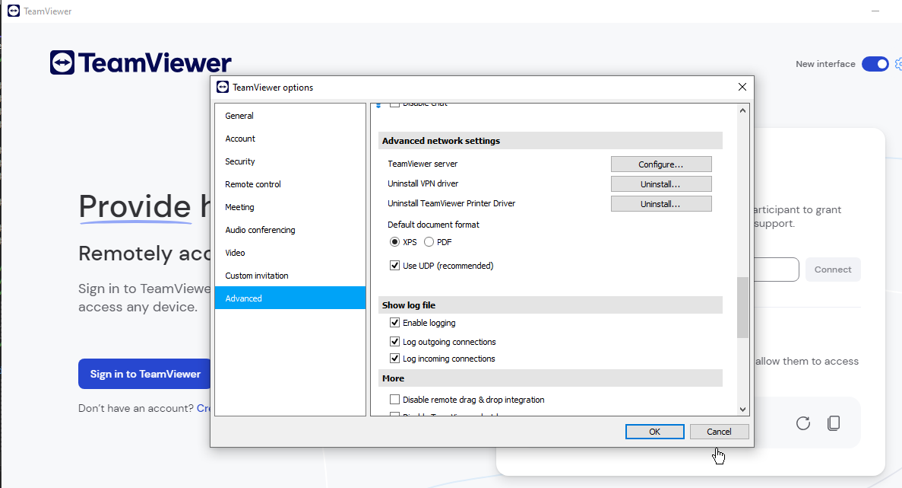
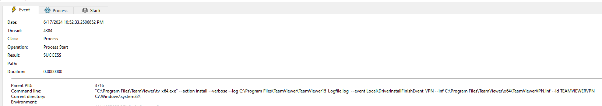
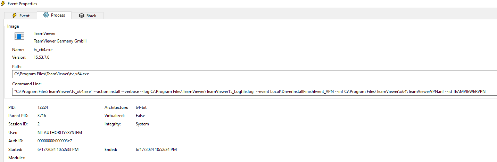
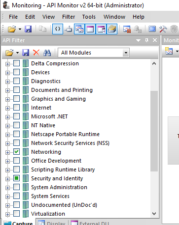
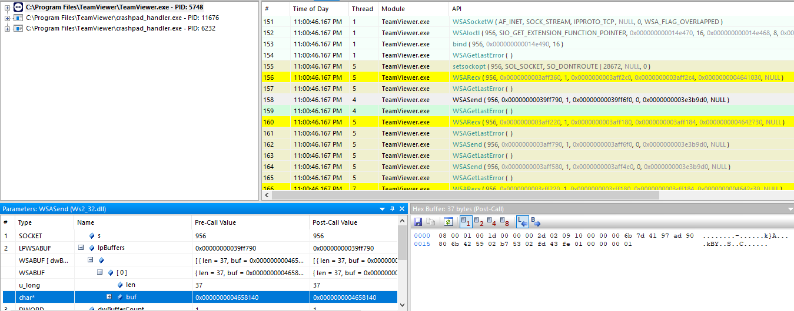
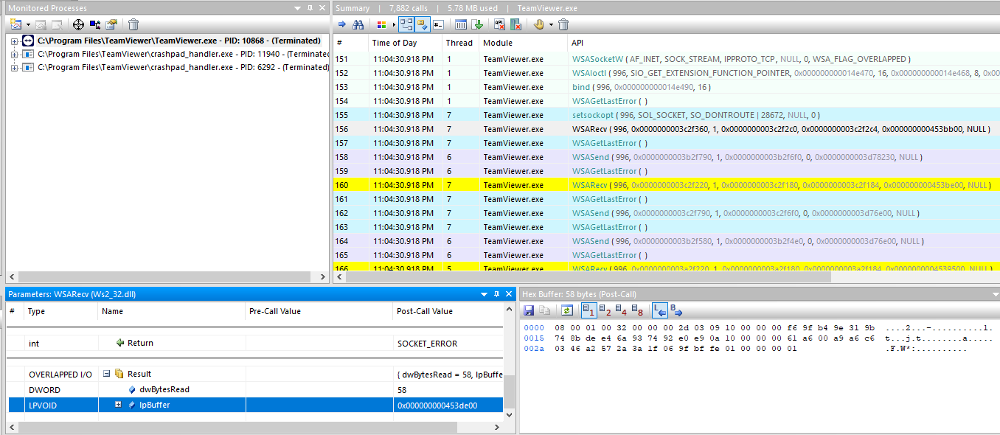
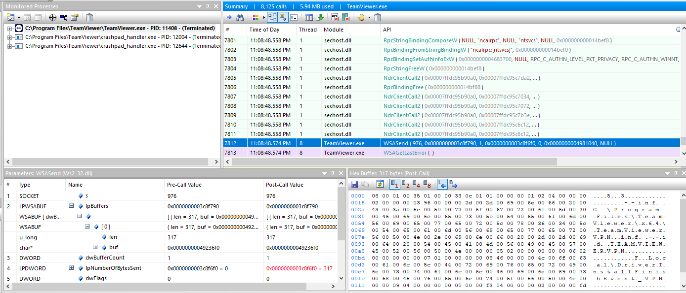
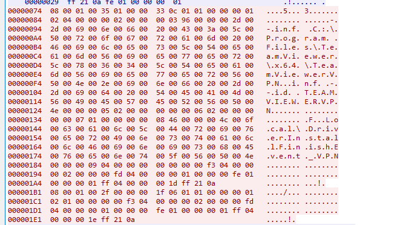
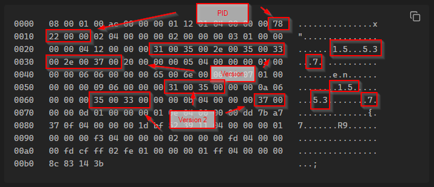

---

layout: post
title: Finding TeamViewer 0days - Part I
lang: en
lang-ref: finding-tv-0days
categories: [Windows security, TeamViewer]
tags: [windows, cybersecurity, CVE-2024-7479, CVE-2024-7481, ZDI-24-1289, ZDI-24-1290, tv-2024-1006, red team, pentesting]

---

# Finding TeamViewer 0days. Part 1: The story begins

This series of blog posts are about some findings related to TeamViewer (TV) IPC communication with its SYSTEM service. I was trying to find some vulnerabilities in TeamViewer client and ended up researching how the communication with its helper service works. After being able to *spoof* (just some simple authentication as we will see) a valid TeamViewer client when connecting to the SYSTEM service IPC, it was possible to trigger an arbitrary driver installation. TeamViewer was not verifying the signature of the driver being installed. They passed the arbitrary *inf* to *UpdateDriverForPlugAndPlayDevices*.

Thus a privilege escalation USER to KERNEL was possible thanks to TeamViewer.

As we will see, one of the best approaches is to use the well-known technique *BYOD, Bring Your Own Vulnerable Driver* to load a valid signed driver into Windows Kernel and then exploit it in order to perform privileged actions from user level, like changing the token of an arbitrary process with a privileged one.

[](../../assets/img/finding-tv-0days-1/logo.webp){:target="_blank"}
## Background

First of all, some background in order to understand some later things. This vulnerability is not exploitable when TeamViewer is just run on the system, it is necessary to install TeamViewer.

When TeamViewer is installed on the system, it creates a service that runs as SYSTEM, *TeamViewer_service.exe*

This service is a helper for the client to some tasks. Thus, the client does not run with elevated privileges and some tasks are delegated to the service.

The communication with the service (IPC) is implemented through sockets (using *Overlapped I/O* and *IoCompletionPort*). By default, TeamViewer SYSTEM services listens on ***5939/tcp*** at localhost.

```
C:\Windows\system32>netstat -ano | findstr /i 15792
  TCP    127.0.0.1:5939         0.0.0.0:0              LISTENING       15792
  TCP    127.0.0.1:5939         127.0.0.1:64668        ESTABLISHED     15792
  [...]
```

I tested and the exploit worked on the following TV versions:
- 15.53.7
- 15.54.6

While testing with TeamViewer some functionality attracted my attention. The ability to install its VPN and Printer Driver just by click. I tested with an unprivileged users and it worked too. 

Curiosity killed the cat.

So, the question is, how is that implemented :)? And the journey researching started.

[](../../assets/img/finding-tv-0days-1/Pasted image 20240617222935.png){:target="_blank"}

## First Steps

At my first try, I was running TV with an administrator user, although with Medium Integrity Level.

So I tried launching the Driver Install with an unprivileged user and that **worked too**.

TeamViewer logged the installation process. Fourth columns indicates *which* entity logged. *S0* is for SYSTEM process logs. The symbol after *S0* indicates the type of log, *+* appears to indicate level of verbosity. More *+*, move verbose. When a error occurs, *!* are used.

```
2024/05/26 20:36:39.130  2036      10604 S0+  GetSimpleDisplayCertNameFromFile: Found cert name: 'TeamViewer Germany GmbH'.
2024/05/26 20:36:39.130  2036      10604 S0+  VerifyTeamViewerCertificate: File for loading certificate is C:\Program Files\TeamViewer\tv_x64.exe
2024/05/26 20:36:39.130  2036      10604 S0+  VerifyTeamViewerCertificate: SHA256 code path.
2024/05/26 20:36:39.130  2036      10604 S0+  SHA256 certificate check.
2024/05/26 20:36:39.130  2036      10604 S0+  VerifyCertHash(): Certificate check succeded.
2024/05/26 20:36:39.130  2036      10604 S0+  tvnetwork::IpcLoaderProcessHandlerWin::Received_StartLoaderProcess: Starting Loader Process C:\Program Files\TeamViewer\tv_x64.exe (type 2) for ID 1500170772 in session 2 with args --action install --verbose --log C:\Program Files\TeamViewer\TeamViewer15_Logfile.log  --event Local\DriverInstallFinishEvent_VPN --inf C:\Program Files\TeamViewer\x64\TeamViewerVPN.inf --id TEAMVIEWERVPN
2024/05/26 20:36:39.130  2036      10604 S0   CToken::GetSystemToken() set session 2
2024/05/26 20:36:39.130  2036      10604 S0+  ProcessWin::CreateProcessInternal: CreateProcess C:\Program Files\TeamViewer\tv_x64.exe AsUser
2024/05/26 20:36:39.130  2036      10604 S0   tvnetwork::IpcLoaderProcessHandlerWin::Received_StartLoaderProcess: Loader process started, pid = 13920
2024/05/26 20:36:39.146 13920 14904 L64  Loader started with: "C:\Program Files\TeamViewer\tv_x64.exe" --action install --verbose --log C:\Program Files\TeamViewer\TeamViewer15_Logfile.log  --event Local\DriverInstallFinishEvent_VPN --inf C:\Program Files\TeamViewer\x64\TeamViewerVPN.inf --id TEAMVIEWERVPN
```

Notice last line, where it is possible to observer that a helper binary is being launched as SYSTEM.

```
2024/05/26 20:36:39.146 13920 14904 L64  Loader started with: "C:\Program Files\TeamViewer\tv_x64.exe" --action install --verbose --log C:\Program Files\TeamViewer\TeamViewer15_Logfile.log  --event Local\DriverInstallFinishEvent_VPN --inf C:\Program Files\TeamViewer\x64\TeamViewerVPN.inf --id TEAMVIEWERVPN
```

Interesting, a SYSTEM process is being created that installs the driver given an *INF* file. This process ends calling `UpdateDriverForPlugAndPlayDevicesA` without verification of the signature (*Catalog File*).
- https://learn.microsoft.com/en-us/windows/win32/api/newdev/nf-newdev-updatedriverforplugandplaydevicesa

[](../../assets/img/finding-tv-0days-1/Pasted image 20240617225325.png){:target="_blank"}
[](../../assets/img/finding-tv-0days-1/Pasted image 20240617225340.png){:target="_blank"}

Where that parameters come from? 

I started then investigating the IPC communication. After some *API Monitor* (what a f\*cking such great tool) hours. I will not bore you with the trial and error of different filters and time studying IPC communication. We now know that is using *5939/tcp*, so lets analyze *Networking APIs*.

[](../../assets/img/finding-tv-0days-1/Pasted image 20240617225946.png){:target="_blank"}

When launching TV it is possible to see that it is using a proprietary protocol. One can think at first that it is encrypted or something like that. But not, TV is not using encryption on its communication.

[](../../assets/img/finding-tv-0days-1/Pasted image 20240617230110.png){:target="_blank"}

[](../../assets/img/finding-tv-0days-1/Pasted image 20240617230549.png){:target="_blank"}

The interesting part is, what happens when the button of *Install VPN Driver* is clicked?

[](../../assets/img/finding-tv-0days-1/Pasted image 20240617231058.png){:target="_blank"}

Oh, oh, Houston...

The client is sending the *INF* parameter to the SYSTEM service and the SYSTEM service calling the *tv_x64.exe* with that parameter.

So the idea was clear, if we send an IPC message to the SYSTEM service indicating an arbitrary *INF* parameter, will we install an arbitrary driver?

Here is another view from Wireshark.

[](../../assets/img/finding-tv-0days-1/Pasted image 20240617231517.png){:target="_blank"}

(Not just the INF parameter is send, but I am skipping the other part as the most relevant one is the INF parameter. Notice the Event message *Local\\DriverInstallFinishEvent*).
## IPC Communication Protocol

This part is the consequence of all the reversing and research of the TV adventure. Chronologically it should be placed the last one, but I think the next sections will be understood better if we first study the IPC communication protocol.

TV IPC messages are simple. The all have the following structure.

```
HEADER
BODY
TAIL
```

We have a *Header* that contains some metadata for the message itself, like the length, the type of message, the length of itself, etc.

We then have the body with the data of the message at issue.

Finally we have a tail that contains always the same signature plus some identifier.

## HEADER

The header is 8-bytes long, but I will consider it as 16-bytes long because after that comes another sub header of another 8 bytes before the body. So, to our understanding, we have 16-byte header before the body. It contains the following fields, where *IDK* means *I don't kwon*.

```
|  0   ||  1   ||  2   ||  3   ||  4   ||  5   ||  6   ||  7   ||  8   ||  9   ||  10   ||  11   ||  12   ||  13   ||  14   ||  15   ||  16   |

| Length of Header || IDK || IDK || IDK || 4-byte Msg Length || 3-byte Msg Length || 2-byte Msg Length || 1-byte Msg Length || IDK || Type of Message || IDK || Direction (Client or Server MSG) || IDK || IDK || IDK || IDK |
```

I have always see the header having 8-bytes, so the first byte of the message is always 0x08.

## BODY

What to say? This part contains the non-encrypted data. Like the *INF* parameter :).
## TAIL

I have found that the last part of the IPC message may vary, but it always start with *0xfe 0x01 0x00 0x00*

I have not investigate in depth this part, I have always maintain the same bytes copied from capture messages.

The last 4-bytes appears to be an identifier. 

Here are the exact messages most relevant for this research.
### Authentication Messages

I will get into more detail about the authentication process in the dedicated part about it (Part 2). This subsection will describe the message itself.

The authentication process has two types of messages. One type of messages that is used by the client and the other type of message that is used by the server. The difference between this two is that *Client -> Server* message contains 8-byte in the body, while the server contains 16-byte in the body. We will see it later why.

**Messages from client to server**

Here it is possible to see a message from client to server that we will thresh.

```
0000   08 00 01 00 1d 00 00 00 2d 02 09 10 00 00 00 b7   ........-.......
0010   48 77 26 8a 72 b8 f0 fe 57 04 03 fc 64 2e b0 fe   Hw&.r...W...d...
0020   01 00 00 00 01                                    .....
```

- First of all we have the header
	- `08 00 01 00 1d 00 00 00`
	- As we can see it is 8-bytes long (as indicated by the first byte). The next three bytes appear to be always the same and I do not known exactly their task.
	- Then we have the next 4-bytes, indicating the length of the message.
- The we have the *sub header*
	- `2d 02 09 10 00 00 00`
	- This *sub header* is indicating the type of message. `2d 02 09` is for *Authentication Message* client to server, while, as we will see, `2d 03 09` is for *Authentication Message* Server to client
	- I do not know what `10 00 00 00` represent, it is the same sequence in both direction of the message.
- Then we have the 16-byte challenge sent by the client to the server.
	- `b7 48 77 26 8a 72 b8 f0 fe 57 04 03 fc 64 2e b0`
- At the end we have the tail. I dot not know exactly what indicates this bytes, but it is always the same.
	- `fe 01 00 00 00 01`

**Message from Server to Client**

Here it is possible to see a message from server to the client that we will thresh too.

```
0000   08 00 01 00 32 00 00 00 2d 03 09 10 00 00 00 29   ....2...-......)
0010   7e d4 88 48 ed 9e 18 5c 3a 4a 12 ce 6e ab 22 0a   ~..H...\:J..n.".
0020   10 00 00 00 4b 85 07 8b 3f 21 76 0d a5 fa 62 9b   ....K...?!v...b.
0030   a7 5e d1 4a fe 01 00 00 00 01                     .^.J......
```

In this case, we have mostly the same, but in this case the message is larger because we have two 16-byte message in this body. The first 16-byte is the challenge sent by the server and the next 16-byte is the response to our sent challenge.

- First of all we have the header
	- `08 00 01 00 1d 00 00 00`
	- As we can see it is 8-bytes long (as indicated by the first byte). The next three bytes appear to be always the same and I do not known exactly their task.
	- Then we have the next 4-bytes, indicating the length of the message.
- The we have the *sub header*
	- `2d 03 09 10 00 00 00`
	- This *sub header* is indicating the type of message, `2d 03 09`. Notice that before we had `2d 03 09`.
	- I do not know what `10 00 00 00` represent, it is the same sequence in both direction of the message.
- Then we have the 16-byte challenge sent by the server to the client.
	- `29 7e d4 88 48 ed 9e 18 5c 3a 4a 12 ce 6e ab 22`
- After that comes the *separator*
	- `0a 10 00 00 00`
- Then we have the response to our challenge from the server.
	- `4b 85 07 8b 3f 21 76 0d a5 fa 62 9b a7 5e d1 4a`
- At the end we have the tail. I dot not know exactly what indicates this bytes, but it is always the same.
	- `fe 01 00 00 00 01`
### Control IPC Message

Once the authentication has completed successfully the client sent to the server a message that contains the PID of process connecting and a identifier and the version, that need to Mach with the TeamViewer Service version. There is more data but I have not researched about it and appeared to not be relevant, so I just maintain the same bytes when connecting from the exploit.

Here is an example message.

```
0000   08 00 01 00 ac 00 00 00 01 12 01 04 00 00 00 78   ...............x
0010   22 00 00 02 04 00 00 00 02 00 00 00 03 01 00 00   "...............
0020   00 00 04 12 00 00 00 31 00 35 00 2e 00 35 00 33   .......1.5...5.3
0030   00 2e 00 37 00 20 00 00 00 05 04 00 00 00 01 00   ...7. ..........
0040   00 00 06 06 00 00 00 65 00 6e 00 00 00 07 01 00   .......e.n......
0050   00 00 00 09 06 00 00 00 31 00 35 00 00 00 0a 06   ........1.5.....
0060   00 00 00 35 00 33 00 00 00 0b 04 00 00 00 37 00   ...5.3........7.
0070   00 00 0d 01 00 00 00 01 0e 04 00 00 00 dd 7b a7   ..............{.
0080   37 0f 04 00 00 00 1d bf 52 39 11 04 00 00 00 01   7.......R9......
0090   00 00 00 f3 04 00 00 00 02 00 00 00 fd 04 00 00   ................
00a0   00 fd cf ff 02 fe 01 00 00 00 01 ff 04 00 00 00   ................
00b0   8c 83 14 3b                                       ...;
```

Again, we start with a similar header.

- First of all we have the header
	- `08 00 01 00 ac 00 00 00`
	- As we can see it is 8-bytes long (as indicated by the first byte). The next three bytes appear to be always the same and I do not known exactly their task.
	- Then we have the next 4-bytes, indicating the length of the message.
- The we have the *sub header*
	- `01 12 01 04 00 00 00`. This indicates the type of message. 
- Then, we have 4-byte indicating the PID connecting.
	- `78 22 00 00`. 8824 in this case.
- Then, in bytes 0x27 to 0x34 we have the version of TeamViewer. In this case it is 15.53.7.
	- This needs to match with the TeamViewer service. In this case, if the TeamViewer client indicates a version different of 15.53.7 the IPC connection will be terminated by the service because of the version mismatch.
	- `31 00 35 00 2e 00 35 00 33 00 2e 00 37`
- The version is later on the message again, but separated by each number of the versoin.
	- In bytes 0x58 to 0x5b we have the major number of the version. 15 in this case
	- In bytes 0x63 to 0x66 we have the medium number of the version.
	- In bytes 0x6e to 0x6f we have the last number of the version.
- [](../../assets/img/finding-tv-0days-1/Pasted image 20240621210706.png){:target="_blank"}
- The rest of the body I do not known what it does, it was necessary only to write the correct PID.
- In this case the tail is a bit different because it contains the following bytes after the common one, `ff 04 00 00 00 95 d4 04 31`.
- At the end there it is a generated identifier that is used in later messages.
	- `8c 83 14 3b`
- I have also see that the language is indicate in this message. In this case *en*. 
### Driver Install Request Message

Once we have authenticated and we have send the *Control IPC message* with the correct PID we are able to send the *Driver Install Message*. YUP! :).

In this message, among other things, we are indicating the *--inf* parameter that will be used later by the SYSTEM process, allowing us to install an arbitrary Kernel Driver from an unprivileged user.

Here is an example message.

```
0000   08 00 01 00 35 01 00 00 33 0c 01 01 00 00 00 01   ....5...3.......
0010   02 04 00 00 00 02 00 00 00 03 96 00 00 00 2d 00   ..............-.
0020   2d 00 69 00 6e 00 66 00 20 00 43 00 3a 00 5c 00   -.i.n.f. .C.:.\.
0030   4e 00 6f 00 74 00 20 00 50 00 72 00 6f 00 67 00   N.o.t. .P.r.o.g.
0040   72 00 61 00 6d 00 20 00 46 00 5c 00 61 00 61 00   r.a.m. .F.\.a.a.
0050   61 00 61 00 61 00 61 00 61 00 61 00 61 00 61 00   a.a.a.a.a.a.a.a.
0060   5c 00 62 00 62 00 62 00 5c 00 41 00 6e 00 6f 00   \.b.b.b.\.A.n.o.
0070   74 00 68 00 65 00 72 00 54 00 68 00 69 00 6e 00   t.h.e.r.T.h.i.n.
0080   67 00 67 00 2e 00 69 00 6e 00 66 00 20 00 2d 00   g.g...i.n.f. .-.
0090   2d 00 69 00 64 00 20 00 54 00 45 00 41 00 4d 00   -.i.d. .T.E.A.M.
00a0   56 00 49 00 45 00 57 00 45 00 52 00 56 00 50 00   V.I.E.W.E.R.V.P.
00b0   4e 00 00 00 05 02 00 00 00 00 00 06 02 00 00 00   N...............
00c0   00 00 07 01 00 00 00 00 08 46 00 00 00 4c 00 6f   .........F...L.o
00d0   00 63 00 61 00 6c 00 5c 00 44 00 72 00 69 00 76   .c.a.l.\.D.r.i.v
00e0   00 65 00 72 00 49 00 6e 00 73 00 74 00 61 00 6c   .e.r.I.n.s.t.a.l
00f0   00 6c 00 46 00 69 00 6e 00 69 00 73 00 68 00 45   .l.F.i.n.i.s.h.E
0100   00 76 00 65 00 6e 00 74 00 5f 00 56 00 50 00 4e   .v.e.n.t._.V.P.N
0110   00 00 00 09 04 00 00 00 00 00 00 00 f3 04 00 00   ................
0120   00 02 00 00 00 fd 04 00 00 00 01 00 00 00 fe 01   ................
0130   00 00 00 01 ff 04 00 00 00 95 d4 04 31            ............1
```

- First of all we have the header
	- `08 00 01 00 35 01 00 00`
	- As we can see it is 8-bytes long (as indicated by the first byte). The next three bytes appear to be always the same and I do not known exactly their task.
	- Then we have the next 4-bytes, indicating the length of the message.
- The we have the *sub header*
	- `33 0c 01 01 00 00 00`. This indicates the type of message.
- Then, we have 22 bytes that I always maintain the same and I actually do not kwow that the mean.
- After that, there is the *--inf* parameter string.
- There comes some other parameters and the end.
- In this case the tail is a bit different because it contains the following bytes after the common one, `ff 04 00 00 00 95 d4 04 31`.
## First Fail: Authentication needed

My first try was to just send the Driver installation request. Short story, it does not work.

I started looking at the log and it contained an error message from the *IPC Structure Parser* because it is expecting some type of message (the authentication one) that is different from the one we are sending.

It was then when I started capturing legitimate traffic and searching for patterns. I notice that the server was sending the 16-byte message shown before and that when sending the same first message the server responds back with the same 16-byte.

*ChatGPT* started to help me to perform some analytical analysis from different inputs and we concluded that TV was using some type of encryption or hashing and not simple binary operations.

When sending a well formatted message TV started to log *invalid response* from *Received_IPC_Auth()*. 

```
2024/05/26 19:03:04.770  3268       3660 S0!! InterProcessNetwork::Received_IPCAuth() invalid response
```

So, we have to correctly authenticate first. As we will see, the authentication algorithm is not robust.
## Second Fail: Failing back to reversing

Before starting reversing I tried if it was possible to take a shortest path. I tried to figure if there where some way of making TV showing why the authentication was failing.

I found a way to enable verbose and debug log output. TV do not log why the authentication is failing in the IPC, but I think is work mentioning and documenting all the registry keys the TV service tries to query and to take a note on the most interesting ones.

I attach the process monitor result here: TODO INSERT LINK

- *IPC_Port_Service*: can be used to change the port where the SYSTEM service IPC listens.
- *Log_Level*: it enables to modify the type of logs included. A tried so many values but did not take note of all sorry. Only for the debug, **0x40**.
- *LogLevelVerboseStarted*: I have not seen any difference, but apparently it enables verbosity logging.
- *IPCPassword*: I have not tested it, but it should change the IPC secret.
- *HooksLogVerbose*: enable logging TV *hooks* in the file *TeamViewer15_Hooks.log*.


This approach was not successful, unless it was funny to understand another parts of TV. Like enabling debug output in the logs for example, and I think is worth the time.

Finally, I ended up reversing the authentication mechanism. We will see that in detail in Part 2.

After that, in Part 3, we will take a look at the exploit and how all the gear parts agree in order to enable privilege scalation from user to Kernel.
