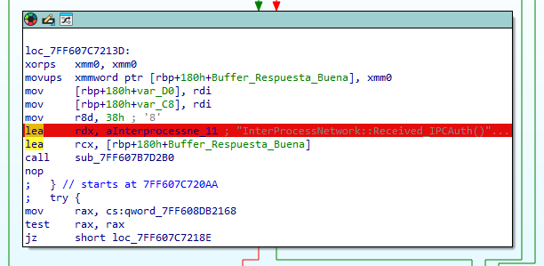
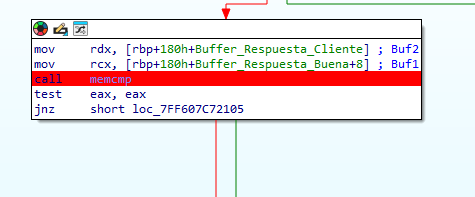
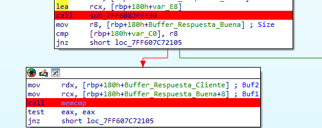
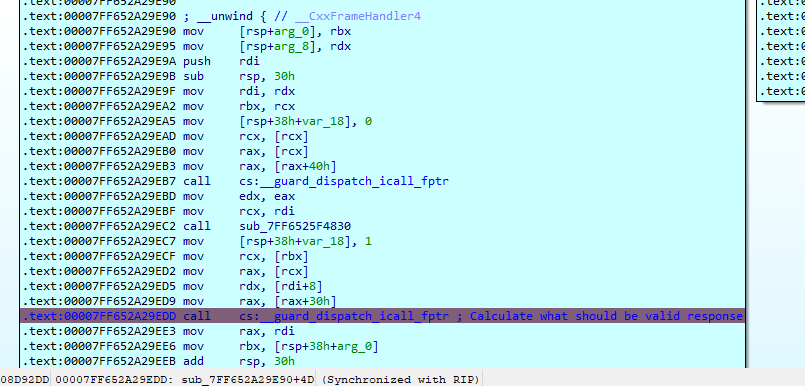
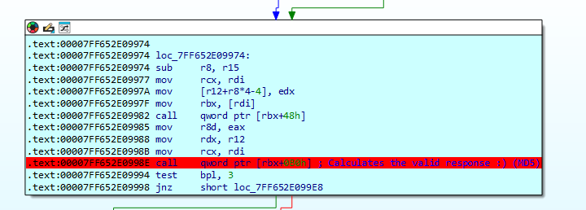
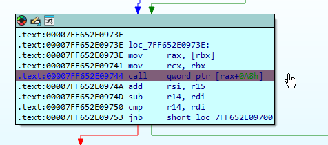
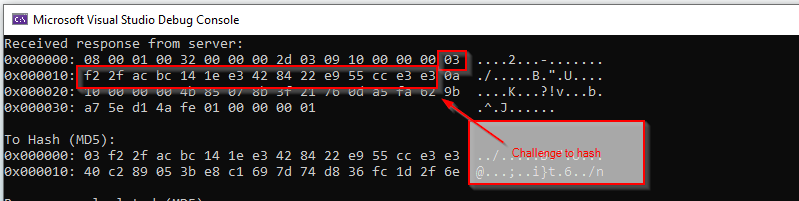
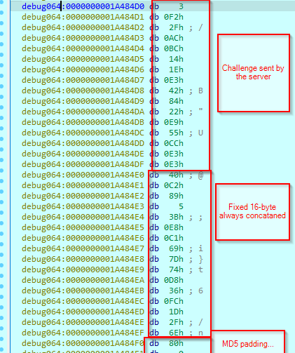
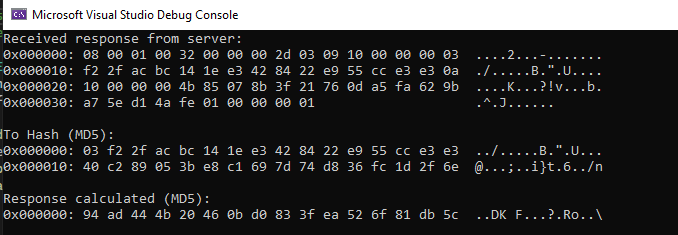

---

layout: post
title: Finding TeamViewer 0days - Part II
lang: en
lang-ref: finding-tv-0days-2
categories: [Windows security, TeamViewer]
tags: [windows, cybersecurity, CVE-2024-7479, CVE-2024-7481, ZDI-24-1289, ZDI-24-1290, tv-2024-1006, red team, pentesting]

---

# Finding TeamViewer 0days. Part 2: Reversing the Authentication Protocol

I started reversing the client in order to find how the authentication was being made. I will skip this whole part as I finally ended understanding the authentication method revering the service.

Reversing the client was a tedious task because of Overlapped I/O, multiple threads handling it, CFG and so on. This conducted me so many times to rabbit holes and messy routes.

I think that showing the reversing process of the client will not contribute worthy to the post, so skipping it to the important part.

Summarizing the process:

- The client send a challenge in the Authentication Message we saw at part 1.
- The server responds with its challenge plus the calculated response from client challenge.
- The client should validate the challenge to detect that is no connecting to a rogue TV service. In our case we can omit this part, we only care about authenticating correctly to the service.
- The client calculates the response based on the server challenge and send it in a new message.

## Where To Start?

When starting to reverse the client I thought that we had a very nice clue. We known that TeamViewer logs:
- `2024/05/26 19:03:04.770  3268       3660 S0!! InterProcessNetwork::Received_IPCAuth() invalid response`

So, the first thing was to find this string. A simple search string in IDA returned the following cross reference.

[](../../assets/img/finding-tv-0days-2/Pasted image 20240619222157.png){:target="_blank"}

Pulling back we can reach where the final compare is being made, checking if the response send by the client matches the correct value.

[](../../assets/img/finding-tv-0days-2/Pasted image 20240619223033.png){:target="_blank"}

## Following the process

When studying the process, the following function was the responsible for returning the expected output.

[](../../assets/img/finding-tv-0days-2/Pasted image 20240619225558.png){:target="_blank"}

I will show the process that this functions follows.

This function is a helper that actually calls another one.

[](../../assets/img/finding-tv-0days-2/Pasted image 20240619230143.png){:target="_blank"}

We finally ends (after another call to a helper), calling the function that performs all the magic. 

[](../../assets/img/finding-tv-0days-2/Pasted image 20240619230317.png){:target="_blank"}

We then end in a loop that calls one function in its body.

[](../../assets/img/finding-tv-0days-2/Pasted image 20240619230443.png){:target="_blank"}

What is this function peforming?

I will show you the first lines of the decompiled code.

```
_int64 __fastcall sub_7FF7E93DD240(_DWORD *a1, _DWORD *a2)
{
  [...VARS...]

  v2 = a1[1];
  v3 = a2;
  v4 = a1[2];
  v5 = a1[3];
  v6 = a2[5];
  v83 = *a2;
  v85 = a2[1];
  v7 = v2 + __ROL4__(*a2 + (v5 ^ v2 & (v4 ^ v5)) + *a1 - 680876936, 7);
  v80 = a2[2];
  v8 = v7 + __ROL4__(v85 + (v4 ^ v7 & (v2 ^ v4)) + v5 - 389564586, 12);
  v84 = v3[3];
  v9 = v8 + __ROL4__(v80 + (v2 ^ v8 & (v7 ^ v2)) + v4 + 606105819, 17);
  v78 = v3[4];
  v10 = v9 + __ROL4__(v84 + (v7 ^ v9 & (v7 ^ v8)) + v2 - 1044525330, 22);
  v77 = v3[6];
  v11 = v10 + __ROL4__(v78 + (v8 ^ v10 & (v9 ^ v8)) + v7 - 176418897, 7);
  v12 = v11 + __ROL4__(v6 + (v9 ^ v11 & (v10 ^ v9)) + v8 + 1200080426, 12);
  v13 = v12 + __ROL4__(v77 + (v10 ^ v12 & (v11 ^ v10)) + v9 - 1473231341, 17);
```

Do you recognize it? It so, congrats. If not, do not worry, me too at the first time and ChatGPT helped me. 

This is the MD5 *Core* function. So basically TV is performing MD5 hashing. Let's take a look at what is being hashed.

In this example execution of the exploit we received the following challenge.

`03 f2 2f ac bc 14 1e e3 42 84 22 e9 55 cc e3 e3`

[](../../assets/img/finding-tv-0days-2/Pasted image 20240619230952.png){:target="_blank"}

But, when analyzing the parameters passed to the MD5 hashing core function we see the following.

[](../../assets/img/finding-tv-0days-2/Pasted image 20240619231327.png){:target="_blank"}

So TV concatenates the challenge the following bytes

- `40 C2 89 05 3B E8 C1 69 7D 74 D8 36 FC 1D 2F 6E`

I have not tested it, but I believe this can be changed with the *IPCPassword* registry key we saw in part 1.

One important thing, this is the *password* used by the *SERVER* challenge.

For *CLIENT* *challenges* a different one is used: `43 6E 67 62 F2 5E A8 D7 04 E5 22 BF A5 5D A1 6A`

So basically in order the authenticate we just need to *MD5(CHALLENGE+STATIC KEY)*.

After that we then need to send the *ControlIPC* indicating the correct PID. I believe that any current process PID could be valid, but I have not tested it. In the exploit the current process PID is sent. Indicating a PID for a non-existent process will make it fail.

[](../../assets/img/finding-tv-0days-2/Pasted image 20240619232449.png){:target="_blank"}

In Part 3 we will have fun writing the exploit and finally use it to elevate privileges.
