---

layout: post
title: Finding TeamViewer 0days - Part III
lang: en
lang-ref: finding-tv-0days-3
categories: [Windows security, TeamViewer]
tags: [windows, cybersecurity, CVE-2024-7479, CVE-2024-7481, ZDI-24-1289, ZDI-24-1290, tv-2024-1006, red team, pentesting]

---

# Finding TeamViewer 0days. Part 3: Putting it all together. PARTY TIME :)!

Now comes the interesting part. I am sorry about the two last lazy parts, but I wanted to explain the whole process :).

Because I had spoiled you, we already know that TV is not filtering the parameter sent by the client to ask for the driver installation nor signature check, etc.

So the idea that we will review in this part is: we will spoof a TV client an asks for a VPN Driver installation but indicating another INF. I reutilized the same original INF of TeamViewer but in another (non-privileged) path renaming the "bad" driver to teamviewervpn.sys, as this is the driver name being targeted by the original INF.

First of all, you can find the project here:
- [https://github.com/PeterGabaldon/CVE-2024-7479_CVE-2024-7481](https://github.com/PeterGabaldon/CVE-2024-7479_CVE-2024-7481){:target="_blank"}

## IMPORTANT NOTE

This bypasses also TeamViewer option *Changes require administrative rights on this computer*.

This check is only effective via the GUI, as *TeamViewer options* is disabled when clicking the button with an unprivileged user. But it is possible to connect to the socket and perform the arbitrary driver load.

[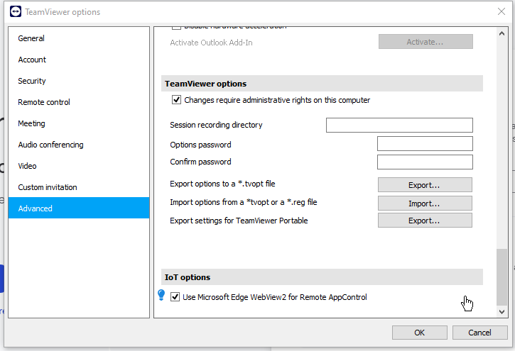](../../assets/img/finding-tv-0days-3/Pasted image 20240620220926.png){:target="_blank"}

## IMPORTANT NOTE II

The exploit is version dependant because of the IPC message where the client specified its PID and another data among the version. The version of the client must match the version of the SYSTEM service. The exploit must be modified (lines 140 to 143) in Main.cpp to the TeamViewer_service.exe version that is being targeted.
## Coding the Exploit

We will start by defining the structures of the IPC messages involved.

[](../../assets/img/finding-tv-0days-3/Pasted image 20240620194205.png){:target="_blank"}

We will use it to send the necessary messages over the sockets using the TV IPC protocol. 

We also will need the MD5 implementation, which I will skip. I have also used the following *hpp* for hexadecimal output printing.
- [https://github.com/zmb3/hexdump/blob/master/Hexdump.hpp](https://github.com/zmb3/hexdump/blob/master/Hexdump.hpp){:target="_blank"}

First of all, we will start connecting to the socket.

[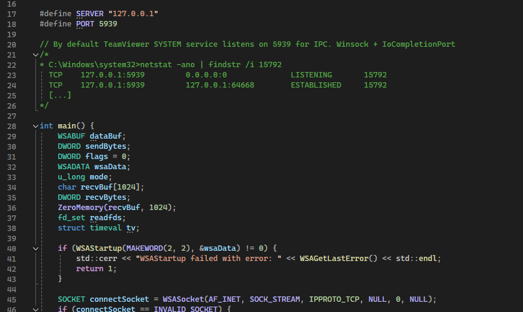](../../assets/img/finding-tv-0days-3/Pasted image 20240620194441.png){:target="_blank"}

[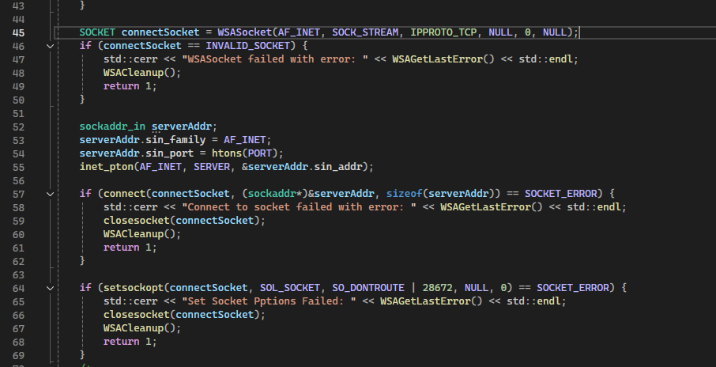](../../assets/img/finding-tv-0days-3/Pasted image 20240620194456.png){:target="_blank"}

I decided to not use *Completion I/O Port* nor *Overlapped IO*. Technically, TV is listening like any other socket, so I will just connect *normally*.

One we have connected to *5939/tcp*, we need to send the first message, which is the first authentication one where the client sends it challenge.

[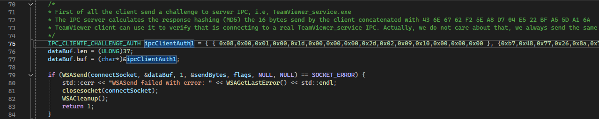](../../assets/img/finding-tv-0days-3/Pasted image 20240620194739.png){:target="_blank"}

`IPC_CLIENTE_CHALLENGE_AUTH ipcClientAuth1 = { { 0x08,0x00,0x01,0x00,0x1d,0x00,0x00,0x00,0x2d,0x02,0x09,0x10,0x00,0x00,0x00 }, {0xb7,0x48,0x77,0x26,0x8a,0x72,0xb8,0xf0,0xfe,0x57,0x04,0x03,0xfc,0x64,0x2e,0xb0}, {0xfe,0x01,0x00,0x00,0x00,0x01} };`

We can always same the same challenge, it does not matter.

Then, we will receive the response from the server containing its challenge plus the response to our. We can just ignore the response and calculate the correct response for its challenge.

[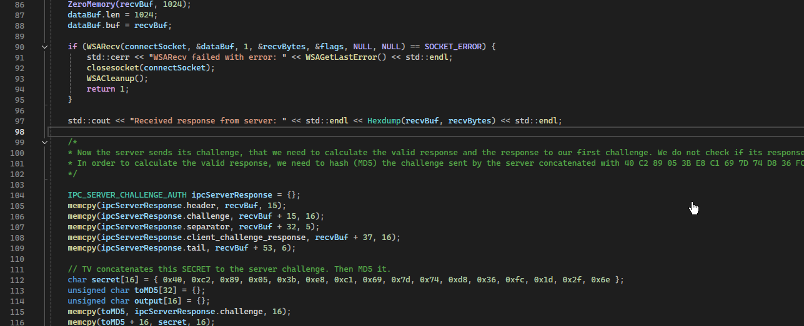](../../assets/img/finding-tv-0days-3/Pasted image 20240620194946.png){:target="_blank"}
[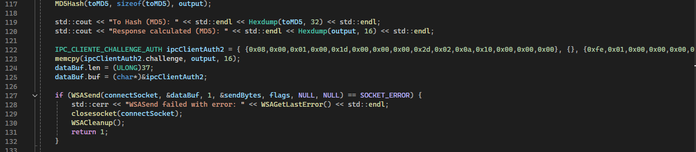](../../assets/img/finding-tv-0days-3/Pasted image 20240620195003.png){:target="_blank"}

And then *send* the calculated response in an *Authentication Message*.

Now it is time to send the *Control IPC* message indicating the PID of the process. As I stated in the first part, I have not reversed the rest of the fields, but just indicating the correct PID and a correct identifier at the end is sufficient.

[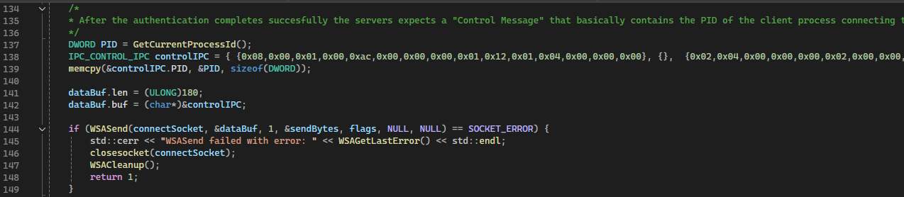](../../assets/img/finding-tv-0days-3/Pasted image 20240620195140.png){:target="_blank"}

After that the service start to sends us some messages about configuration, it tries to sync some config. We just need to read all this packets, but it is not necessary to do anything with this information.

[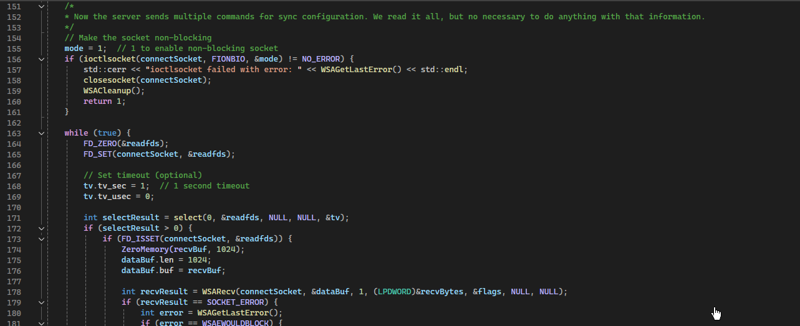](../../assets/img/finding-tv-0days-3/Pasted image 20240620195325.png){:target="_blank"}
[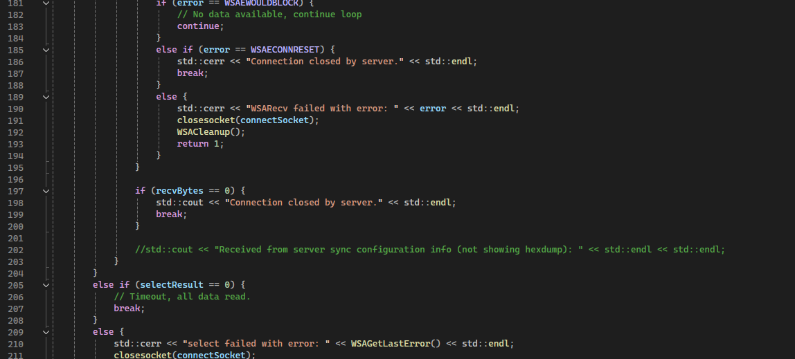](../../assets/img/finding-tv-0days-3/Pasted image 20240620195505.png){:target="_blank"}
[](../../assets/img/finding-tv-0days-3/Pasted image 20240620195604.png){:target="_blank"}

After that then comes the most interesting part. We are ready to send the *Driver Install* request.

### IMPORTANT NOTE

I do not know why because I have not analyzed it, but it appears that not all paths works. At first I thought it was the length, but then tried different lengths and ones worked while others not. I think that maybe I got the service a bit crazy with so many tests. I ended up using the following path, **which can be created by a non privileged user by default in Windows**.

- C:\\Not Program F\\aaaaaaaaaa\\bbb\\AnotherThingg.inf

[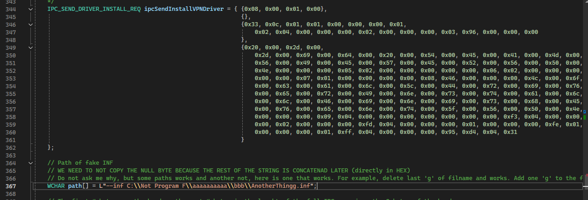](../../assets/img/finding-tv-0days-3/Pasted image 20240620200006.png){:target="_blank"}

The length in the IPC message is just the length of the body data, does not take into account the header. Also, it does not take into account the two bytes of the NULL BYTE (two bytes because is *wide string*). The IPC message does not *null-terminate* the strings.

So we need to calculate the current length taking that into account.

[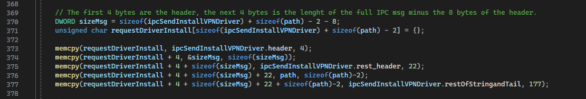](../../assets/img/finding-tv-0days-3/Pasted image 20240620200155.png){:target="_blank"}

Then we are ready to send the magic :).

[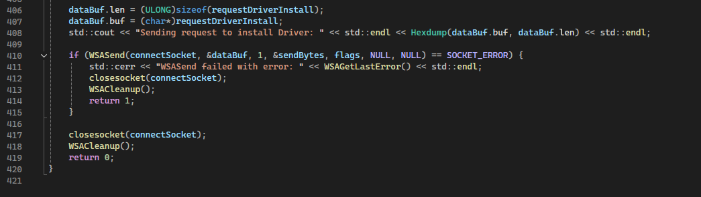](../../assets/img/finding-tv-0days-3/Pasted image 20240620200211.png){:target="_blank"}

## Elevating to Kernel

At first I thought that we could use the INF to create an arbitrary service running as SYSTEM and elevate privileges that way. But the helper program of TV ends calling `UpdateDriverForPlugAndPlayDevicesA` without verification of the signature (*Catalog File*).
- [https://learn.microsoft.com/en-us/windows/win32/api/newdev/nf-newdev-updatedriverforplugandplaydevicesa](https://learn.microsoft.com/en-us/windows/win32/api/newdev/nf-newdev-updatedriverforplugandplaydevicesa){:target="_blank"}

This function updates the INF for an existing hardware based on the hardware ID. I have not found a way to perform the arbitrary service creation. Nevertheless, here is and example INF file. 

```
; ExampleService.inf
; INF file to create a service that executes a binary as SYSTEM

[Version]
Signature="$WINDOWS NT$"
Class=Service
ClassGuid={4D36E97D-E325-11CE-BFC1-08002BE10318}
Provider=%ProviderName%
DriverVer=06/16/2024,1.0.0.0

[DestinationDirs]
DefaultDestDir = 12 ; DIRID_DRIVERS

[SourceDisksNames]
1 = %DiskName%,,,""

[SourceDisksFiles]
ExampleService.exe = 1

[Manufacturer]
%ManufacturerName%=Example,NTx86,NTamd64

[Example.NTx86]
%ServiceName%=ExampleService_Install, Root\LEGACY_ExampleService

[Example.NTamd64]
%ServiceName%=ExampleService_Install, Root\LEGACY_ExampleService

[ExampleService_Install]
CopyFiles = ExampleService_CopyFiles
AddService = ExampleService, 0x00000002, ExampleService_Service_Inst

[ExampleService_CopyFiles]
ExampleService.exe

[ExampleService_Service_Inst]
DisplayName    = %ServiceName%
ServiceType    = 0x10 ; SERVICE_WIN32_OWN_PROCESS
StartType      = 2    ; SERVICE_AUTO_START
ErrorControl   = 1    ; SERVICE_ERROR_NORMAL
ServiceBinary  = %12%\ExampleService.exe
StartName      = LocalSystem

[Strings]
ProviderName="Example Provider"
ManufacturerName="Example Manufacturer"
ServiceName="Example Service"
DiskName="Example Installation Disk"
```

It is necessary to generate the *CAT* with *makecat*.
- [https://learn.microsoft.com/en-us/windows/win32/seccrypto/makecat](https://learn.microsoft.com/en-us/windows/win32/seccrypto/makecat){:target="_blank"}

Finally, I ended up using a easier approach. Let's use *BYOVD, Bring You Own Vulnerable Driver* with the tool  *BYOVDKit*:
- [https://github.com/Hagrid29/BYOVDKit](https://github.com/Hagrid29/BYOVDKit){:target="_blank"}

I just re-used the same INF and CAT of original TeamViewer but replace *teamviewervpn.sys* with the driver we want to load and rename or copy the original *INF*, in this case *AnotherThingg.inf.

[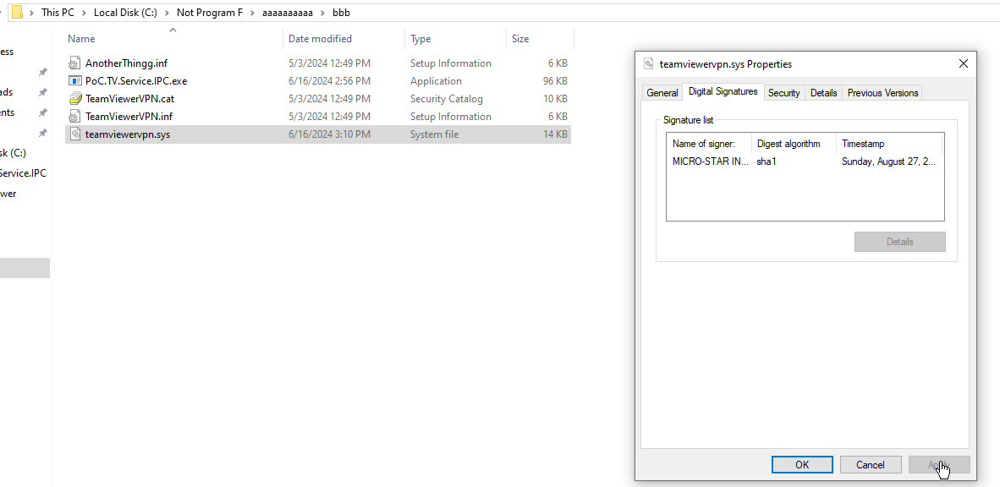](../../assets/img/finding-tv-0days-3/Pasted image 20240620201127.png){:target="_blank"}

We then launch our exploit and the driver gets loaded.

[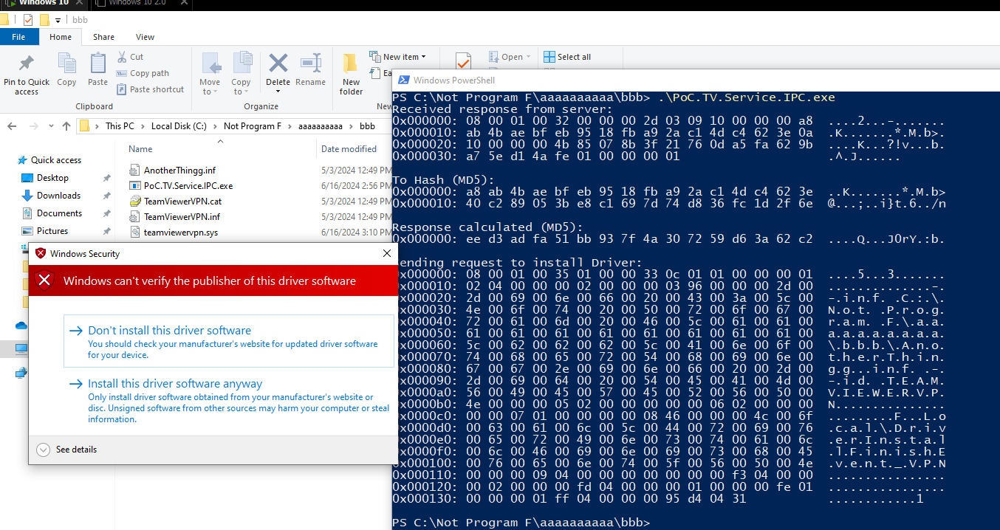](../../assets/img/finding-tv-0days-3/Pasted image 20240620201213.png){:target="_blank"}
[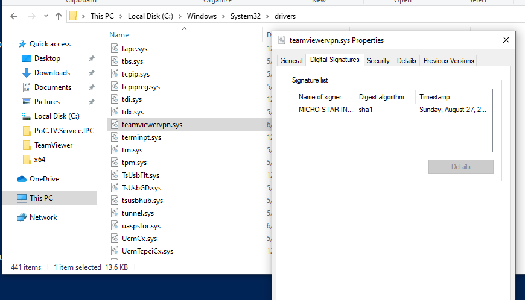](../../assets/img/finding-tv-0days-3/Pasted image 20240620201232.png){:target="_blank"}

We can then leverage the vulnerable driver to elevate privileges.

[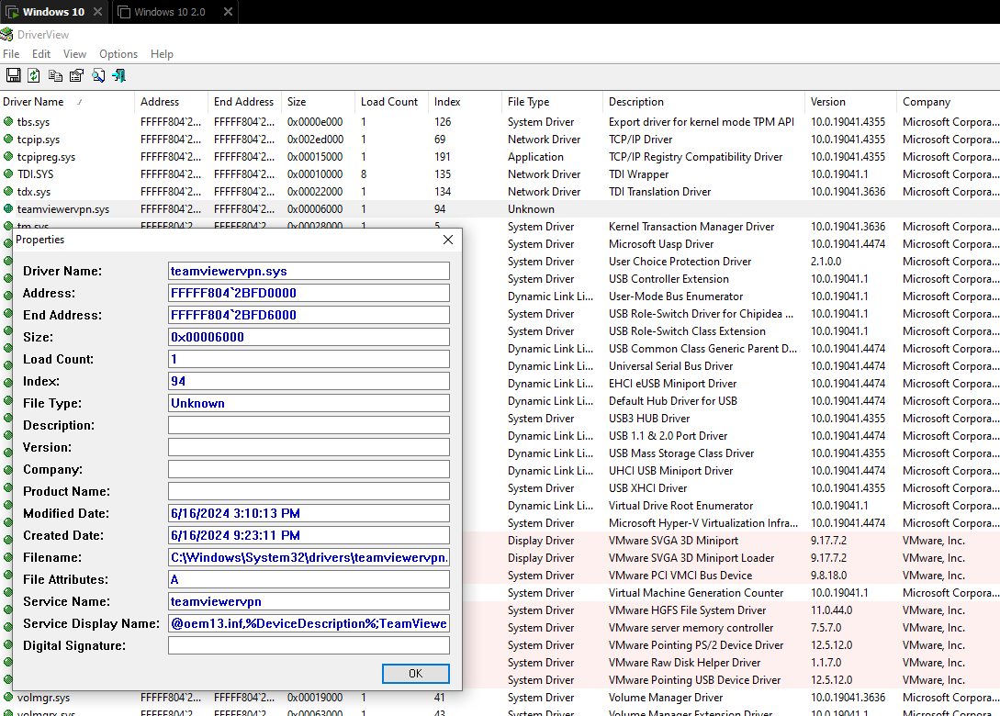](../../assets/img/finding-tv-0days-3/Pasted image 20240620201350.png){:target="_blank"}

[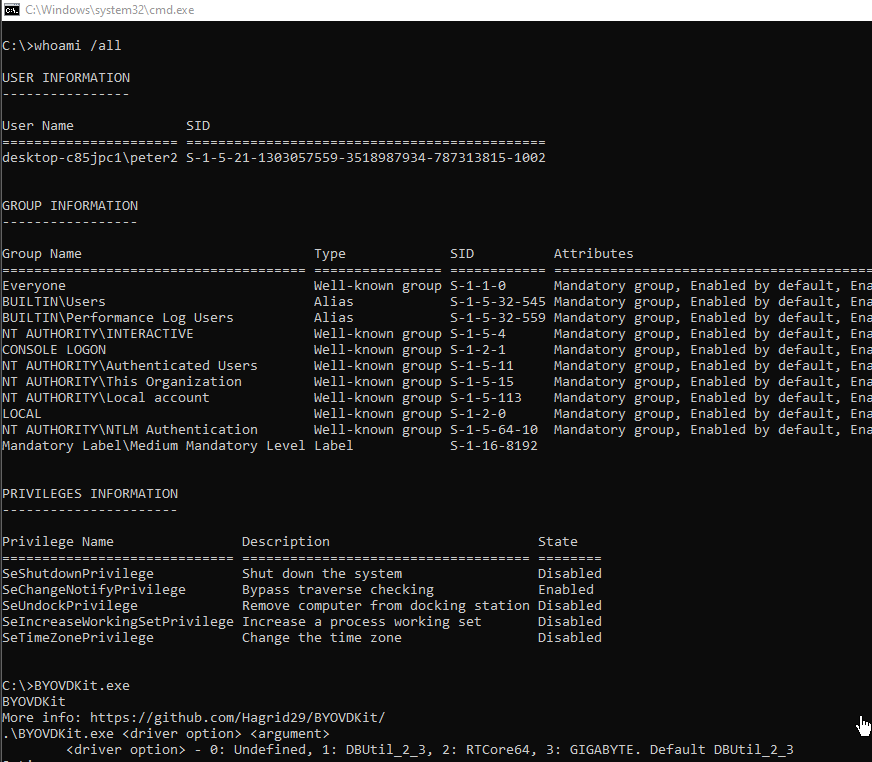](../../assets/img/finding-tv-0days-3/Pasted image 20240620201500.png){:target="_blank"}

We will copy the *Primary Access Token* of PID 4, i.e, the SYSTEM process.

[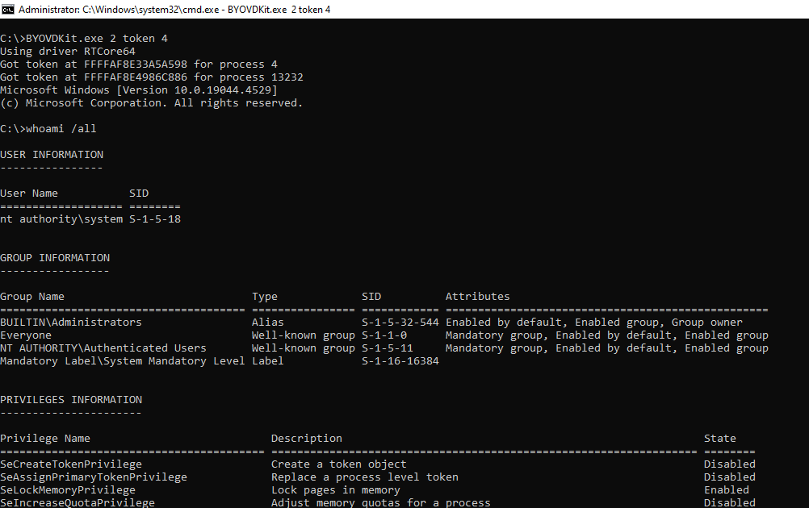](../../assets/img/finding-tv-0days-3/Pasted image 20240620201617.png){:target="_blank"}

NICE, WE ARE SYSTEM :D

USER TO KERNEL.

If you want to test and load another driver do not remember to delete the one we have installed from the *Windows CAT Store*.

- C:\Windows\system32>pnputil -enum-drivers

[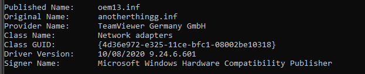](../../assets/img/finding-tv-0days-3/Pasted image 20240620201830.png){:target="_blank"}

- C:\Windows\system32>pnputil -delete-driver oem13.inf -force -uninstall

[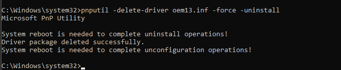](../../assets/img/finding-tv-0days-3/Pasted image 20240620201840.png){:target="_blank"}
