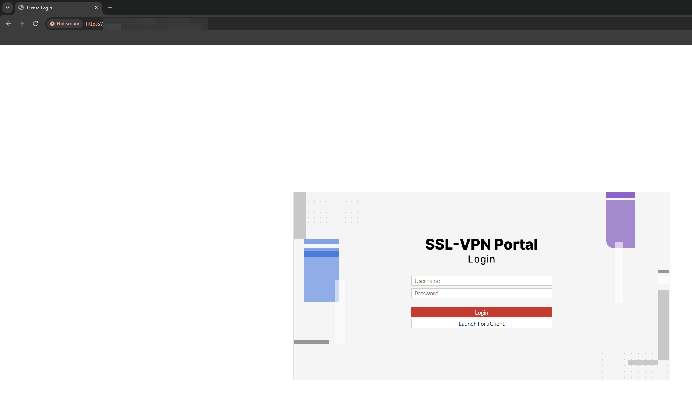
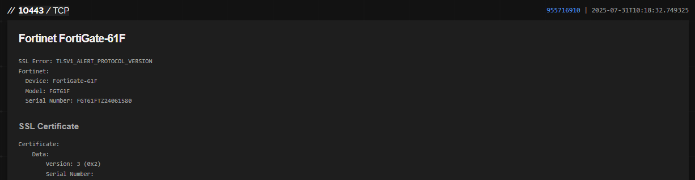
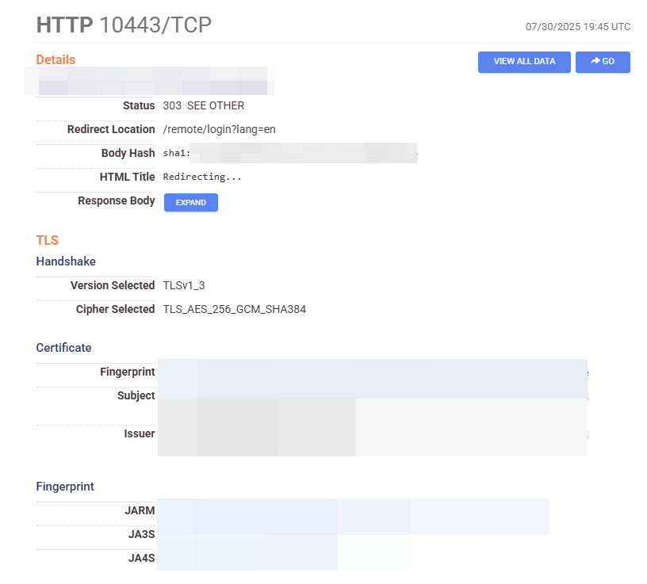
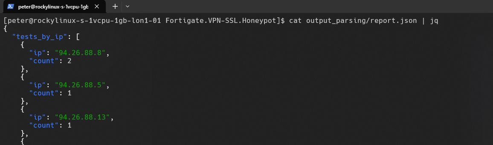
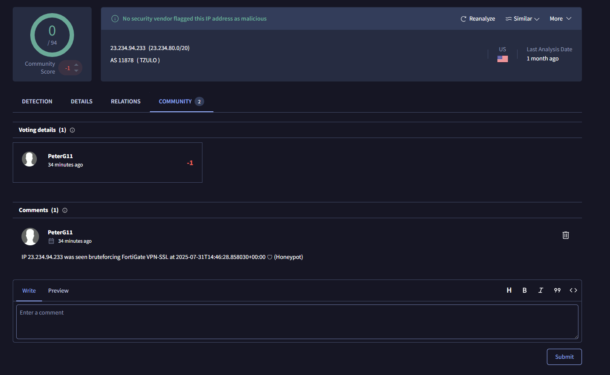
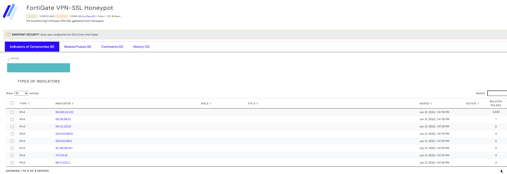
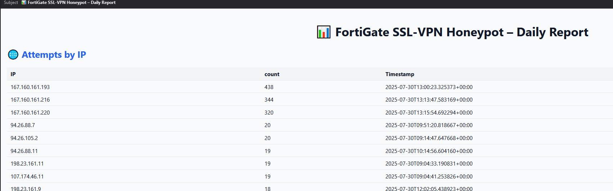
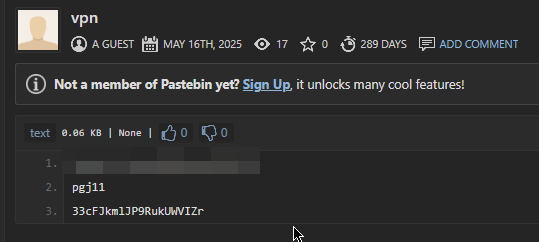
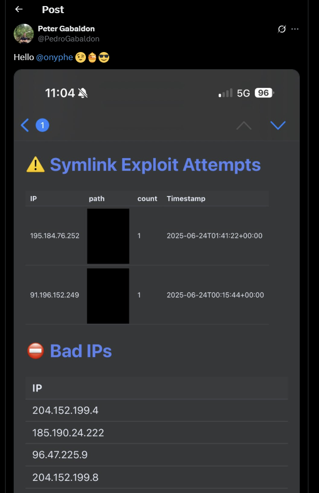

---

layout: post
title: FortiGate VPN-SSL Honeypot
lang: en
lang-ref: fortigate-vpn-ssl-honeypot
categories: [FortiGate, VPN, Honeypot]
tags: [honeypot, vpn, fortigate, intelligence]

---

# FortiGate VPN-SSL Honeypot

The following blog post contains an example of running and configuring the FortiGate VPN-SSL Honeypot project. This project can be found in Github here:
- https://github.com/PeterGabaldon/Fortigate.VPN-SSL.Honeypot

# Description and Capabilities

A **deception honeypot** that mimics FortiGate VPN-SSL devices to trap brute force attempts, detect deliberately exfiltrated credentials for counter‑intelligence, and report malicious activity to external intelligence feeds (VT, OTX).

- **Python & Flask** for login portal.
- **Nginx** fronts the portal with TLS.
- **Docker** environment via `docker compose`.
- **SQLite** stores raw telemetry (creds & symlink‑exploit probes).
- A suite of helper scripts automate parsing, reporting, and alerting.

The Honeypot has the following capabilities currently implemented.

|🚩Feature|Description|
|---|---|
|📧**Report to email**|HTML dashboard with summary of Honeypot traps|
|🌐**Report to OTX**|Posts new bad IPs to AlienVault OTX pulses|
|🔍**Report to VT**|Down‑votes & comments IPs on VirusTotal|
|🙈**Counter‑intel**|Flags any password present in `exfiltrated_passwords.txt` used for counter ingelligence. Deliberately exfiltrate credentials and detect attempts to use them.|
|~~⚠️**Symlink exploit detection**~~|~~Catches symlink exploit attempts~~. Unfortunately, as this is not public yet it has been removed. Showing the detection approach would shows also how to exploit it.|

The following sections will show an example of running the Honeypot in a cloud server among its capabilities.

# Installation and Running the Honey

The Honeypot is written in Python and built around `docker-compose`.

So, in order to start running the Honeypot ensure you have installed `Docker`. After that, it can be run running these commands.

```shell
# 1. Clone & build
$ git clone https://github.com/PeterGabaldon/Fortigate.VPN-SSL.Honeypot.git
$ cd Fortigate.VPN-SSL.Honeypot-main

# 2. Generate TLS material (one‑off)
$ ./nginx/dist/conf/ssl/gen-cert.sh
$ ./nginx/dist/conf/ssl/gen-dhparam.sh 2048

# 3. Run with docker compose
$ docker compose up # 🔥 boots nginx & honeypot

# 4. Parse logs & load SQLite
$ ./parse.sh   # ➜ data/db/honeypot.db gets populated
```

Before running the Honeypot, it is necessary to generate the DH params and certificate configured in *nginx*.

If you want to modify some parameters about the certificate, edit `./nginx/dist/conf/ssl/gen-cert.sh`. By default the certificate generated will use the following information:
- emailAddress=support@fortinet.com
- CN=FGT61FTZ24061580
- OU=FortiGate
- O=Fortinet
- L=Sunnyvale
- ST=California
- C=US

```shell
$ cat ./nginx/dist/conf/ssl/gen-cert.sh
#! /bin/bash

/usr/bin/openssl req -subj '/C=US/ST=California/L=Sunnyvale/O=Fortinet/OU=FortiGate/CN=FGT61FTZ24061580/emailAddress=support@fortinet.com/' -nodes -x509 -sha512 -newkey rsa:8192 -keyout "nginx.key" -out "nginx.crt" -days 3650
```

After that, run `docker compose up` and the Honeypot will be up and reachable from port `10443`. Modify `nginx/dist/conf/honey.conf` if want to run it in another port.

```shell
$ cat nginx/dist/conf/honey.conf
############################################
### NGINX T-Pot configuration file by mo ###
############################################

server {

    #########################
    ### Basic server settings
    #########################
    listen 10443 ssl http2;
    [...]
```

After that, the Honey will be accessible.

[](../../assets/img/fortigate-vpn-ssl-honeypot/Pasted image 20250731170818.png){:target="_blank"}

Just for your information, once it is published to internet, in a few days it will appea in internet service mappers like `Shodan` or `Censys`.

[](../../assets/img/fortigate-vpn-ssl-honeypot/Pasted image 20250731170920.png){:target="_blank"}

[](../../assets/img/fortigate-vpn-ssl-honeypot/Pasted image 20250731171018.png){:target="_blank"}

# Parsing 

Honeypot data is logged at `data/log/honey/creds.log` and nginx data is logged at `data/log/nginx/access.log`.

Here is an example of information captured by the Honey, with the credentials redacted.

```shell
trainee T[***]4 185.213.193.234 2025-07-31T15:00:18.385476+00:00
sromero s[***]o 91.92.34.11 2025-07-31T15:00:44.028099+00:00
ke 1[***]8 167.160.161.193 2025-07-31T15:00:49.098469+00:00
he P[***]d 167.160.161.216 2025-07-31T15:01:02.217613+00:00
fausto F[***]3 23.234.70.149 2025-07-31T15:01:05.474080+00:00
nkennedy n[***]y 107.174.46.11 2025-07-31T15:01:19.092927+00:00
ke 1[***]8 167.160.161.193 2025-07-31T15:01:22.168543+00:00
isreal i[***]2 43.225.189.151 2025-07-31T15:01:33.667071+00:00
he P[***]d 167.160.161.216 2025-07-31T15:01:35.845423+00:00
amy W[***]1 23.234.117.79 2025-07-31T15:01:44.388001+00:00
sqluser s[***]1 43.225.189.170 2025-07-31T15:02:53.167762+00:00
intranet p[***]d 23.234.68.230 2025-07-31T15:02:55.229870+00:00
pferguson p[***]n 104.168.80.13 2025-07-31T15:03:05.072113+00:00
report %[***]x 68.235.46.88 2025-07-31T15:04:32.869353+00:00
uking u[***]g 94.26.88.5 2025-07-31T15:04:45.977357+00:00
ladams l[***]s 198.23.161.10 2025-07-31T15:04:46.027902+00:00
teresa T[***]1 23.234.114.197 2025-07-31T15:04:50.948803+00:00
tstephens t[***]s 94.26.88.3 2025-07-31T15:05:36.710669+00:00
kf 1[***]8 167.160.161.193 2025-07-31T15:06:09.337948+00:00
jolson j[***]n 198.23.161.3 2025-07-31T15:06:14.681890+00:00
hf P[***]d 167.160.161.216 2025-07-31T15:06:36.153136+00:00
kf 1[***]8 167.160.161.193 2025-07-31T15:06:42.417378+00:00
aaron a[***]1 149.40.50.116 2025-07-31T15:06:47.697336+00:00
hf P[***]d 167.160.161.216 2025-07-31T15:07:09.860109+00:00
wpierce w[***]e 94.26.105.3 2025-07-31T15:07:32.213667+00:00
elong e[***]g 192.109.138.9 2025-07-31T15:08:21.726254+00:00
ybryant y[***]t 94.26.105.8 2025-07-31T15:08:26.972756+00:00
oromero o[***]o 104.168.80.3 2025-07-31T15:08:45.380433+00:00
isreal i[***]2 43.225.189.151 2025-07-31T15:08:47.140009+00:00
scans P[***]0 68.235.46.145 2025-07-31T15:09:05.908442+00:00
simon s[***]n 45.134.142.222 2025-07-31T15:10:19.605062+00:00
oallen o[***]n 104.168.80.9 2025-07-31T15:10:20.994895+00:00
sqluser s[***]1 43.225.189.170 2025-07-31T15:10:34.016648+00:00
landon l[***]3 146.70.165.70 2025-07-31T15:11:13.777620+00:00
kg 1[***]8 167.160.161.193 2025-07-31T15:11:35.171434+00:00
```

The Honeypot contains a `parse` script that parses the information and stores it in an `sqlite` database. Also, the results of the parsing is showed by the output of the script. It will also produce a JSON with the results.

```shell
$ bash parse.sh
Number of username/password test by IP
-----------------------
1       94.26.88.5
1       94.26.88.3
1       94.26.105.8
1       94.26.105.3
1       94.26.105.11
1       91.92.34.11
1       68.235.46.88
1       68.235.46.145
1       45.134.142.222
2       43.225.189.170
2       43.225.189.151
1       23.94.58.7
1       23.234.70.149
1       23.234.69.59
1       23.234.68.230
1       23.234.117.79
1       23.234.114.197
1       23.162.40.165
1       198.23.161.3
1       198.23.161.10
1       192.109.138.9
1       185.213.193.234
6       167.160.161.216
6       167.160.161.193
1       149.40.50.116
1       146.70.165.70
1       107.174.46.11
1       104.168.80.9
1       104.168.80.3
1       104.168.80.13

Number of username/password test by username,password,IP
-----------------------
1	zramirez,z[***]z,94.26.105.11
1	ybryant,y[***]t,94.26.105.8
1	wpierce,w[***]e,94.26.105.3
1	uking,u[***]g,94.26.88.5
1	tstephens,t[***]s,94.26.88.3
1	trainee,T[***]4,185.213.193.234
1	teresa,T[***]1,23.234.114.197
1	sromero,s[***]o,91.92.34.11
2	sqluser,s[***]1,43.225.189.170
1	simon,s[***]n,45.134.142.222
1	scans,P[***]0,68.235.46.145
1	report,%[***]x,68.235.46.88
1	pferguson,p[***]n,104.168.80.13
1	oromero,o[***]o,104.168.80.3
1	oallen,o[***]n,104.168.80.9
1	nkennedy,n[***]y,107.174.46.11
1	media,s[***]t,23.162.40.165
1	landon,l[***]3,146.70.165.70
1	ladams,l[***]s,198.23.161.10
2	kg,1[***]8,167.160.161.193
2	kf,1[***]8,167.160.161.193
2	ke,1[***]8,167.160.161.193
1	jolson,j[***]n,198.23.161.3
2	isreal,i[***]2,43.225.189.151
1	intranet,p[***]d,23.234.68.230
2	hg,P[***]d,167.160.161.216
2	hf,P[***]d,167.160.161.216
2	he,P[***]d,167.160.161.216
1	frussell,f[***]l,23.94.58.7
1	fausto,F[***]3,23.234.70.149
1	elong,e[***]g,192.109.138.9
1	andrew,P[***]3,23.234.69.59
1	amy,W[***]1,23.234.117.79
1	aaron,a[***]1,149.40.50.116


Number of times each username was seen
-----------------------
1       zramirez
1       ybryant
1       wpierce
1       uking
1       tstephens
1       trainee
1       teresa
1       sromero
2       sqluser
1       simon
1       scans
1       report
1       pferguson
1       oromero
1       oallen
1       nkennedy
1       media
1       landon
1       ladams
2       kg
2       kf
2       ke
1       jolson
2       isreal
1       intranet
2       hg
2       hf
2       he
1       frussell
1       fausto
1       elong
1       andrew
1       amy
1       aaron

Number of times each password was seen
-----------------------
1       zramirez
1       ybryant
1       wpierce
1       W[***]1         
1       uking
1       tstephens
1       T[***]4         
1       T[***]1         
1       s[***]t         
1       sromero
2       s[***]1         
1       simon
1       p[***]n         
1       P[***]0         
1       p[***]d         
1       P[***]3         
6       P[***]d         
1       o[***]o         
1       o[***]n         
1       n[***]y         
1       l[***]3         
1       l[***]s         
1       j[***]n         
2       i[***]2         
1       f[***]l         
1       F[***]3         
1       e[***]g         
1       P[***]3         
1       W[***]1         
1       a[***]1         
1       %[***]x         
6       1[***]8         

Dumping IPs to bad_ips.txt
-----------------------
104.168.80.13   2025-07-31T15:03:05.072113+00:00
104.168.80.3    2025-07-31T15:08:45.380433+00:00
104.168.80.9    2025-07-31T15:10:20.994895+00:00
107.174.46.11   2025-07-31T15:01:19.092927+00:00
146.70.165.70   2025-07-31T15:11:13.777620+00:00
149.40.50.116   2025-07-31T15:06:47.697336+00:00
167.160.161.193 2025-07-31T15:00:49.098469+00:00
167.160.161.193 2025-07-31T15:01:22.168543+00:00
167.160.161.193 2025-07-31T15:06:09.337948+00:00
167.160.161.193 2025-07-31T15:06:42.417378+00:00
167.160.161.193 2025-07-31T15:11:35.171434+00:00
167.160.161.193 2025-07-31T15:12:07.689597+00:00
167.160.161.216 2025-07-31T15:01:02.217613+00:00
167.160.161.216 2025-07-31T15:01:35.845423+00:00
167.160.161.216 2025-07-31T15:06:36.153136+00:00
167.160.161.216 2025-07-31T15:07:09.860109+00:00
167.160.161.216 2025-07-31T15:12:11.541550+00:00
167.160.161.216 2025-07-31T15:12:48.902528+00:00
185.213.193.234 2025-07-31T15:00:18.385476+00:00
192.109.138.9   2025-07-31T15:08:21.726254+00:00
198.23.161.10   2025-07-31T15:04:46.027902+00:00
198.23.161.3    2025-07-31T15:06:14.681890+00:00
23.162.40.165   2025-07-31T15:12:14.744867+00:00
23.234.114.197  2025-07-31T15:04:50.948803+00:00
23.234.117.79   2025-07-31T15:01:44.388001+00:00
23.234.68.230   2025-07-31T15:02:55.229870+00:00
23.234.69.59    2025-07-31T15:14:36.722044+00:00
23.234.70.149   2025-07-31T15:01:05.474080+00:00
23.94.58.7      2025-07-31T15:13:23.427372+00:00
43.225.189.151  2025-07-31T15:01:33.667071+00:00
43.225.189.151  2025-07-31T15:08:47.140009+00:00
43.225.189.170  2025-07-31T15:02:53.167762+00:00
43.225.189.170  2025-07-31T15:10:34.016648+00:00
45.134.142.222  2025-07-31T15:10:19.605062+00:00
68.235.46.145   2025-07-31T15:09:05.908442+00:00
68.235.46.88    2025-07-31T15:04:32.869353+00:00
91.92.34.11     2025-07-31T15:00:44.028099+00:00
94.26.105.11    2025-07-31T15:14:45.742802+00:00
94.26.105.3     2025-07-31T15:07:32.213667+00:00
94.26.105.8     2025-07-31T15:08:26.972756+00:00
94.26.88.3      2025-07-31T15:05:36.710669+00:00
94.26.88.5      2025-07-31T15:04:45.977357+00:00

Dumping IPs exploiting Symlink Persistence Method to bad_ips_symlink.txt
-----------------------

✅ JSON report written to /home/peter/Fortigate.VPN-SSL.Honeypot/output_parsing/report.json
🆗 SQLite schema ready (/home/peter/Fortigate.VPN-SSL.Honeypot/db/honeypot.db)
✅ Imported creds.log → honeypot_creds
✅ Imported nginx symlink attempts → symlink_exploits
🗑️  Logs truncated – parse.sh complete.
```

[](../../assets/img/fortigate-vpn-ssl-honeypot/Pasted image 20250802124423.png){:target="_blank"}

# Scheduled Reporting

I recommend you to configure a service and a timer in `systemd` to periodically parse the information gathered at the Honeypot. The repository contains a template for it. Here is the one that I am using.

```shell
# cat fgate-vpn-honeypot-parse-and-report.service
# /etc/systemd/system/fgate-vpn-honeypot-parse-and-report.service
[Unit]
Description=Parse and report FortiGate VPN-SSL Honeypot service

[Service]
User=peter
Group=peter
WorkingDirectory=/home/peter/Fortigate.VPN-SSL.Honeypot/
Type=oneshot
ExecStart=/home/peter/Fortigate.VPN-SSL.Honeypot/parse.sh
```

```shell
# cat fgate-vpn-honeypot-parse-and-report.timer
# /etc/systemd/system/fgate-vpn-honeypot-parse-and-report.timer
[Unit]
Description=Parse and report FortiGate VPN-SSL Honeypot service timer

[Timer]
OnCalendar=*:0/30
Persistent=true

[Install]
WantedBy=timers.target
```

One important reminder, as the Honey run as root inside the container.

> **ACL Fix**: the logs are written as `root` (inside the container). Allow the service user write access in order to the parser script (parse.sh) to be able to clear the logs:
> 
> ```shell
$ sudo setfacl -m u:fortihoney:rw data/log/honey/creds.log data/log/nginx/access.log
> ```

# Reporting Modules

The Honeypot contains some modules to perform reporting of the information gathered.

Every reporting module is at is *report_to_* directory. I recommend you to run each one in a in its proper *venv*.

```shell
$ cd report_to_...
$ python -m venv .venv
$ . .venv/bin/activate
$ pip install -r requirements.txt
```

### Reporting to VT/OTX

When reporting to VT/OTX, the datetime of the last successful report is saved to prevent reporting again the same IP addresses.


Configure the yaml file with the credentials and the comment and tag to use when reporting it in VT.

```shell
$ cat report_to_vt/vt_config/report_to_vt_bad_ips.yaml.template
vt_api_key: "<YOUR VT API KEY>"
tag: "FortiGate VPN‑SSL Honeypot"        # used for per‑tag state tracking
comment: "IP {ip} was seen bruteforcing FortiGate VPN-SSL at {seen} 🛡️"
honeypot:
  ip_file: "../honeypot_bad_ips.txt"     
```

Here is an example of a malicious IP being reported.

- https://www.virustotal.com/gui/ip-address/23.234.94.233/community

[](../../assets/img/fortigate-vpn-ssl-honeypot/Pasted image 20250731173618.png){:target="_blank"}

And the following is the configuration yaml file for reporting to OTX.

```shell
$ cat report_to_otx/otx_config/report_to_otx.config.yaml.template
# config.yaml

otx_api_key: YOUR_OTX_API_KEY_HERE

pulse:
  name: "FortiGate VPN-SSL Honeypot"
  description: "IPs bruteforcing FortiGate VPN-SSL gathered from Honeypot"
  type: "blacklist"     # or "threat", "vulnerability", etc.
  public: true
  tlp: "WHITE"          # TLP: WHITE, GREEN, AMBER, RED

honeypot:
  ip_file: "./honeypot_bad_ips.txt"
```

And here you can find an example of the Pulse.

- https://otx.alienvault.com/pulse/68570c45f7889b52b9f051f2

[](../../assets/img/fortigate-vpn-ssl-honeypot/Pasted image 20250731173810.png){:target="_blank"}

I also recommend to run the Reporting modules periodically via the `systemd` timer and service. Here is my full `systemd` service run by the timer every 30 minutes which, apart for the aforementioned periodic parsing, will run (in its respective `venvs`) the parsing scripts.

```shell
# cat fgate-vpn-honeypot-parse-and-report.service
# /etc/systemd/system/fgate-vpn-honeypot-parse-and-report.service
[Unit]
Description=Parse and report FortiGate VPN-SSL Honeypot service

[Service]
User=peter
Group=peter
WorkingDirectory=/home/peter/Fortigate.VPN-SSL.Honeypot/
Type=oneshot
ExecStart=/home/peter/Fortigate.VPN-SSL.Honeypot/parse.sh
ExecStart=-/home/peter/Fortigate.VPN-SSL.Honeypot/report_to_otx/.venv/bin/python3 report_to_otx/report_to_otx.py -c report_to_otx/otx_config/report_to_otx.config.yaml
ExecStart=-/home/peter/Fortigate.VPN-SSL.Honeypot/report_to_otx/.venv/bin/python3 report_to_otx/report_to_otx.py -c report_to_otx/otx_config/report_to_otx.config.symlink.yaml
ExecStart=-/home/peter/Fortigate.VPN-SSL.Honeypot/report_to_vt/.venv/bin/python3 report_to_vt/report_to_vt.py -c report_to_vt/vt_config/report_to_vt_bad_ips.yaml
ExecStart=-/home/peter/Fortigate.VPN-SSL.Honeypot/report_to_vt/.venv/bin/python3 report_to_vt/report_to_vt.py -c report_to_vt/vt_config/report_to_vt_bad_ips.symlink.yaml
```

### Reporting to Email

When reporting to email, the threshold of data to include in the report is selected by the --hours parameter, by default the last 24h of Honeypot data is used.

The configuration for reporting to email is shown below.

```shell
$ cat report_to_email/email_config.yaml.template
subject: "📊 FortiGate SSL‑VPN Honeypot – Daily Report"
from: "Honeypot <honeypot@example.com>"   # optional; defaults to username if omitted
to:
  - security@example.com
  - soc@example.com
smtp:
  host: smtp.example.com
  port: 465              # 465 = SMTPS, 587 = STARTTLS, 25 = opportunistic
  username: honeypot@example.com
  password: "s3cr3tP@ssw0rd"
  use_ssl: true          # true ⇒ implicit TLS (465); false ⇒ STARTTLS (587/25)
```

It will produce an email with the following information.

- 🌐 Attempts by IP
- 🧑‍💻 Attempts by User / Pass / IP
- 👤 Attempts by User
- 🔑 Attempts by Password
- ⚠️ Symlink Exploit Attempts
- ⛔ Bad IPs
- 💥 Exfiltrated Credentials

[](../../assets/img/fortigate-vpn-ssl-honeypot/Pasted image 20250731174810.png){:target="_blank"}

# Counter-Intelligence (Deliberately Exfiltrate Credentials)

The honeypot isn’t just for telemetry—it actively **hunts for leaked or deliberately planted passwords** you care about.

1. **Watch-list file**  
    Drop one password per line into `exfiltrated_passwords.txt` at the repo root.  
    Example:
    
    ```
    S3cr3tP@ssw0rd
    th1sIsB41t
    ```
    

The email‐report script loads that watch-list and flags any match during the selected time-window.

A dedicated table “💥 Exfiltrated Credentials” appears in the email report, showing the IP addresses along with the timestamp that used the credentials that were deliberately exfiltrated.

Ideas to exfiltrate credentials

- Run stealer in a controlled environ
- Write the credentials in pastebin
- Sell the credentials in a forum
- ...

For example, I exfiltrated fake credentials in a Pastebin post and some days after an attempt was performed using them.

[](../../assets/img/fortigate-vpn-ssl-honeypot/Pasted image 20250731174924.png){:target="_blank"}
# Symlink Exploit Detections

The Honeypot also detects attempt to use the Symlink persistence method in FortiGate units (https://www.fortinet.com/blog/psirt-blogs/analysis-of-threat-actor-activity).

Unfortunately, as this is not public yet it has been removed. Showing the detection approach would shows also how to exploit it.

For example, https://www.onyphe.io/ scans the internet finding vulnerable appliances and they were caught by the Honeypot. I am sorry but the detection of these attempts has is not available in the public version of the Honeypot. Maybe some day.

- https://x.com/PedroGabaldon/status/1937439245482000793

[](../../assets/img/fortigate-vpn-ssl-honeypot/Pasted image 20250731175140.png){:target="_blank"}


