---

layout: post
title: FortiGate Symlink Persistence Method
lang: en
lang-ref: fortigate-symlink-persistence-method
categories: [FortiGate, VPN, Symlink, Persistence, CVE-2025-68686]
tags: [honeypot, vpn, fortigate, intelligence]

---

# Analysis and Exploitation of FortiGate Symlink Persistence Method

[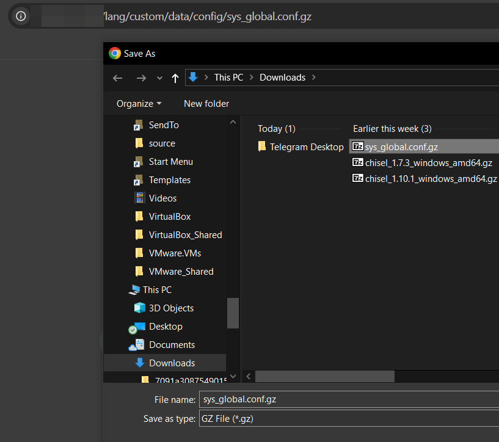](../../assets/img/fortigate-symlink/image_2025-04-26_20-00-14.png){:target="_blank"}
# Background📚

Around April 2025 Fortinet started warning customers that a Threat Actor (TA) continued to have remote read-only access to filesystem after patching FortiGates (FGT) units. This was achieved by a path in the VPN-SSL. Basically, requesting some route (we will see it later in the post) in the VPN-SSL, it allowed to **access root file system remotely and without authentication**.

Using this method, TA could download files as the symbolic link pointed to the root. Among these files, it was possible to download FortiGate configuration, for example.

Some days later Fortinet published a post in FortiGuard with some information about this.
- [https://www.fortinet.com/blog/psirt-blogs/analysis-of-threat-actor-activity](https://www.fortinet.com/blog/psirt-blogs/analysis-of-threat-actor-activity)

If you had one of these versions: **FortiOS 7.4, 7.2, 7.0, 6.4** the symlink was supposedly removed by AV/IPS engine. 

And in these versions: **FortiOS 7.6.2, 7.4.7, 7.2.11 & 7.0.17, 6.4.16** the update removes the symlink and also a patch was added in the VPN-SSL two prevent the exploitation.

It is very important to note that this is **not a *0day***. This method was used by TA **after** compromising FortiGates units with other vulns. In the post-exp phase they used to created the symlink that could survive updates of the FGT and thus giving the remote (if VPN-SSL is enabled) read-only access to root filesystem 😎.

# Abstract💣

Basically, a TA (or maybe more than one I don´t know) used to modify a symlink used by language configuration in the VPN-SSL. For years, the TA have used to apply this persistence method when compromising a FortiGate unit.

Specifically, FortiGate's VPN-SSL custom languages use a symlink to point to the upload directory in another partition.

```
# /migadmin/lang/ directory
$ ls -la
total 3088
drwxr-xr-x  2 peter peter   4096 Jan 20 01:00 .
drwxr-xr-x 23 peter peter  20480 Jan 20 01:00 ..
-r--r--r--  1 peter peter 405723 Jan 20 01:00 big5.json.gz
lrwxrwxrwx  1 peter peter     18 Jan 20 01:00 custom -> /data2/custom_lang
-r--r--r--  1 peter peter 314080 Jan 20 01:00 en.json.gz
-r--r--r--  1 peter peter 402738 Jan 20 01:00 euc-kr.json.gz
-r--r--r--  1 peter peter 395117 Jan 20 01:00 fr.json.gz
-r--r--r--  1 peter peter 388097 Jan 20 01:00 GB2312.json.gz
-r--r--r--  1 peter peter 396576 Jan 20 01:00 pg.json.gz
-r--r--r--  1 peter peter 398429 Jan 20 01:00 sp.json.gz
-r--r--r--  1 peter peter 421183 Jan 20 01:00 x-sjis.json.gz
```

TA used to modify this symlink to point to the root of the filesystem so it was possible to access **remotely and without authentication** every file through the VPN-SSL using `/lang/custom/{PATH}`.

For example, in order to download the configuration:
- `/lang/custom/data/config/sys_global.conf.gz`

[](../../assets/img/fortigate-symlink/image_2025-04-26_20-00-14.png){:target="_blank"}

Now, I encourage you to read the full post if curious about the details. (Spoiler: the patch can be bypassed).
# Reversing and Patch-Diffing🛠

Once we were aware of this method we started to analyze the path and to understand the how this method works.

First of all we downloaded FortiGate VM from Fortinet in order to extract `rootfs` and `ramdisk` from VMDK. If you are not aware, `rootfs` is encrypted by a custom method and `flatkc` is responsible for decrypting it at boot time.

Recently Fortinet modified the encryption process. *RandoriSec* documented the updated method and also published a tool in order to be able to extract the contents of *rootfs*.

- [https://blog.randorisec.fr/fortigate-rootfs-decryption/](https://blog.randorisec.fr/fortigate-rootfs-decryption/)
- [https://github.com/randorisec/decrypt-fortigate-rootfs](https://github.com/randorisec/decrypt-fortigate-rootfs)

## Extracting and decrypting rootfs🔐

After launching FortiGates VMs in VMware (v74.7 and v7.4.6) the VMDKs were extracted. There are multiple VMDKs because FortiGate uses various disks (and each of them various partitions), but the first one contains the root filesystem in the first partition.

[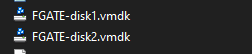](../../assets/img/fortigate-symlink/Pasted image 20250426170504.png){:target="_blank"}

After getting them, the next step is to mount the VMDK and extract `flatkc` and the items of root filesystem contained in `rootfs.gz`

```
$ sudo modprobe nbd max_part=16
$ sudo qemu-nbd -c /dev/nbd2 FGATE-disk1.vmdk
$ sudo mount /dev/nbd1p2 fs1/

$ ls -la
total 114060
drwxr-xr-x 11 root  root      4096 Apr  3 23:59 .
drwxrwxr-x 10 peter peter     4096 Apr 25 22:13 ..
drwxr-xr-x  2 root  root      4096 Jan 20 01:00 bin
drwxr-xr-x  3 root  root      4096 Jan 20 01:00 boot
-r--r--r--  1 root  root         1 Jan 20 01:00 boot.msg
drwxr-xr-x  2 root  root      4096 Jan 20 01:00 cmdb
drwxr-xr-x  2 root  root      4096 Apr  3 22:04 config
-r--r--r--  2 root  root  17569906 Jan 20 01:00 datafs.tar.gz
-r--r--r--  2 root  root  17569906 Jan 20 01:00 datafs.tar.gz.bak
-r--r--r--  2 root  root       256 Jan 20 01:00 datafs.tar.gz.chk
-r--r--r--  2 root  root       256 Jan 20 01:00 datafs.tar.gz.chk.bak
-r--r--r--  1 root  root      1137 Jan 20 01:00 .db
-r--r--r--  1 root  root     13729 Jan 20 01:00 .db.x
-rw-r--r--  1 root  root         0 Apr  3 23:59 dhcp6s_db.bak
-rw-r--r--  1 root  root         0 Apr  3 23:59 dhcpddb.bak
-rw-r--r--  1 root  root         0 Apr  3 23:59 dhcp_ipmac.dat.bak
drwxr-xr-x 15 root  root      4096 Apr  3 22:05 etc
-rw-r--r--  1 root  root       165 Apr  3 23:59 extlinux.conf
-r--r--r--  1 root  root        53 Jan 20 01:00 filechecksum
-r--r--r--  1 root  root   7475296 Jan 20 01:00 flatkc
-r--r--r--  1 root  root       256 Jan 20 01:00 flatkc.chk
-r--r--r--  1 root  root      3282 Jan 20 01:00 flatkc.sig
-r--r--r--  1 root  root     11768 Jan 20 01:00 hash_bin.sha256
-r--r--r--  1 root  root    122656 Mar  4  2016 ldlinux.c32
-r--r--r--  1 root  root     69632 Mar  4  2016 ldlinux.sys
drwxr-xr-x  2 root  root      4096 Apr  3 23:59 lib
drwx------  2 root  root      4096 Apr  3 22:02 log
drwx------  2 root  root     16384 Jan 20 19:44 lost+found
-r--r--r--  1 root  root  73822741 Jan 20 01:00 rootfs.gz
-r--r--r--  1 root  root       256 Jan 20 01:00 rootfs.gz.chk
d-wxr----t  3 root  root      4096 Apr  3 23:59 web-ui
```

[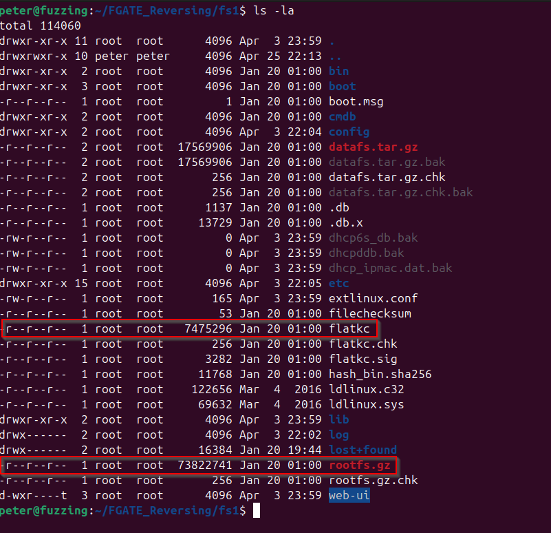](../../assets/img/fortigate-symlink/Pasted image 20250426171741.png){:target="_blank"}

Extracting and decrypting `rootfs` will allow us to retrieve `init` binary and analyze FortiGate VPN-SSL to study the patch.

The next step is to decrypt it using *Randorisec* tool.

### A Digress

---

It did not work at first glance. In summary, the version of `vmlinux-to-elf` I was using was not able to reconstruct `kallsyms` symbols table and because of that I ended up modifying *Randorisec* tool to find decryption routine using the stack size of that function instead of the symbol name.

If you are curious about the details an *issue* and a PR was opened.
- [https://github.com/randorisec/decrypt-fortigate-rootfs/issues/1](https://github.com/randorisec/decrypt-fortigate-rootfs/issues/1)
- [https://github.com/randorisec/decrypt-fortigate-rootfs/pull/2](https://github.com/randorisec/decrypt-fortigate-rootfs/pull/2)

And here is my fork with the modification
- [https://github.com/PeterGabaldon/decrypt-fortigate-rootfs/tree/locate_fgt_verify_initrd_with_stack_size](https://github.com/PeterGabaldon/decrypt-fortigate-rootfs/tree/locate_fgt_verify_initrd_with_stack_size)

---

After that we can continue to convert `flatkc`  to a full ELF and decrypt `rootfs`.

```
$ python3 -m venv .venv
$ pip install -r requirements.txt
$ python3 decrypt_rootfs.py --debug  ../flatkc.v7.4.7.elf ../rootfs.7.4.7.gz ../rootfs.7.4.7.gz.decrypted
 ____      _    _   _ ____   ___  ____  ___ ____  _____ ____ 
|  _ \    / \  | \ | |  _ \ / _ \|  _ \|_ _/ ___|| ____/ ___|
| |_) |  / _ \ |  \| | | | | | | | |_) || |\___ \|  _|| |    
|  _ <  / ___ \| |\  | |_| | |_| |  _ < | | ___) | |__| |___ 
|_| \_\/_/   \_\_| \_|____/ \___/|_| \_\___|____/|_____\____|
                                                             

                   [https://randorisec.fr](https://randorisec.fr)


                  
[INFO] Retrieving crypto material...
0xffffffff8170d2b0

[DEBUG] SEED address found: 0xffffffff8170d2b0
[DEBUG] SEED: b'FA468F98F238DE76AC5A8B36C0EAF915E5CF1D3365E307A845A0407627A7F8A4'
[DEBUG] RSAPUBKEY: b'6766FF5EE42A96C860CAFF316F0597AEEBD7170E6F0487523795AD8AA495CF4DCEC0ADE51C01A84F5A2D7FA243D77716B8FD7867139510C69FFB410852A975C2EF3AE92856A21C8EB66029F07CDDC3FF8100488B7EF8B5197E02406373584CD85210CE31A9A72F580B3C0AE0DF5A68B39D972E8643F4BD0FBF8E0275AF89D0C09C2F57C78A47D2943D810E828ECA14E1F5667A7960EB66280AFC6CBB393A36A22A5424F99AE6189D21FBA4ED1988D6BFC62033079FE5E94BAFAF815222AE3C4C0203BA8BC391942E5E41914C65566C74B061E6CC615A2294F85AC245B6BE8D498E2303B75EF61C68DAA868DA1C72D51E1FA0DC1770C09BE7CD998BC78747518B9FB15484E4877324AB70F0A57018'
[DEBUG] AES key: b'655487820C60D573857985065A9D2D2AA0F0E66E8755E7E577E99226EC663901'
[DEBUG] AES counter: b'988BA0AEB5DA6A452E809968F5076261'
[INFO] Decrypting ../rootfs.7.4.7.gz...
[DEBUG] AES-CTR increment: 12
73822496it [00:19, 3832264.67it/s]                                                                                                                                                                                                 
[INFO] DONE.
```

Once it is decrypted the last step is to `gunzip` it and decompress from `cpio`.

```
$ mv rootfs.7.4.7.gz.decrypted rootfs.7.4.7.gz.decrypted.gz
$ gunzip rootfs.7.4.7.gz.decrypted.gz
$ mkdir cpio_extract; cd cpio_extract; sudo cpio -idv < ../rootfs.7.4.7.gz.decrypted
$ cd cpio_extract; sudo cpio -idv < ../rootfs.7.4.7.gz.decrypted 
.
lib
sys
node-scripts.tar.xz
[...]
233843 blocks
```

```
$ ls -la
total 47216
drwxrwxr-x 14 peter peter     4096 Apr 26 17:46 .
drwxrwxr-x  3 peter peter     4096 Apr 26 17:42 ..
drwxr-xr-x  2 peter peter     4096 Jan 20 01:00 bin
-r--r--r--  1 root  root  33109932 Apr 26 17:45 bin.tar.xz
drwxr-xr-x  2 root  root      4096 Apr 26 17:45 boot
drwxr-xr-x  3 root  root      4096 Apr 26 17:45 data
drwxr-xr-x  2 root  root      4096 Apr 26 17:45 data2
drwxr-xr-x  8 root  root     20480 Apr 26 17:45 dev
lrwxrwxrwx  1 root  root         8 Apr 26 17:45 etc -> data/etc
lrwxrwxrwx  1 root  root         1 Apr 26 17:45 fortidev -> /
lrwxrwxrwx  1 root  root        10 Apr 26 17:45 init -> /sbin/init
drwxr-xr-x  5 root  root      4096 Apr 26 17:45 lib
lrwxrwxrwx  1 root  root         4 Apr 26 17:45 lib64 -> /lib
-r--r--r--  1 root  root  14456836 Apr 26 17:45 migadmin.tar.xz
-r--r--r--  1 root  root    549180 Apr 26 17:45 node-scripts.tar.xz
drwxr-xr-x  2 root  root      4096 Apr 26 17:45 proc
drwxr-xr-x  2 root  root      4096 Apr 26 17:45 sbin
drwxr-xr-x  2 root  root      4096 Apr 26 17:45 sys
drwxr-xr-x  2 root  root      4096 Apr 26 17:45 tmp
drwxr-xr-x  3 root  root      4096 Apr 26 17:45 usr
-r--r--r--  1 root  root    148572 Apr 26 17:45 usr.tar.xz
drwxr-xr-x  9 root  root      4096 Apr 26 17:45 var

```

Now `init` binary can be extracted.

```
$ tar xJvf bin.tar.xz
$ ls -la bin/init
-r-xr--r-- 1 peter peter 79955752 Jan 20 01:00 bin/init
```

The same process was done with version 7.4.6 to patch-diff init binaries.
# Patch-Analysis

In order to analyze the differences I like to use `Bindiff` and `BinExport` plugin in `Ghidra`.

One important thing is that because of the size of `init` binary it is necessary to launch `Ghidra` with more memory. This can be easily achieved modifying `MAXMEM` in `ghidrarun`.

[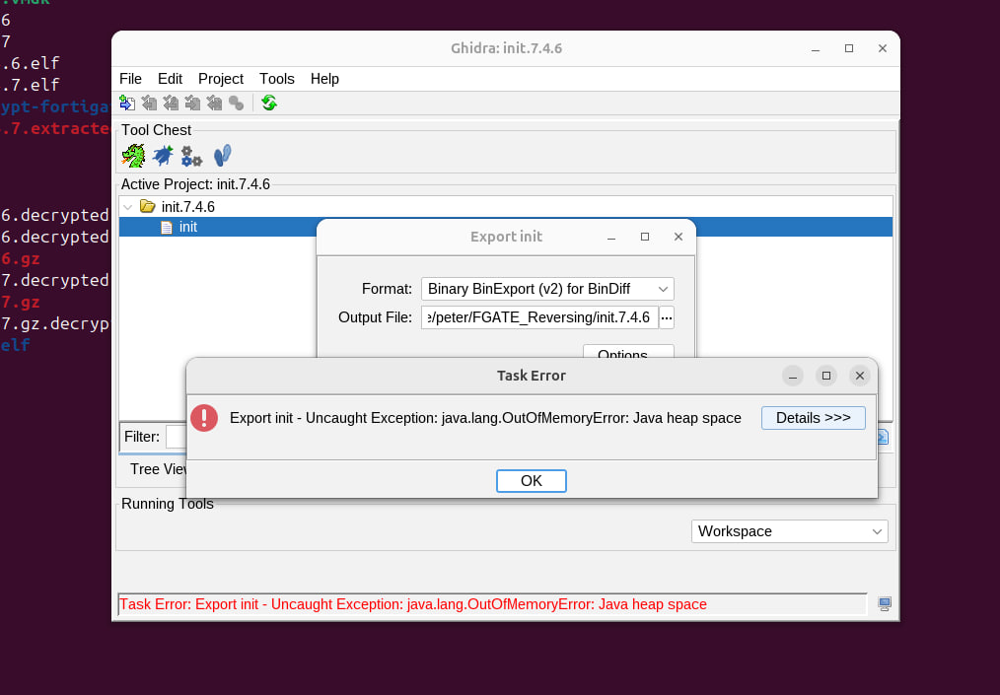](../../assets/img/fortigate-symlink/Pasted image 20250426181602.png){:target="_blank"}

```
$ cat ghidraRun
#!/usr/bin/env bash

#----------------------------------------
# Ghidra launch
#----------------------------------------

# Maximum heap memory may be changed if default is inadequate. This will generally be up to 1/4 of 
# the physical memory available to the OS. Uncomment MAXMEM setting if non-default value is needed.
#MAXMEM=2G

# Resolve symbolic link if present and get the directory this script lives in.
# NOTE: "readlink -f" is best but works on Linux only, "readlink" will only work if your PWD
# contains the link you are calling (which is the best we can do on macOS), and the "echo" is the 
# fallback, which doesn't attempt to do anything with links.
SCRIPT_FILE="$(readlink -f "$0" 2>/dev/null || readlink "$0" 2>/dev/null || echo "$0")"
SCRIPT_DIR="${SCRIPT_FILE%/*}"
MAXMEM=16G

# Launch Ghidra
"${SCRIPT_DIR}"/support/launch.sh bg jdk Ghidra "${MAXMEM}" "" ghidra.GhidraRun "$@"
```

After generating the `BinExports` we can move on to `BinDiff` and `IDA`.

[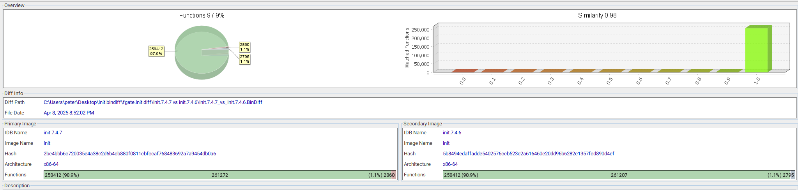](../../assets/img/fortigate-symlink/Pasted image 20250426183646.png){:target="_blank"}

The modified functions that add the check for the VPN-SSL paths are the following. These corresponds to two VPN-SSL handlers.

[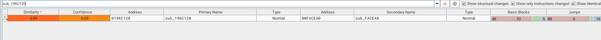](../../assets/img/fortigate-symlink/Pasted image 20250426184038.png){:target="_blank"}

[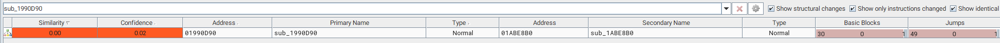](../../assets/img/fortigate-symlink/Pasted image 20250426184108.png){:target="_blank"}

Fortinet is now using in two VPN-SSL handlers a routine to resolve the *Symlink* and check that it points to the corresponding path.

`sub_272F3A0`

[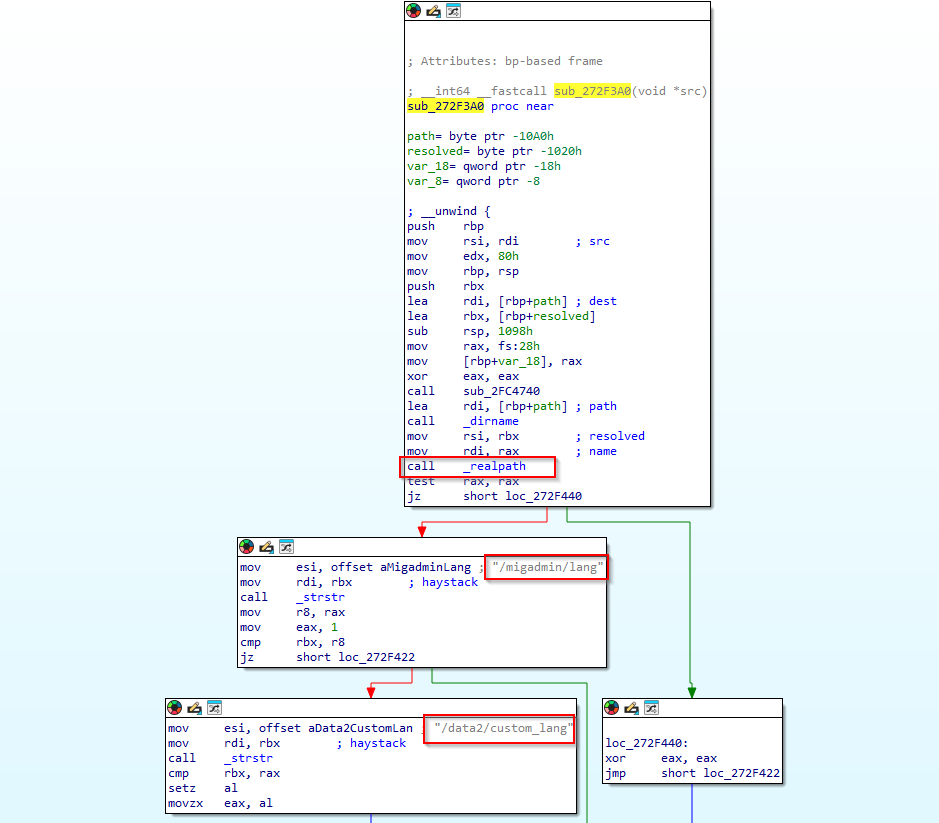](../../assets/img/fortigate-symlink/Pasted image 20250426184425.png){:target="_blank"}

This function basically takes a single argument—a file path (`src`)—and returns 1 if that file lives directly under one of two special language‐resource directories, and 0 otherwise. It calls `realpath` this way `realpath(dirname(path), resolved);`.

This routine is called in two VPN-SSL handlers when the following path is requested in the VPN-SSL `/lang/custom`.

`sub_196C120` (`default_handler`)

[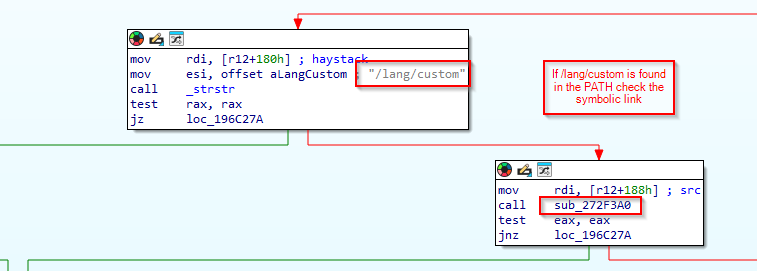](../../assets/img/fortigate-symlink/Pasted image 20250426184915.png){:target="_blank"}

If the check of the symbolic link is not OK a `403 Forbidden` will be returned.

[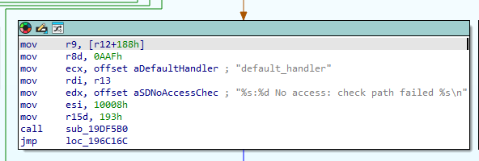](../../assets/img/fortigate-symlink/Pasted image 20250426185243.png){:target="_blank"}

`sub_1990D90` (`sslvpn_zip_handler`)

Basically, the same check.

[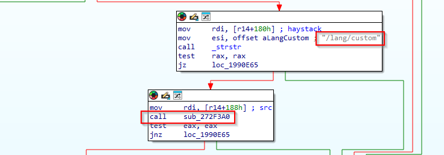](../../assets/img/fortigate-symlink/Pasted image 20250426185138.png){:target="_blank"}

[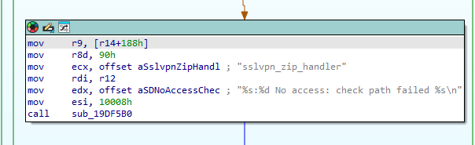](../../assets/img/fortigate-symlink/Pasted image 20250426185213.png){:target="_blank"}

So, now we know that Fortinet is checking for queries with `/lang/custom` 😊.

Now moving into exploitation 🔥.
# Exploitation🧨

The `/lang/` path can be queried in the VPN-SSL without authentication. For example, you can request `/lang/sp.json` (Spanish 🇪🇸).

[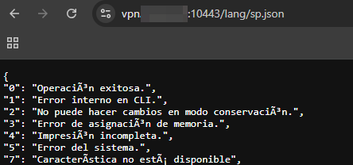](../../assets/img/fortigate-symlink/Pasted image 20250426192344.png){:target="_blank"}

The following languages are incorporated in the VPN-SSL (`/migadmin/lang`).

```
# /migadmin/lang/ directory
$ ls -la
total 3088
drwxr-xr-x  2 peter peter   4096 Jan 20 01:00 .
drwxr-xr-x 23 peter peter  20480 Jan 20 01:00 ..
-r--r--r--  1 peter peter 405723 Jan 20 01:00 big5.json.gz
lrwxrwxrwx  1 peter peter     18 Jan 20 01:00 custom -> /data2/custom_lang
-r--r--r--  1 peter peter 314080 Jan 20 01:00 en.json.gz
-r--r--r--  1 peter peter 402738 Jan 20 01:00 euc-kr.json.gz
-r--r--r--  1 peter peter 395117 Jan 20 01:00 fr.json.gz
-r--r--r--  1 peter peter 388097 Jan 20 01:00 GB2312.json.gz
-r--r--r--  1 peter peter 396576 Jan 20 01:00 pg.json.gz
-r--r--r--  1 peter peter 398429 Jan 20 01:00 sp.json.gz
-r--r--r--  1 peter peter 421183 Jan 20 01:00 x-sjis.json.gz
```

You see `custom` pointing to `/data2/custom_lang` 😉?

In VPN-SSL it is possible to configure a custom language. First it is necessary to enable it. 

```
config system global
    set gui-custom-language enable
end
```

After that it is possible to upload a `JSON` file like we saw before and configure it in the VPN-SSL.

[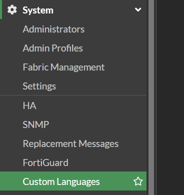](../../assets/img/fortigate-symlink/image_2025-04-26_19-41-23.png){:target="_blank"}

[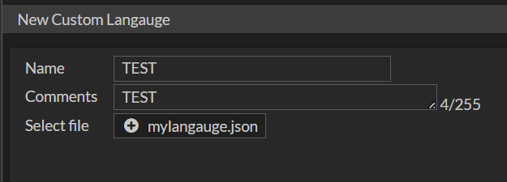](../../assets/img/fortigate-symlink/image_2025-04-26_19-41-05.png){:target="_blank"}

[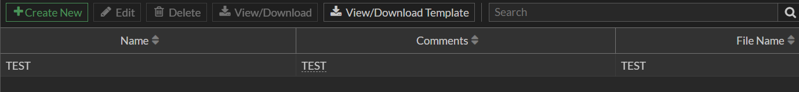](../../assets/img/fortigate-symlink/image_2025-04-26_19-40-05.png){:target="_blank"}

Later, in the VPN-SSL portal it can be selected.

[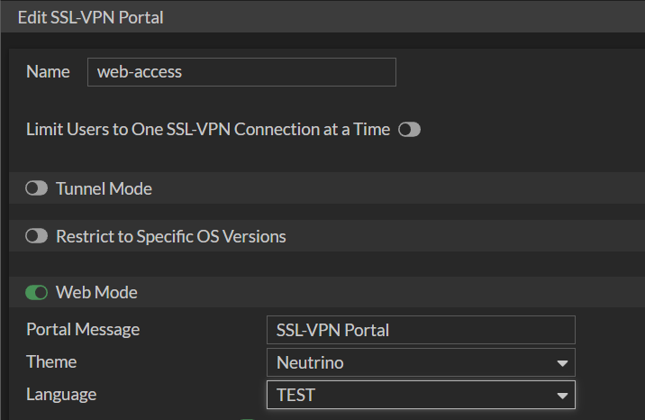](../../assets/img/fortigate-symlink/image_2025-04-26_19-42-25.png){:target="_blank"}

As we saw in the languages directory of VPN-SSL (`/migadmin/lang`) there is always `custom` pointing to `/data2/custom_lang`. The `/data2/` is the partition where persistent data resides, like some configurations. And, in `data2/custom_lang` is where custom languages get uploaded.

[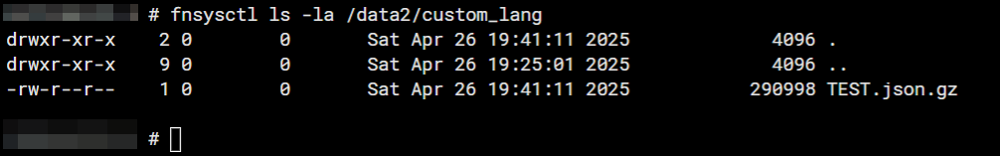](../../assets/img/fortigate-symlink/Pasted image 20250426194823.png){:target="_blank"}

**What attackers did is modify the symbolic link `/migadmin/lang/custom` to point to the root of the FortiGate, so it is possible to remotely access all the files using VPN-SSL's `/lang/custom` PATH**❤️

Here is an example of a compromised FortiGate.
- `/lang/custom/data/etc/ssh/ssh_host_rsa_key`

[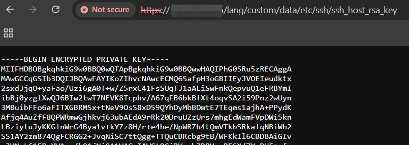](../../assets/img/fortigate-symlink/image_2025-04-26_19-58-51.png){:target="_blank"}

[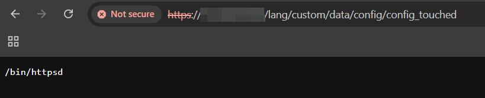](../../assets/img/fortigate-symlink/image_2025-04-26_19-59-19.png){:target="_blank"}

And of course, downloading the configuration.
- `/lang/custom/data/config/sys_global.conf.gz`

[](../../assets/img/fortigate-symlink/image_2025-04-26_20-00-14.png){:target="_blank"}

[](../../assets/img/fortigate-symlink/image_2025-04-26_20-01-30.png){:target="_blank"}

And the best about that is it survived updates ✨.

# Bypassing the Patch, tool, and internet analysis🤓

After the details were clear, we managed to bypass the patch. Using `strstr` is not the best idea... Also built a tool to analyze the status of FortiGate devices remotely. 

All of this continues in the following post at ITRESIT Labs: 
- [https://labs.itresit.es/2026/02/11/fortigate-symlink-persistence-method-patch-bypass-cve-2025-68686/](https://labs.itresit.es/2026/02/11/fortigate-symlink-persistence-method-patch-bypass-cve-2025-68686/)

